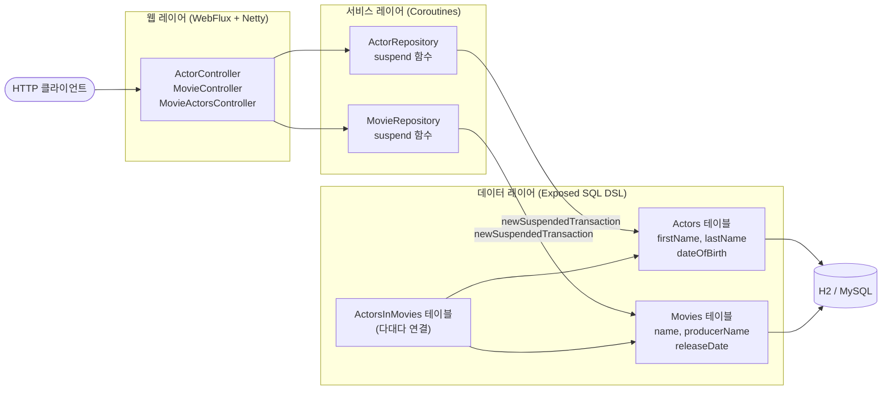
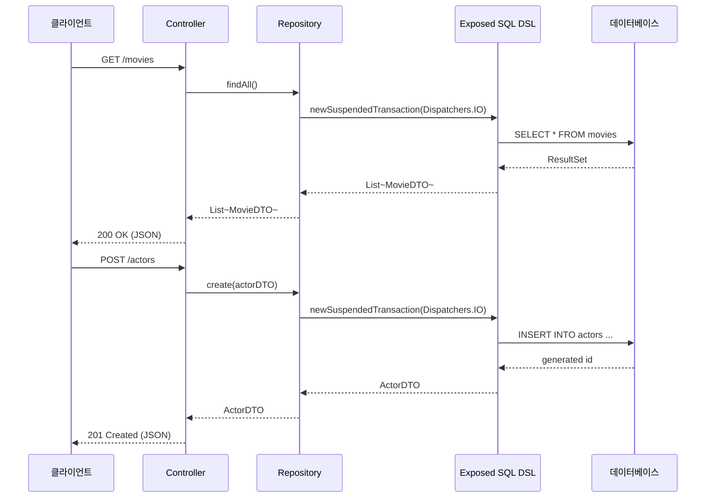

# Exposed SQL + Spring WebFlux + Kotlin Coroutines

Spring WebFlux 환경에서 Kotlin Coroutines와 JetBrains Exposed SQL DSL을 조합하여 Actor·Movie CRUD REST API를 구현하는 예제입니다.

## 아키텍처 흐름



## HTTP 요청 처리 흐름



## 기술 스택

| 기술 | 역할 |
|---|---|
| Spring WebFlux + Netty | 비동기 HTTP 서버 |
| Kotlin Coroutines | suspend 기반 비동기 처리 |
| Exposed SQL DSL | 타입 안전 SQL 쿼리 |
| H2 (In-Memory) | 기본 데이터베이스 |
| SpringDoc OpenAPI | Swagger UI (`/swagger-ui.html`) |

## 핵심 패턴

Exposed의 `newSuspendedTransaction`을 사용하면 suspend 함수 안에서 트랜잭션을 수행할 수 있습니다:

```kotlin
suspend fun findAll(): List<ActorDTO> = newSuspendedTransaction(Dispatchers.IO) {
    ActorTable.selectAll().map { it.toActorDTO() }
}
```

## REST API 엔드포인트

| Method | 경로 | 설명 |
|---|---|---|
| GET | `/actors` | 전체 배우 목록 |
| GET | `/actors/{id}` | 배우 조회 |
| POST | `/actors` | 배우 생성 |
| PUT | `/actors/{id}` | 배우 수정 |
| DELETE | `/actors/{id}` | 배우 삭제 |
| GET | `/movies` | 전체 영화 목록 |
| GET | `/movies/{id}` | 영화 조회 |
| GET | `/movie-actors` | 영화-배우 연관 목록 |

## 실행

```bash
./gradlew :exposed-sql-webflux-coroutines:bootRun
```

Swagger UI: http://localhost:8080/swagger-ui.html

## 참고

- [Exposed — Coroutines 트랜잭션](https://github.com/JetBrains/Exposed/wiki/Transactions#working-with-coroutines)
- [Spring WebFlux + Kotlin Coroutines](https://docs.spring.io/spring-framework/reference/languages/kotlin/coroutines.html)

There are two variants, one with H2 and one with Postgres. H2 is the easiest starting point because it is an
in-memory database.

### Running with H2

Run [MainWithH2.kt](src/main/kotlin/nl/toefel/blog/exposed/MainWithH2.kt). It will automatically:

1. create an in-memory H2 database
2. create the schema
3. load test data
4. start a API server at localhost:8080

### Running with Postgres

First start a Postgres database. If you have docker available, you can use:

    docker run --name exposed-db -p 5432:5432 -e POSTGRES_USER=exposed -e POSTGRES_PASSWORD=exposed -d postgres

Then run [MainWithPostgresAndHikari](src/main/kotlin/nl/toefel/blog/exposed/MainWithPostgresAndHikari.kt). It will:

1. create a HikariCP datasource connecting to the postgres database
2. create or update the schema
3. load test data if not already present
4. start a API server at localhost:8080

### Database diagram


# Overview of code

Start by looking at how the database tables are described [in code](src/main/kotlin/nl/toefel/blog/exposed/db/).
The database structure is specified in code very similar to SQL DDL statements. No annotations or reflection required.

* [Actors.kt](src/main/kotlin/nl/toefel/blog/exposed/db/Actors.kt)
* [Movies.kt](src/main/kotlin/nl/toefel/blog/exposed/db/Movies.kt)
* [ActorsInMovies.kt](src/main/kotlin/nl/toefel/blog/exposed/db/ActorsInMovies.kt)

Notice that the database types `varchar`, `integer` and `date/datetime/timestamp` map to Kotlin types
`String` and `Int` and `joda.DateTime`. Using these definitions, we can write queries in a type-safe manner using a DSL.

[Router.kt](src/main/kotlin/nl/toefel/blog/exposed/rest/Router.kt) contains the REST api which uses the DSL
to serve requests. The executed SQL queries are logging at runtime for
debugging [logback.xml](src/main/resources/logback.xml).

To interact with the database, simply start a transaction block:

```kotlin
val actorCount = transaction {
    Actors.selectAll().count()
}
```

`transaction` uses the datasource that was configured
in [MainWithH2.kt](src/main/kotlin/nl/toefel/blog/exposed/MainWithH2.kt)
or [MainWithPostgresAndHikari](src/main/kotlin/nl/toefel/blog/exposed/MainWithPostgresAndHikari.kt).

You can query as much as you want within a transaction block, when it goes out of scope without
an error, it will automatically `commit()`. Leaving the scope with an exception automatically
triggers a `rollback()`.

The last statement of the `transaction` is returned, as in the example. Transaction blocks can be nested,
see [NestedTransactions](NestedTransactions.md) for details.

### Spring transaction management

Kotlin Exposed can use the spring transaction management. Import
the [spring-transaction](https://mvnrepository.com/artifact/org.jetbrains.exposed/spring-transaction?repo=kotlin-exposed).
dependency.

```groovy
    implementation "org.jetbrains.exposed:spring-transaction:0.16.1"
```

Then create the `org.jetbrains.exposed.spring.SpringTransactionManager` bean in your application config:

```kotlin
    @Bean
fun transactionManager(dataSource: HikariDataSource): SpringTransactionManager {
    val transactionManager = SpringTransactionManager(
        dataSource, DEFAULT_ISOLATION_LEVEL, DEFAULT_REPETITION_ATTEMPTS
    )
    return transactionManager
}
```

There is also
an [exposed-spring-boot-starter](https://github.com/JetBrains/Exposed/tree/master/exposed-spring-boot-starter).

# Using the REST apis

When started, you can use these URL's to interact with it:

    # fetch all actors
    curl http://localhost:8080/actors | python -m json.tool
    
    # fetch all actors with first name Angelina
    curl http://localhost:8080/actors?firstName=Angelina
    
    # add an actor
    curl -X POST http://localhost:8080/actors -H 'application/json' \
       -d '{"firstName":"Ousmane","lastName":"Dembele","dateOfBirth":"1975-05-10"}' 
    
    # delete an actor
    curl -X DELETE http://localhost:8080/actors/2
    
    
    # fetch all movies
    curl http://localhost:8080/movies
    
    # fetch a specific movie to see which actors are in it
    curl http://localhost:8080/movies/2

## More info

* [Exposed README](https://github.com/JetBrains/Exposed)
* [Exposed wiki](https://github.com/JetBrains/Exposed/wiki) with the docs.
* [Baeldung Guide to the Kotlin Exposed framework](https://www.baeldung.com/kotlin-exposed-persistence) older resource
* [How we use Kotlin with Exposed for SQL access at TouK](https://medium.com/@pjagielski/how-we-use-kotlin-with-exposed-at-touk-eacaae4565b5)
* [Bits and blobs of Kotlin/Exposed JDBC framework](https://medium.com/@OhadShai/bits-and-blobs-of-kotlin-exposed-jdbc-framework-f1ee56dc8840)
