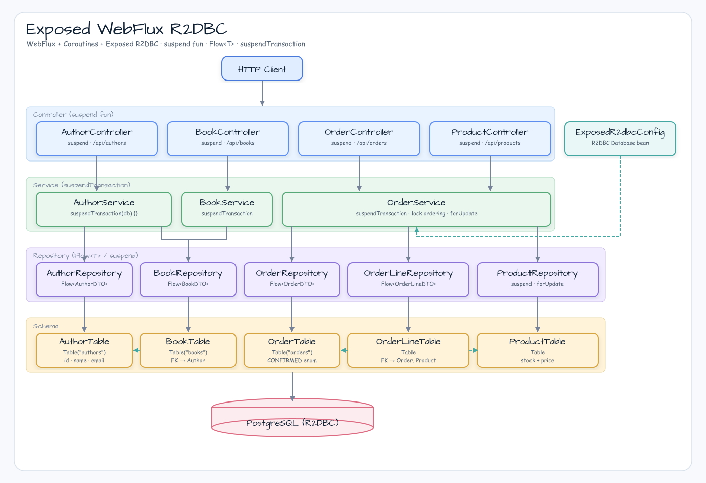

# exposed/webflux-r2dbc

[English](README.md) | 한국어

## 예제 시나리오

이 예제는 **exposed/webflux-r2dbc**를 실행 가능한 Exposed 데이터 접근 워크숍 조각으로 다룹니다. 개발자가 먼저 확인할 흐름인 모듈 설정, 샘플 또는 테스트 실행, 반복적인 인프라 코드를 줄여 주는 라이브러리와 프레임워크 API 관찰에 초점을 맞춥니다.

## 흐름 다이어그램

1. `exposed-webflux-r2dbc`에 필요한 로컬 런타임을 준비합니다.
2. 예제 시나리오를 담당하는 애플리케이션, 컨트롤러, 서비스 또는 테스트 픽스처를 실행합니다.
3. 반복적인 인프라 작업을 bluetape4k 유틸리티나 Spring/Kotlin 통합에 위임합니다.
4. 샘플 출력, HTTP 응답, 리포지토리 상태, 메트릭, 트레이스 또는 테스트 기대값으로 보이는 결과를 검증합니다.

## 시퀀스 다이어그램

핵심 시퀀스는 호출자 또는 테스트 픽스처 -> 워크숍 어댑터 -> bluetape4k 헬퍼/API -> 외부 런타임 또는 인메모리 백엔드 -> 검증/응답 순서입니다. 이 모듈에 전용 시퀀스 자산이 있으면 아래 이미지가 상호작용 순서를 보여 줍니다. 그렇지 않으면 소스 테스트가 실행 가능한 시퀀스의 기준입니다.

WebFlux + Coroutines + Exposed R2DBC로 완전한 리액티브/코루틴 데이터 접근을 구성합니다.

## 아키텍처




## 사용한 bluetape4k 기능

| 기능 | 아티팩트 | 코드 위치 | 이점 |
|---------|----------|---------------|---------|
| `KLoggingChannel` | `bluetape4k-logging` | 모든 companion object | 코루틴을 인식하는 구조적 로깅(MDC 전파) |
| `bluetape4k-coroutines` | `bluetape4k-coroutines` | 서비스, 동시성 테스트 | 코루틴 스코프 헬퍼와 Flow 유틸리티 |
| `Fakers.faker` | `bluetape4k-junit5` | 테스트 베이스 클래스 | 결정적인 가짜 데이터 생성 |
| `shouldBeEqualTo` matchers | `bluetape4k-assertions` | 모든 테스트 클래스 | 읽기 쉬운 Kotlin 관용 assertion |
| `PostgreSQLServer.Launcher.postgres` | `bluetape4k-testcontainers` | `AbstractWebfluxR2dbcTest` | 싱글턴 Testcontainers PostgreSQL. 한 번 시작해 모든 테스트가 공유합니다. |

## bluetape4k 적용 전 / 후

### Exposed를 사용한 코루틴 안전 R2DBC 트랜잭션

```kotlin
// Before — Reactor chain: verbose, no structured concurrency
fun findAll(): Flux<Author> =
    Mono.fromCallable { db.transaction { AuthorTable.selectAll().toList() } }
        .flatMapMany { Flux.fromIterable(it) }
        .subscribeOn(Schedulers.boundedElastic())

// After — bluetape4k suspendTransaction: idiomatic coroutine, Flow-aware
fun findAll(): Flow<Author> = flow {
    suspendTransaction(db = db) {
        AuthorTable.selectAll()
            .map { it.toAuthor() }
            .forEach { emit(it) }
    }
}
```

### Testcontainers 싱글턴 패턴

```kotlin
// Before — new container per test class → slow, resource-heavy
@Testcontainers
abstract class AbstractTest {
    @Container
    val postgres = PostgreSQLContainer("postgres:15")
}

// After — bluetape4k singleton launcher: one container for the entire test suite
abstract class AbstractWebfluxR2dbcTest {
    companion object {
        val postgres = PostgreSQLServer.Launcher.postgres   // shared singleton
    }
}
```

## 핵심 패턴

- **리포지토리 계층**: `fun findAll(): Flow<T>`, `suspend fun findById(): T?` — 리포지토리 레벨에는 TX를 두지 않습니다.
- **서비스 계층**: `suspendTransaction(db = db) { repo.findAll().toList() }` — Flow는 TX 안에서 소비합니다.
- **스키마 초기화**: 시작 시 HikariDataSource와 `try/finally { ds.close() }`를 사용하는 일회성 JDBC 초기화입니다.
- **동시성 테스트**: `runBlocking { coroutineScope { List(N) { async(Dispatchers.IO) { ... } }.awaitAll() } }`.
- **열린 커서 수정**: 같은 커넥션에서 삭제를 실행하면서 Flow를 스트리밍하지 않도록, 변경 전에 `.toList()`를 호출합니다.

## 실행

```bash
./gradlew :exposed-webflux-r2dbc:bootRun
# http://localhost:8080/swagger-ui/index.html
```

## 테스트

```bash
./gradlew :exposed-webflux-r2dbc:test
```

| 테스트 클래스 | 커버리지 |
|-----------|---------|
| `AuthorControllerTest` | Author + Book CRUD |
| `OrderControllerTest` | Order place, cancel, 404/409 cases |
| `ConcurrentPlaceOrderTest` | N=10 coroutines, stock=1 → 1 success + 9 conflicts (409) |
