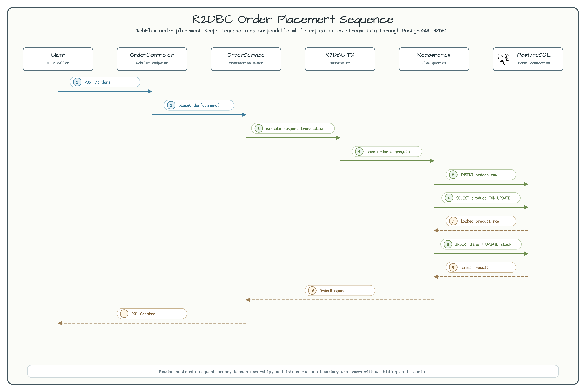
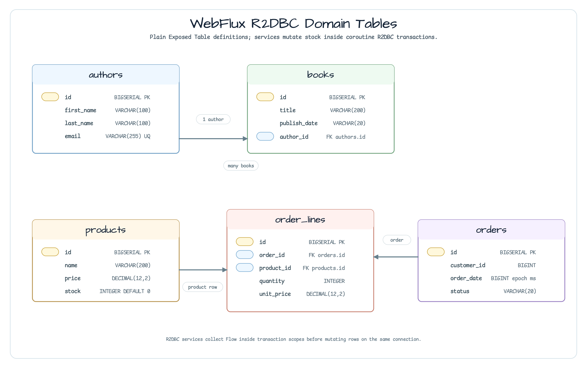

# exposed/webflux-r2dbc

[English](README.md) | 한국어

`exposed/webflux-r2dbc`는 Kotlin coroutine과 Exposed R2DBC를 사용하는 Spring WebFlux 예제입니다.

이 모듈은 transaction 소유권을 service layer에 둡니다. Repository는 `Flow<T>` read와 `suspend` write를 제공하고, service가 `suspendTransaction(db = r2dbcDatabase)`로 호출을 감쌉니다. JDBC 경로는 Hikari를 통한 startup schema initialization에만 사용됩니다.

## 아키텍처


| 영역 | 구현 | 독자가 확인할 계약 |
|---|---|---|
| Web API | `AuthorController`, `BookController`, `ProductController`, `OrderController`가 suspend WebFlux endpoint를 제공합니다. | Request handling은 coroutine-first로 유지됩니다. |
| R2DBC runtime | `ExposedR2dbcConfig`가 `ConnectionFactoryOptions`, `ConnectionPool`, `R2dbcDatabase`를 만듭니다. | Exposed R2DBC 작업은 pool-backed database와 `Dispatchers.IO`에서 실행됩니다. |
| Service transaction boundary | `AuthorService`, `BookService`, `OrderService`가 `suspendTransaction(db = db)`를 호출합니다. | 같은 connection에서 write하기 전에 Flow read를 transaction 안에서 collect합니다. |
| Repository primitives | Repository는 select에 `Flow<DTO>`, insert/update/delete에 suspend method를 제공합니다. | Repository는 얇게 유지되고 transaction lifetime을 결정하지 않습니다. |
| Schema initialization | `DatabaseInitializer`가 R2DBC URL을 JDBC URL로 바꾸고 startup 시 Hikari를 한 번 사용합니다. | Blocking JDBC는 schema creation에만 쓰이고 request processing에는 쓰이지 않습니다. |

## 주문 처리 시퀀스



`OrderService.placeOrder()`는 하나의 coroutine R2DBC transaction을 엽니다. 그 안에서 order header를 insert하고, 요청 라인을 `productId` 기준으로 정렬한 뒤 각 product row를 `FOR UPDATE`로 잠그고 order line을 쓰며 stock을 감소시킵니다.

재고가 부족하면 같은 `suspendTransaction` scope 안에서 `InsufficientStockException`을 던지고, WebFlux는 `GlobalExceptionHandler`를 통해 conflict 응답을 반환합니다.

## 스키마



| 테이블 | 역할 |
|---|---|
| `authors`, `books` | Author/book CRUD는 plain Exposed `Table` 정의와 service-owned R2DBC transaction을 사용합니다. |
| `products` | Product stock은 주문 처리 중 lock 후 감소됩니다. |
| `orders`, `order_lines` | 주문 처리는 order header와 line row를 같은 R2DBC transaction에서 씁니다. |

## 주요 코드 경로

| 파일 | 확인할 내용 |
|---|---|
| `config/ExposedR2dbcConfig.kt` | Pool-backed `R2dbcDatabase`와 coroutine dispatcher configuration. |
| `config/DatabaseInitializer.kt` | Hikari를 통한 one-shot JDBC schema creation. |
| `author/service/*Service.kt` | `suspendTransaction` ownership과 Flow collection rule. |
| `order/service/OrderService.kt` | Product lock ordering, stock conflict, order write transaction. |
| `*/repository/*Repository.kt` | 얇은 Flow/suspend query primitive. |
| `*/schema/*Table.kt` | ERD에 표시한 plain Exposed table definitions. |

## 실행

애플리케이션은 `r2dbc:postgresql://localhost:5432/exposedwebflux`의 PostgreSQL과 `postgres/postgres` 계정을 기대합니다.

```bash
./gradlew :exposed-webflux-r2dbc:bootRun
# http://localhost:8080/swagger-ui/index.html
```

## 테스트

```bash
./gradlew :exposed-webflux-r2dbc:test
```

| 테스트 클래스 | 범위 |
|---|---|
| `AuthorControllerTest` | Author, book CRUD endpoint. |
| `OrderControllerTest` | Order placement, cancellation, 404, stock-conflict case. |
| `ConcurrentPlaceOrderTest` | 마지막 stock item을 여러 coroutine request가 동시에 소비하려 할 때 하나만 성공하는지 확인합니다. |
