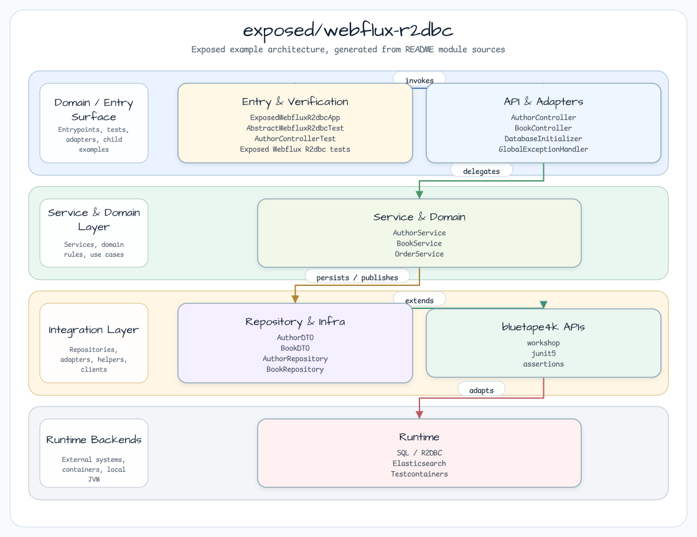

# exposed/webflux-r2dbc

[한국어](README.ko.md) | English

## Example Scenario

This example exercises **exposed/webflux-r2dbc** as a runnable Exposed data access workshop slice. It focuses on the path a developer would inspect first: configure the module, run the sample or tests, and observe the library or framework APIs that remove repetitive infrastructure code.

## Sequence Diagram

WebFlux + Coroutines + Exposed R2DBC — fully reactive/coroutine data access.

## Architecture



## Used bluetape4k Features

| Feature | Artifact | Code location | Benefit |
|---------|----------|---------------|---------|
| `KLoggingChannel` | `bluetape4k-logging` | Every companion object | Coroutine-aware structured logging (MDC propagation) |
| `bluetape4k-coroutines` | `bluetape4k-coroutines` | Service, concurrency tests | Coroutine scope helpers and Flow utilities |
| `Fakers.faker` | `bluetape4k-junit5` | Test base classes | Deterministic fake data generation |
| `shouldBeEqualTo` matchers | `bluetape4k-assertions` | All test classes | Readable Kotlin-idiomatic assertions |
| `PostgreSQLServer.Launcher.postgres` | `bluetape4k-testcontainers` | `AbstractWebfluxR2dbcTest` | Singleton Testcontainers PostgreSQL — started once, shared across all tests |

## bluetape4k Before / After

### Coroutine-safe R2DBC transactions with Exposed

```kotlin
// Before — Reactor chain: verbose, no structured concurrency
fun findAll(): Flux<Author> =
    Mono.fromCallable { db.transaction { AuthorTable.selectAll().toList() } }
        .flatMapMany { Flux.fromIterable(it) }
        .subscribeOn(Schedulers.boundedElastic())

// After — bluetape4k suspendTransaction: idiomatic coroutine, Flow-aware
fun findAll(): Flow<Author> = flow {
    suspendTransaction(db = db) {
        AuthorTable.selectAll()
            .map { it.toAuthor() }
            .forEach { emit(it) }
    }
}
```

### Testcontainers singleton pattern

```kotlin
// Before — new container per test class → slow, resource-heavy
@Testcontainers
abstract class AbstractTest {
    @Container
    val postgres = PostgreSQLContainer("postgres:15")
}

// After — bluetape4k singleton launcher: one container for the entire test suite
abstract class AbstractWebfluxR2dbcTest {
    companion object {
        val postgres = PostgreSQLServer.Launcher.postgres   // shared singleton
    }
}
```

## Key Patterns

- **Repository layer**: `fun findAll(): Flow<T>`, `suspend fun findById(): T?` — no TX at repo level.
- **Service layer**: `suspendTransaction(db = db) { repo.findAll().toList() }` — Flow consumed INSIDE TX.
- **Schema init**: One-shot JDBC via HikariDataSource + `try/finally { ds.close() }` at startup.
- **Concurrent test**: `runBlocking { coroutineScope { List(N) { async(Dispatchers.IO) { ... } }.awaitAll() } }`.
- **Open-cursor fix**: `.toList()` before mutations — never stream Flow while issuing deletes on same connection.

## Running

```bash
./gradlew :exposed-webflux-r2dbc:bootRun
# http://localhost:8080/swagger-ui/index.html
```

## Tests

```bash
./gradlew :exposed-webflux-r2dbc:test
```

| Test Class | Coverage |
|-----------|---------|
| `AuthorControllerTest` | Author + Book CRUD |
| `OrderControllerTest` | Order place, cancel, 404/409 cases |
| `ConcurrentPlaceOrderTest` | N=10 coroutines, stock=1 → 1 success + 9 conflicts (409) |
