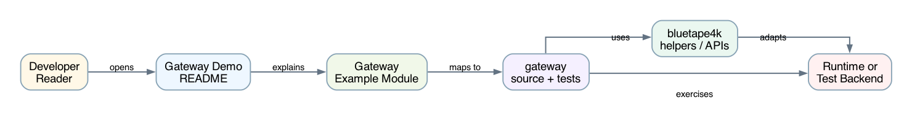
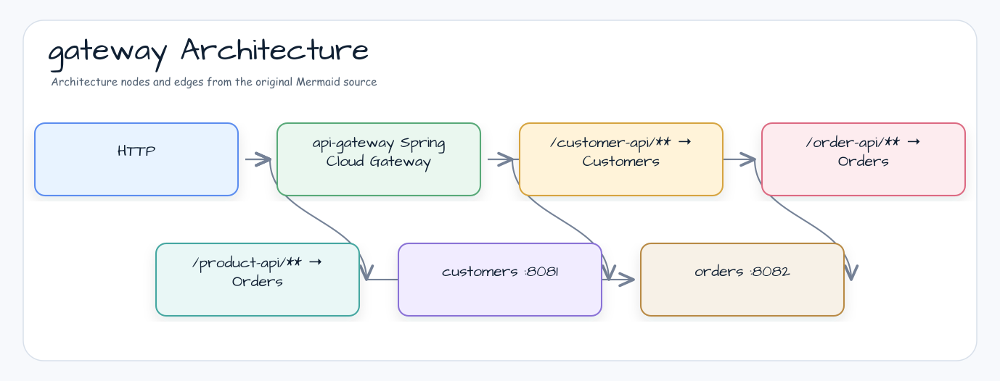

# Gateway Demo

[한국어](README.ko.md) | English

## Example Scenario

This example exercises **Gateway Demo** as a runnable gateway and downstream service coordination workshop slice. It focuses on the path a developer would inspect first: configure the module, run the sample or tests, and observe the library or framework APIs that remove repetitive infrastructure code.


## Architecture Diagram



The module is organized around the sample entry point or test fixture, the bluetape4k extension layer, and the runtime dependency used by the example. Keep the package under `io.bluetape4k.workshop.gateway` as the source of truth when comparing this README with the code.


## Flow Diagram

1. Prepare the local runtime required by `Gateway Demo`.
2. Execute the application, controller, service, or test fixture that owns the example scenario.
3. Delegate repetitive infrastructure work to bluetape4k utilities or Spring/Kotlin integrations.
4. Assert the visible result through the sample output, HTTP response, repository state, metric, trace, or test expectation.

## Sequence Diagram

The core sequence is: caller or test fixture -> workshop adapter -> bluetape4k helper/API -> external runtime or in-memory backend -> assertion/response. When this module has a dedicated sequence asset, the image below shows that interaction order; otherwise the source tests are the authoritative executable sequence.

This is an example of using Spring Cloud API Gateway to service internal services Customer API and Order API through API Gateway.

## Architecture diagram



-. API Gateway : http://localhost:8080
-. Customer API: http://localhost:8081/customers
-. Order API : http://localhost:8082/orders

## How to use

Run the customer (8081) and order (8082) services first, then gateway-demo (8080).

Use `httpie` to call Customer API and Order API through API Gateway.

### 1. Use Customer API

```bash
$ http://localhost:8080/customer-api/customers
```

### 2. Run Order, Product API

```bash
$ http localhost:8080/order-api/orders
```

```bash
$ http localhost:8080/product-api/products
```

## reference

- [Spring Cloud Gateway](https://spring.io/projects/spring-cloud-gateway)
- [Spring Cloud Gateway: Implementing Routes in Microservices](https://medium.com/@AlexanderObregon/spring-cloud-gateway-implementing-routes-in-microservices-29094a0f8845)
- [Swagger Integration with Spring Cloud Gateway - Part 2] (https://medium.com/@pubuduc.14/swagger-openapi-specification-3-integration-with-spring-cloud-gateway-part-2-1d670d4ab69a)
- [API Gateway Service - Spring Cloud Gateway - Add Filter](https://kingchan223.tistory.com/398)
