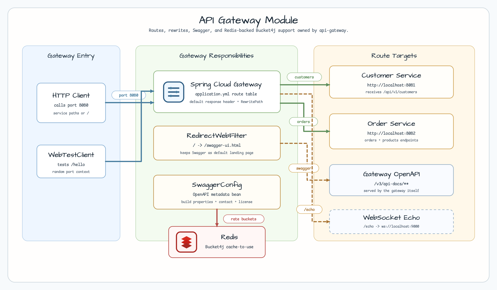
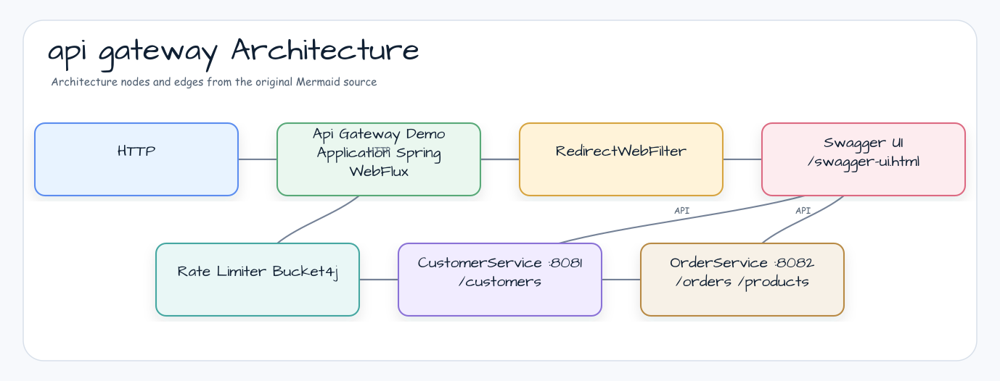
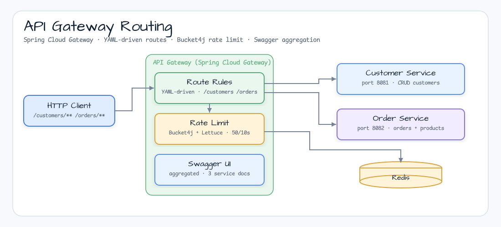
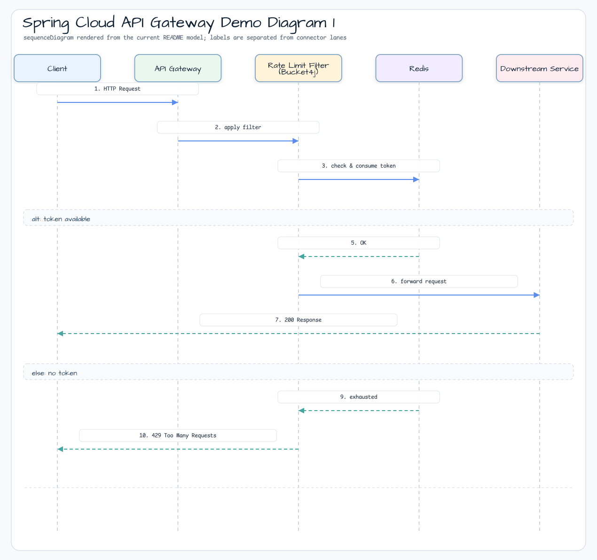

# Spring Cloud API Gateway Demo

[English](README.md) | 한국어

## 아키텍처 다이어그램



이 모듈은 샘플 진입점 또는 테스트 픽스처, bluetape4k 확장 계층, 예제가 사용하는 런타임 의존성을 중심으로 구성됩니다. 이 README와 코드를 비교할 때는 `io.bluetape4k.workshop.gateway` 패키지를 기준으로 삼으세요.



## 시퀀스 다이어그램

핵심 시퀀스는 호출자 또는 테스트 픽스처 -> 워크숍 어댑터 -> bluetape4k 헬퍼/API -> 외부 런타임 또는 인메모리 백엔드 -> 검증/응답 순서입니다. 이 모듈에 전용 시퀀스 자산이 있으면 아래 이미지가 상호작용 순서를 보여 줍니다. 그렇지 않으면 소스 테스트가 실행 가능한 시퀀스의 기준입니다.

Spring Cloud Gateway(WebFlux 기반) 데모로, 하위 Customer 및 Order 마이크로서비스에 대한 라우팅, Swagger UI 집계, Redis(Lettuce)와 Redisson 기반 Bucket4j 토큰 버킷 요청 제한을 제공합니다.

## 시나리오



## 이 모듈이 보여 주는 것

1. **라우팅** — Customer와 Order 서비스에 대한 선언적 라우트 규칙
2. **Swagger 집계** — 두 하위 API를 하나의 Swagger UI에서 확인
3. **요청 제한** — Redis(Lettuce)와 Redisson으로 뒷받침되는 Bucket4j 토큰 버킷 rate limiter
4. **서킷 브레이커** — 하위 서비스 장애 격리를 위한 Resilience4j 통합
5. **리다이렉트 필터** — 요청 정규화를 위한 커스텀 `WebFilter`

## 사용한 bluetape4k 기능

| 모듈 | 기능 | 사용 방식 |
|---|---|---|
| `bluetape4k-logging` | `KLoggingChannel()` | 모든 컴포넌트에서 코루틴을 인식하는 구조적 로깅 |
| `bluetape4k-bucket4j` | Bucket4j extensions | Lettuce/Redisson과 통합한 토큰 버킷 rate limiter |
| `bluetape4k-resilience4j` | Resilience4j helpers | upstream route를 위한 서킷 브레이커 통합 |
| `bluetape4k-cache-core` | Cache abstractions | Lettuce 기반 분산 캐시 설정 |
| `bluetape4k-coroutines` | Coroutine utilities | Reactor/WebFlux 파이프라인을 위한 코루틴 dispatcher 브리지 |
| `bluetape4k-netty` | Netty extensions | Netty 채널 설정 헬퍼 |
| `bluetape4k-junit5` | `runSuspendIO { }` | suspend 기반 통합 테스트 runner |
| `bluetape4k-support` | `uninitialized()`, `unsafeLazy` | 지연 bean 초기화 헬퍼 |

## bluetape4k 적용 전 / 후

### `KLoggingChannel`과 일반 logger 비교

```kotlin
// Before — SLF4J LoggerFactory directly
private val log = LoggerFactory.getLogger(ApiGatewayDemoApplication::class.java)
log.info("Starting GatewayApplication ...")

// After — KLoggingChannel (coroutine MDC context propagation included)
companion object : KLoggingChannel() {
    init { log.info { "Starting GatewayApplication ..." } }   // lazy lambda
}
```

### Bucket4j rate limiter — Redis 기반

```kotlin
// Before — manual Bucket/ProxyManager wiring
val proxyManager = LettuceBasedProxyManager.builderFor(redisClient)
    .withExpirationAfterWriteStrategy(ExpirationAfterWriteStrategy.basedOnTimeForRefillingBucketUpToMax(ofMinutes(1)))
    .build()

// After — bluetape4k-bucket4j fluent builder
val bucket = bucket4j {
    addLimit {
        capacity(100)
        refillGreedy(100, ofMinutes(1))
    }
}.build(proxyManager, key)
```

## 요청 제한 흐름



## 설정

`application.yml`의 주요 섹션:

```yaml
spring:
  cloud:
    gateway:
      server:
        webflux:
          routes:
            - id: customers
              uri: lb://customers
              predicates:
                - Path=/customers/**
            - id: orders
              uri: lb://orders
              predicates:
                - Path=/orders/**
```

## 실행

```bash
# Start the gateway
./gradlew :gateway-api-gateway:bootRun
```

Gateway는 `http://localhost:8080`에서 수신합니다.
Swagger UI: `http://localhost:8080/webjars/swagger-ui/index.html`

## 테스트

```bash
./gradlew :gateway-api-gateway:test
```

## 참고 자료

- [Spring Cloud Gateway Reference](https://docs.spring.io/spring-cloud-gateway/reference/)
- [Bucket4j Documentation](https://bucket4j.com/)
- [bluetape4k-bucket4j](https://github.com/bluetape4k/bluetape4k-projects)
