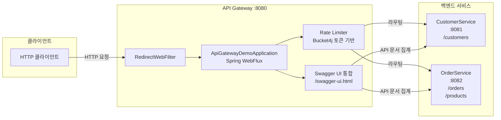

# Spring Cloud API Gateway Demo

Spring Webflux 기반의 API Gateway 에 대한 예제입니다.

## 아키텍처 다이어그램

API Gateway 가 Customer Service, Order Service 에 대한
다음과 같은 기능을 제공합니다.

1. Routing 기능
2. Swagger 통합 (API Gateway 에서 Customer, Order API에 대한 Swagger UI 를 통합 제공)
3. Bucket4j 이용한 Token 기반의 Rate limiter 를 적용하는 예를 제공합니다.

## 실행

## 설정

## 참고

- [Rate Limiting a Spring API Using Bucket4j](https://www.baeldung.com/spring-bucket4j)
- 
