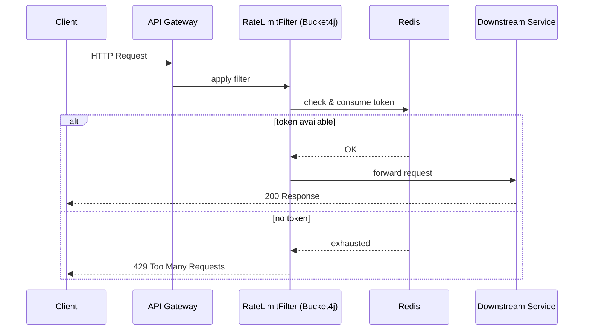

# Spring Cloud API Gateway Demo

[한국어](README.ko.md) | English

## Architecture Diagram


The module is organized around the sample entry point or test fixture, the bluetape4k extension layer, and the runtime dependency used by the example. Keep the package under `io.bluetape4k.workshop.gateway` as the source of truth when comparing this README with the code.


## Sequence Diagram

The core sequence is: caller or test fixture -> workshop adapter -> bluetape4k helper/API -> external runtime or in-memory backend -> assertion/response. When this module has a dedicated sequence asset, the image below shows that interaction order; otherwise the source tests are the authoritative executable sequence.

Spring Cloud Gateway (WebFlux-based) demo that provides routing, Swagger UI aggregation,
and Bucket4j token-bucket rate limiting for downstream Customer and Order microservices.

## Scenario


## What This Module Shows

1. **Routing** — declarative route rules for Customer and Order services
2. **Swagger aggregation** — single Swagger UI covering both downstream APIs
3. **Rate limiting** — token-bucket rate limiter via Bucket4j backed by Redis (Lettuce) and Redisson
4. **Circuit breaker** — Resilience4j integration for downstream failure isolation
5. **Redirect filter** — custom `WebFilter` for request normalization

## Used bluetape4k Features

| Module | Feature | Usage |
|---|---|---|
| `bluetape4k-logging` | `KLoggingChannel()` | Coroutine-aware structured logging in all components |
| `bluetape4k-bucket4j` | Bucket4j extensions | Token-bucket rate limiter integration with Lettuce/Redisson |
| `bluetape4k-resilience4j` | Resilience4j helpers | Circuit breaker integration for upstream routes |
| `bluetape4k-cache-core` | Cache abstractions | Lettuce-backed distributed cache configuration |
| `bluetape4k-coroutines` | Coroutine utilities | Coroutine dispatcher bridging for Reactor/WebFlux pipelines |
| `bluetape4k-netty` | Netty extensions | Netty channel configuration helpers |
| `bluetape4k-junit5` | `runSuspendIO { }` | Suspend-based integration test runner |
| `bluetape4k-support` | `uninitialized()`, `unsafeLazy` | Deferred bean initialization helpers |

## bluetape4k Before / After

### `KLoggingChannel` vs plain logger

```kotlin
// Before — SLF4J LoggerFactory directly
private val log = LoggerFactory.getLogger(ApiGatewayDemoApplication::class.java)
log.info("Starting GatewayApplication ...")

// After — KLoggingChannel (coroutine MDC context propagation included)
companion object : KLoggingChannel() {
    init { log.info { "Starting GatewayApplication ..." } }   // lazy lambda
}
```

### Bucket4j rate limiter — Redis-backed

```kotlin
// Before — manual Bucket/ProxyManager wiring
val proxyManager = LettuceBasedProxyManager.builderFor(redisClient)
    .withExpirationAfterWriteStrategy(ExpirationAfterWriteStrategy.basedOnTimeForRefillingBucketUpToMax(ofMinutes(1)))
    .build()

// After — bluetape4k-bucket4j fluent builder
val bucket = bucket4j {
    addLimit {
        capacity(100)
        refillGreedy(100, ofMinutes(1))
    }
}.build(proxyManager, key)
```

## Rate Limit Flow


```mermaid
sequenceDiagram
    participant Client
    participant GW as API Gateway
    participant RL as RateLimitFilter (Bucket4j)
    participant Redis
    participant DS as Downstream Service

    Client->>GW: HTTP Request
    GW->>RL: apply filter
    RL->>Redis: check & consume token
    alt token available
        Redis-->>RL: OK
        RL->>DS: forward request
        DS-->>Client: 200 Response
    else no token
        Redis-->>RL: exhausted
        RL-->>Client: 429 Too Many Requests
    end
```

## Configuration

`application.yml` key sections:

```yaml
spring:
  cloud:
    gateway:
      server:
        webflux:
          routes:
            - id: customers
              uri: lb://customers
              predicates:
                - Path=/customers/**
            - id: orders
              uri: lb://orders
              predicates:
                - Path=/orders/**
```

## Running

```bash
# Start the gateway
./gradlew :gateway-api-gateway:bootRun
```

Gateway listens on `http://localhost:8080`.
Swagger UI: `http://localhost:8080/webjars/swagger-ui/index.html`

## Tests

```bash
./gradlew :gateway-api-gateway:test
```

## References

- [Spring Cloud Gateway Reference](https://docs.spring.io/spring-cloud-gateway/reference/)
- [Bucket4j Documentation](https://bucket4j.com/)
- [bluetape4k-bucket4j](https://github.com/bluetape4k/bluetape4k-projects)
