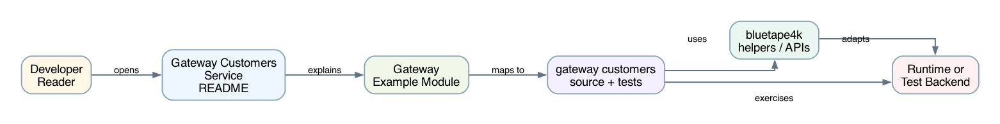
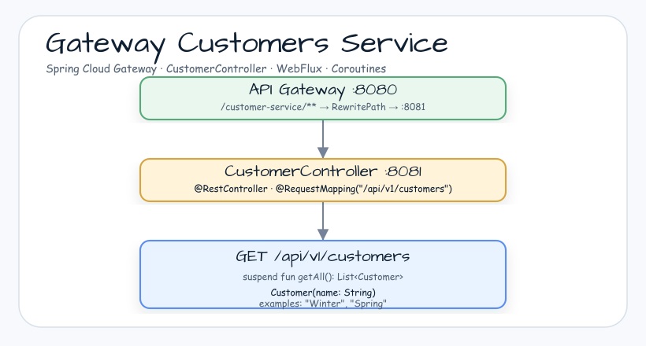

# Gateway Customers Service

[한국어](README.ko.md) | English

## Example Scenario

This example exercises **Gateway Customers Service** as a runnable gateway and downstream service coordination workshop slice. It focuses on the path a developer would inspect first: configure the module, run the sample or tests, and observe the library or framework APIs that remove repetitive infrastructure code.

## Flow Diagram

1. Prepare the local runtime required by `gateway-customers`.
2. Execute the application, controller, service, or test fixture that owns the example scenario.
3. Delegate repetitive infrastructure work to bluetape4k utilities or Spring/Kotlin integrations.
4. Assert the visible result through the sample output, HTTP response, repository state, metric, trace, or test expectation.

## Sequence Diagram

The core sequence is: caller or test fixture -> workshop adapter -> bluetape4k helper/API -> external runtime or in-memory backend -> assertion/response. When this module has a dedicated sequence asset, the image below shows that interaction order; otherwise the source tests are the authoritative executable sequence.

Customer service example for the Gateway workshop. It exposes a small WebFlux API, redirects the root path to Swagger UI, and runs as the customer backend on port `8081`.

## Architecture





## What This Module Shows

- WebFlux controller endpoint at `GET /api/v1/customers`.
- Sample customer payloads returned from `CustomerContoller`.
- Root-path redirect from `/` to `/swagger-ui.html` through `RedirectWebFilter`.
- Actuator endpoint exposure for local workshop observability.

## Running

```bash
./gradlew :customers:bootRun
```

Then open:

- Swagger UI: `http://localhost:8081/swagger-ui.html`
- Customer API: `http://localhost:8081/api/v1/customers`
- Actuator endpoints: `http://localhost:8081/actuator`

## Used Bluetape4k Features

| Module | Feature | Usage |
|--------|---------|-------|
| `bluetape4k-logging` | `KLoggingChannel()` | Coroutine-aware structured logging in controllers and services |
| `bluetape4k-support` | `uninitialized()`, `unsafeLazy` | Deferred field initialization for injected beans |
| `bluetape4k-junit5` | `runSuspendIO { }` | Suspend-based integration test runner |

## Source Map

- `CustomerApplication.kt` starts the Spring Boot application.
- `CustomerContoller.kt` defines the customer API.
- `CustomerConfig.kt`, `SwaggerConfig.kt`, and `ObservationConfig.kt` provide service metadata, OpenAPI, and observation support.
- `application.yml` sets `spring.application.name=Customers`, AOT, port `8081`, and management endpoint exposure.
