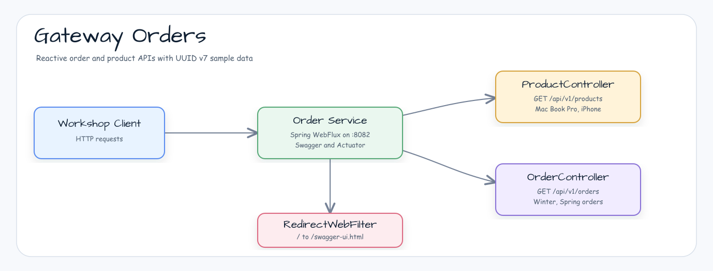

# Gateway Orders Service

[English](README.md) | 한국어

## 예제 시나리오

이 예제는 **Gateway Orders Service** 모듈을 실행 가능한 게이트웨이와 하위 서비스 연동 예제로 보여줍니다. 개발자가 먼저 확인할 경로인 모듈 설정, 샘플 또는 테스트 실행, 반복적인 인프라 코드를 줄이는 라이브러리 또는 프레임워크 API 사용 방식을 중심으로 설명합니다.

## 흐름 다이어그램

1. `gateway-orders` 예제에 필요한 로컬 런타임을 준비합니다.
2. 예제 시나리오를 담당하는 애플리케이션, 컨트롤러, 서비스 또는 테스트 픽스처를 실행합니다.
3. 반복적인 인프라 처리는 bluetape4k 유틸리티 또는 Spring/Kotlin 통합 기능에 위임합니다.
4. 샘플 출력, HTTP 응답, 저장소 상태, metric, trace 또는 테스트 기대값으로 결과를 검증합니다.

## 시퀀스 다이어그램

핵심 시퀀스는 호출자 또는 테스트 픽스처 -> 워크샵 어댑터 -> bluetape4k 헬퍼/API -> 외부 런타임 또는 인메모리 백엔드 -> 검증/응답 순서입니다. 전용 시퀀스 이미지가 있는 모듈은 아래 이미지가 상호작용 순서를 보여주며, 없는 경우 소스 테스트가 실행 가능한 시퀀스의 기준입니다.

Gateway 워크숍의 주문 서비스 예제입니다. 상품과 주문 API를 제공하고, 루트 경로를 Swagger UI로 리다이렉트하며, order 백엔드로 `8082` 포트에서 실행됩니다.

## 아키텍처



## 이 모듈에서 확인할 내용

- `GET /api/v1/products` WebFlux 컨트롤러 엔드포인트.
- `GET /api/v1/orders` WebFlux 컨트롤러 엔드포인트.
- 샘플 상품과 주문에 사용하는 UUID v7 ID 생성.
- `/`에서 `/swagger-ui.html`로의 루트 경로 리다이렉트.
- 로컬 워크숍 관찰성을 위한 Actuator 엔드포인트 노출.

## 실행

```bash
./gradlew :orders:bootRun
```

실행 후 다음 주소를 확인합니다.

- Swagger UI: `http://localhost:8082/swagger-ui.html`
- Products API: `http://localhost:8082/api/v1/products`
- Orders API: `http://localhost:8082/api/v1/orders`
- Actuator endpoints: `http://localhost:8082/actuator`

## 사용된 Bluetape4k 기능

| 모듈 | 기능 | 사용 위치 |
|------|------|---------|
| `bluetape4k-logging` | `KLoggingChannel()`, `KLogging()` | 컨트롤러와 설정의 코루틴 안전 구조화 로깅 |
| `bluetape4k-idgenerators` | `Uuid` (UUID v7) | 상품과 주문 ID 생성 (타입 안전 UUID v7) |
| `bluetape4k-support` | `uninitialized()`, `unsafeLazy` | 주입 빈의 지연 필드 초기화 |
| `bluetape4k-assertions` | `shouldBeFalse` | 간결한 테스트 단언문 |
| `bluetape4k-junit5` | `runSuspendIO { }` | suspend 기반 통합 테스트 실행기 |

## 소스 맵

- `OrderApplication.kt`는 Spring Boot 애플리케이션을 시작합니다.
- `ProductController.kt`는 샘플 상품을 반환합니다.
- `OrderController.kt`는 샘플 주문을 반환합니다.
- `OrderConfig.kt`, `SwaggerConfig.kt`, `ObservationConfig.kt`는 서비스 메타데이터, OpenAPI, 관찰성 설정을 제공합니다.
- `application.yml`은 `spring.application.name=Orders`, AOT, `8082` 포트, management endpoint 노출을 설정합니다.
