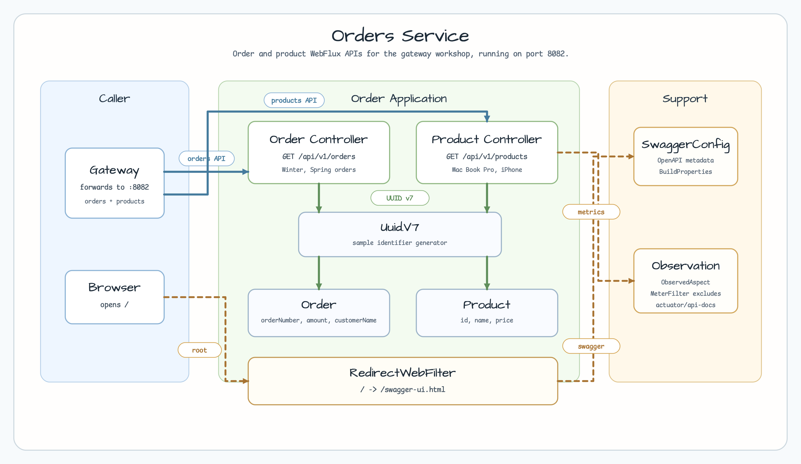

# Gateway Orders Service

[한국어](README.ko.md) | English

## What This Module Shows

`orders` is the order backend used by the gateway workshop. It runs as a Spring
Boot WebFlux application on `8082` and exposes two suspend controllers:

- `GET /api/v1/orders`
- `GET /api/v1/products`

Both controllers generate sample UUID v7 identifiers with `Uuid.V7`.

## Architecture



The service has no database dependency. It returns in-memory sample products and
orders so the gateway example can focus on route forwarding and path rewrite
behavior.

## Runtime Contract

| Concern | Source-backed behavior |
|---|---|
| Orders API | `GET /api/v1/orders` returns two sample orders for Winter and Spring |
| Products API | `GET /api/v1/products` returns two sample products |
| IDs | `Uuid.V7.nextIdAsString()` creates sample order/product identifiers |
| Swagger landing page | `/` is rewritten to `/swagger-ui.html` by `RedirectWebFilter` |
| Observability | Actuator endpoints are exposed; Micrometer URI filter excludes management and API-doc paths |
| AOT | `spring.aot.enabled=true` in `application.yml` |

## Run

```bash
./gradlew :orders:bootRun
```

Open:

```bash
http :8082/api/v1/orders
http :8082/api/v1/products
http :8082/swagger-ui.html
http :8082/actuator
```

## bluetape4k Usage

| Library | Usage |
|---|---|
| `bluetape4k-logging` | `KLoggingChannel()` in the application, config, filter, and controllers |
| `bluetape4k-idgenerators` | UUID v7 sample IDs for orders and products |
| `bluetape4k-support` | `uninitialized()` and `unsafeLazy` in Swagger configuration |
| `bluetape4k-coroutines` | Suspend WebFlux controller endpoints |

## Source References

- `src/main/kotlin/io/bluetape4k/workshop/gateway/orders/controller/OrderController.kt`
- `src/main/kotlin/io/bluetape4k/workshop/gateway/orders/controller/ProductController.kt`
- `src/main/kotlin/io/bluetape4k/workshop/gateway/orders/filters/RedirectWebFilter.kt`
- `src/main/kotlin/io/bluetape4k/workshop/gateway/orders/config/managements/ObservationConfig.kt`
- `src/main/resources/application.yml`
