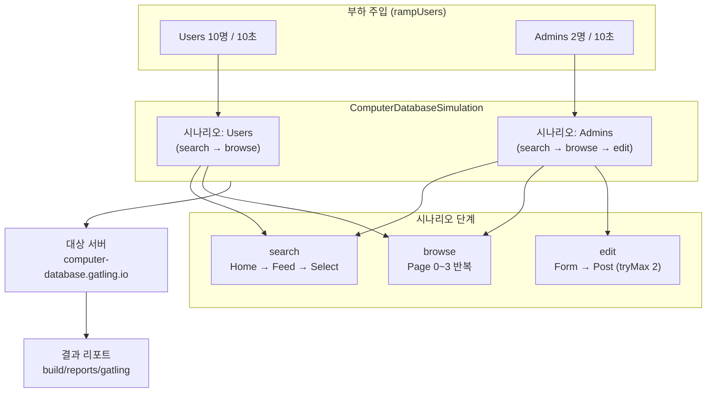
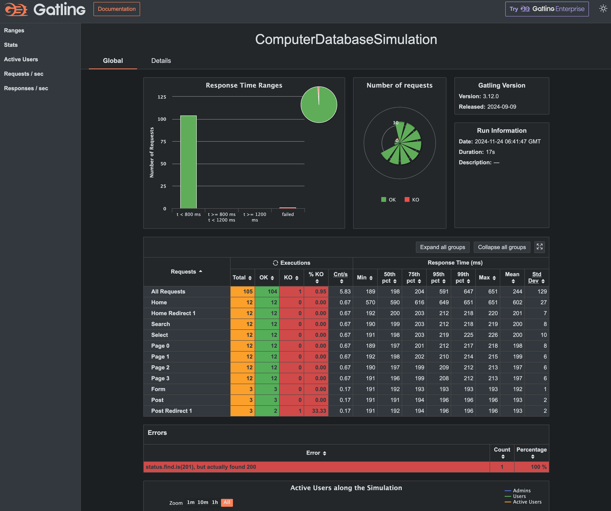
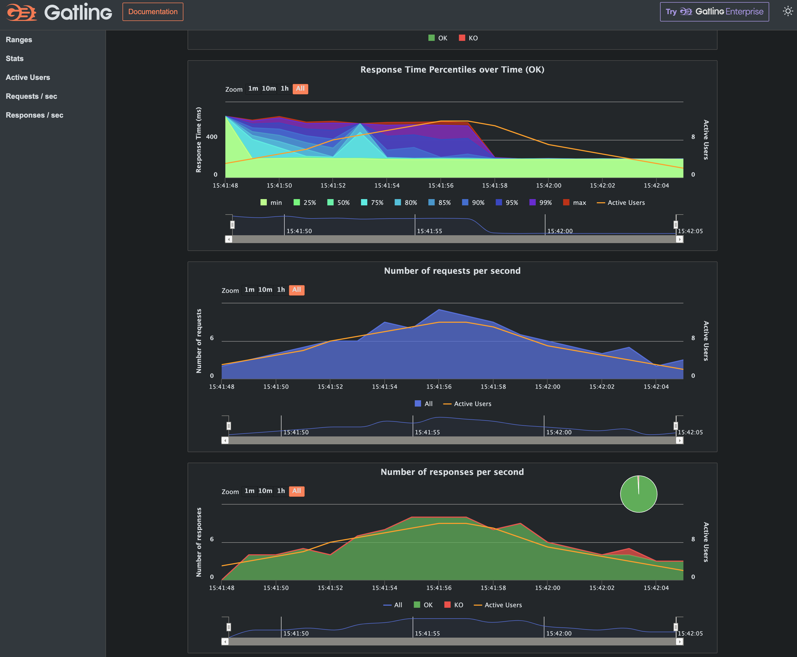

Gatling plugin for Gradle - Kotlin demo project
===============================================

A simple showcase of a Gradle project using the Gatling plugin for Gradle. Refer to the plugin documentation
[on the Gatling website](https://gatling.io/docs/current/extensions/gradle_plugin/) for usage.

This project is written in Kotlin, others are available
for [Java](https://github.com/gatling/gatling-gradle-plugin-demo-java)
and [Scala](https://github.com/gatling/gatling-gradle-plugin-demo-scala).

It includes:

* Gradle Wrapper, so you don't need to install Gradle (a JDK must be installed and $JAVA_HOME configured)
* minimal `build.gradle.kts` leveraging Gradle wrapper
* latest version of `io.gatling.gradle` plugin applied
* sample [Simulation](https://gatling.io/docs/gatling/reference/current/general/concepts/#simulation) class,
  demonstrating sufficient Gatling functionality
* proper source file layout

## Results

The simulation generates a report in the `build/reports/gatling` directory. The report is an HTML file that can be

