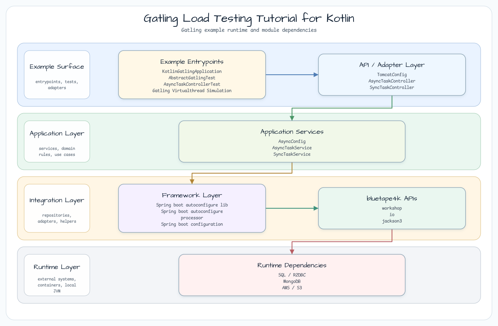
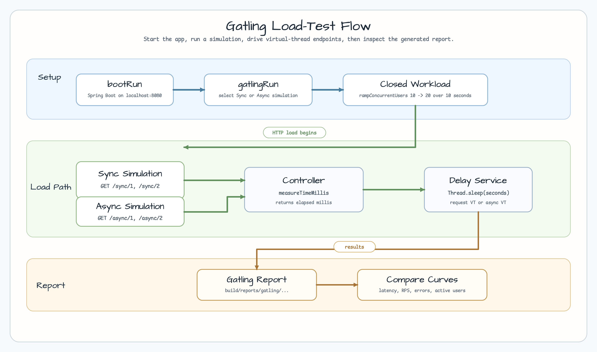
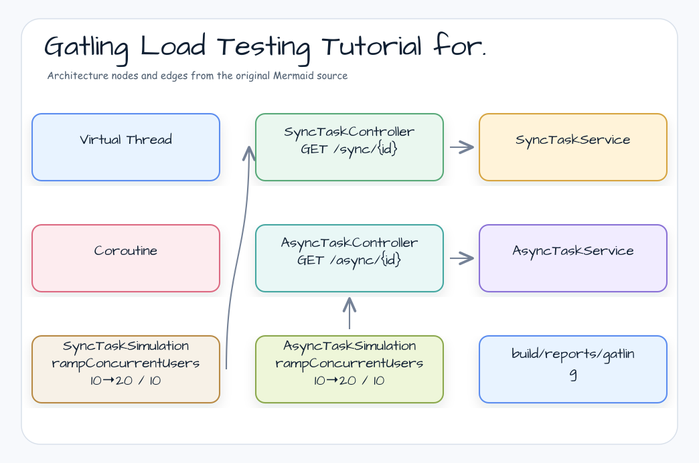
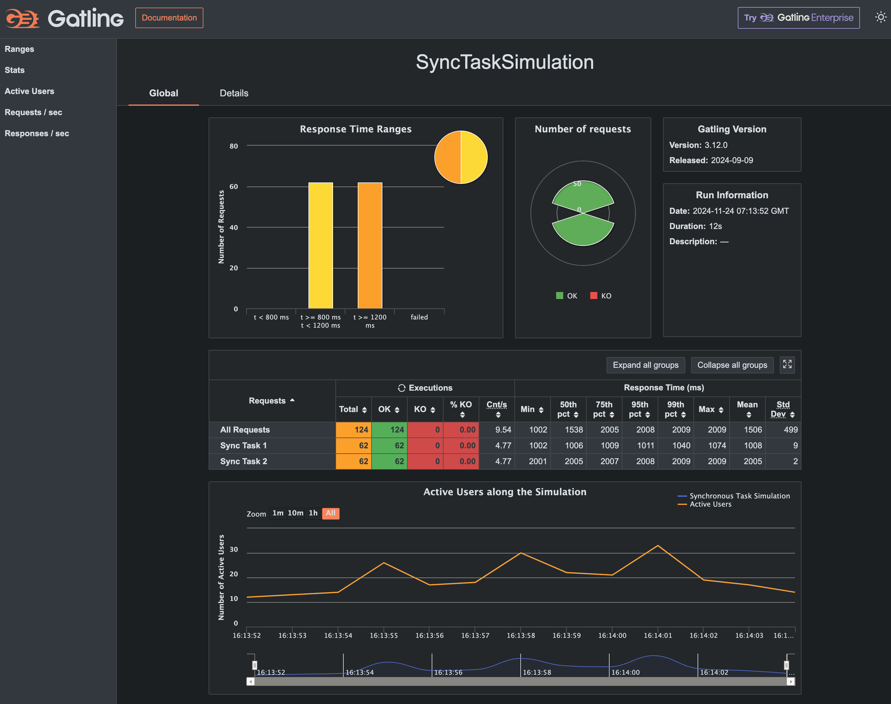
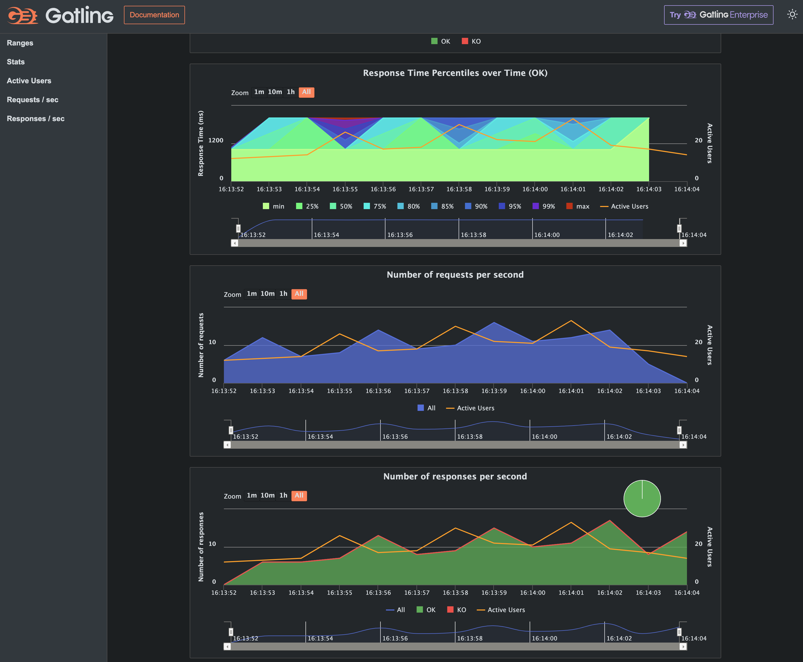
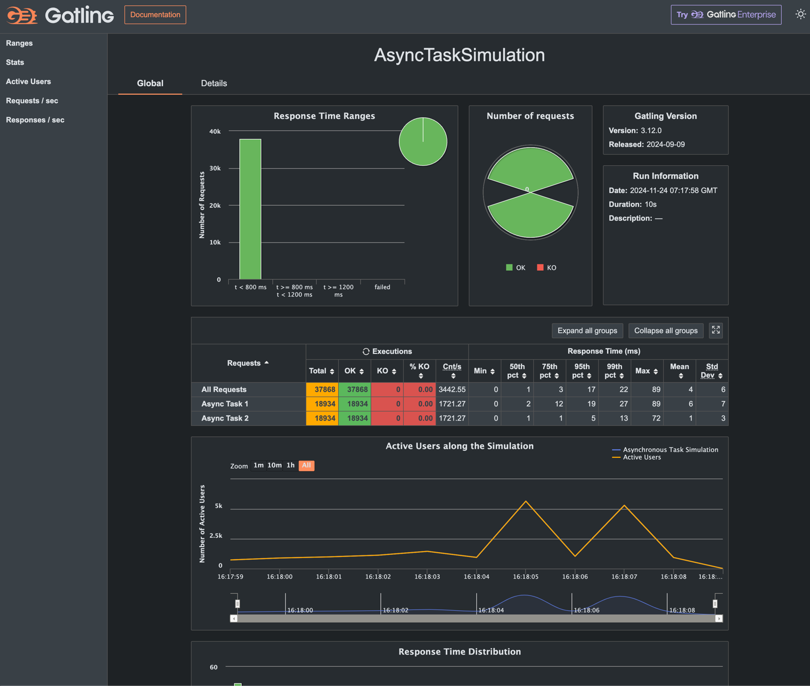
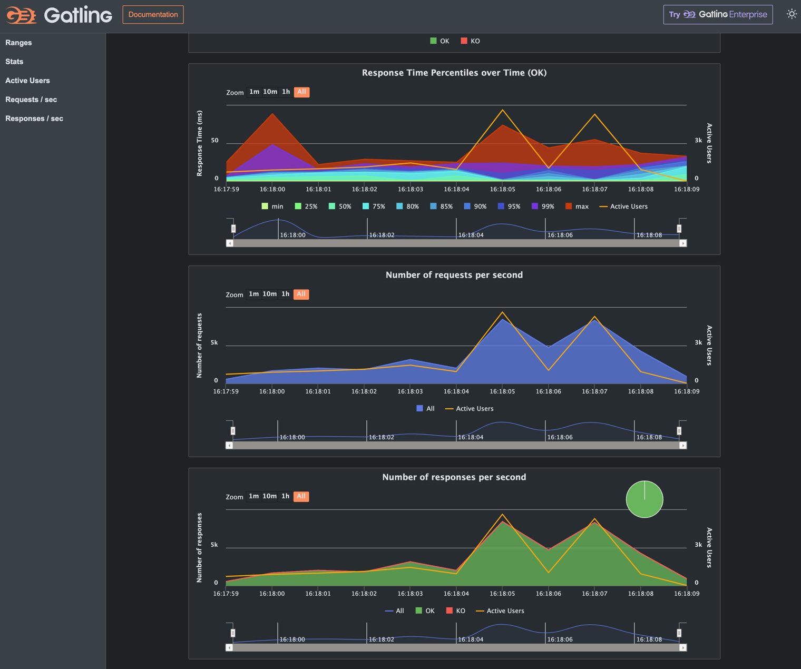

# Gatling Load Testing Tutorial for Kotlin

[English](README.md) | 한국어

## 예제 시나리오

이 예제는 **Gatling Load Testing Tutorial for Kotlin**을 실행 가능한 부하 테스트 워크샵 조각으로 다룹니다. 개발자가 가장 먼저 확인할 흐름인 모듈 설정, 샘플 또는 테스트 실행, 반복적인 인프라 코드를 줄여 주는 라이브러리/프레임워크 API 관찰에 초점을 둡니다.

## 흐름 다이어그램

1. `gatling-virtualthread-simulation`에 필요한 로컬 런타임을 준비합니다.
2. 예제 시나리오를 담당하는 애플리케이션, 컨트롤러, 서비스 또는 테스트 픽스처를 실행합니다.
3. 반복적인 인프라 작업을 bluetape4k 유틸리티 또는 Spring/Kotlin 통합 기능에 위임합니다.
4. 샘플 출력, HTTP 응답, 저장소 상태, 메트릭, 트레이스 또는 테스트 기대값으로 보이는 결과를 검증합니다.

## 시퀀스 다이어그램

핵심 시퀀스는 호출자 또는 테스트 픽스처 -> 워크샵 어댑터 -> bluetape4k 헬퍼/API -> 외부 런타임 또는 인메모리 백엔드 -> 검증/응답 순서입니다. 이 모듈에 전용 시퀀스 자산이 있으면 아래 이미지가 상호작용 순서를 보여 줍니다. 그렇지 않으면 소스 테스트가 실행 가능한 시퀀스의 기준입니다.

원본: [github: mdportnov/kotlin-gatling-tutorial](https://github.com/mdportnov/kotlin-gatling-tutorial)

원본은 MySQL을 사용하지만, 여기서는 편의를 위해 Testcontainers + MongoDB를 사용합니다.

이 저장소는 웹 애플리케이션용으로 널리 쓰이는 오픈소스 부하 테스트 도구 Gatling을 소개하는
글 ["Gatling Load Testing Tutorial"](https://medium.com/@mdportnov/stress-testing-with-gatling-kotlin-part-2-1eb13d489dc9)의 코드 예제와 리소스를 포함합니다.

## 아키텍처







## 시뮬레이션 구조

| Simulation Class | Endpoint | Injection Profile | Description |
|---|---|---|---|
| `SyncTaskSimulation` | `/sync/{id}` | 10초 동안 동시 사용자 10→20 ramp | Virtual Thread에서 실행되는 동기 블로킹 작업 |
| `AsyncTaskSimulation` | `/async/{id}` | 10초 동안 동시 사용자 10→20 ramp | 비동기 논블로킹 작업 |

```kotlin
// SyncTaskSimulation — ramp load profile
init {
    setUp(
        scn.injectClosed(rampConcurrentUsers(10).to(20).during(10.seconds.toJavaDuration()))
    ).protocols(httpProtocol)
}
```

## 시뮬레이션 실행

### Step 1 — 애플리케이션 시작

애플리케이션은 MongoDB가 필요합니다. MongoDB는 Testcontainers로 자동 시작됩니다.

```bash
./gradlew :gatling-virtualthread-simulation:bootRun
```

로그에 `Started KotlinGatlingApplication`이 보일 때까지 기다립니다.

### Step 2 — 부하 테스트 실행

```bash
# Run all Gatling simulations
./gradlew :gatling-virtualthread-simulation:gatlingRun

# Run a specific simulation by class name
./gradlew :gatling-virtualthread-simulation:gatlingRun --simulation simulations.SyncTaskSimulation
./gradlew :gatling-virtualthread-simulation:gatlingRun --simulation simulations.AsyncTaskSimulation
```

### Step 3 — 리포트 보기

리포트는 `build/reports/gatling/`에 생성됩니다. 가장 최신 timestamp 디렉터리의 `index.html`을 엽니다.

```
build/reports/gatling/
└── synctasksimulation-<timestamp>/
    └── index.html       ← open this
```

## 결과 해석

### 리포트의 주요 지표

| Metric | Good | Investigate |
|---|---|---|
| **Response time (mean)** | < 200ms | > 500ms |
| **Response time (95th percentile)** | < 500ms | > 1000ms |
| **Requests/sec (throughput)** | Stable plateau | Gradual decline |
| **Error %** | 0% | > 1% |
| **Active users** | Tracks injection profile | Flat-lines below target |

### 부하 프로파일 주석

Gatling 리포트 차트는 다음 단계를 보여 줍니다.

1. **Ramp-up**: 사용자가 10초 동안 10명에서 20명으로 증가합니다.
2. **Plateau**: 이 시뮬레이션에서는 설정하지 않았습니다. ramp는 10초 뒤 종료됩니다.
3. **Response time distribution**: 히스토그램이 p50/p75/p95/p99를 보여 줍니다.

### Virtual Thread 영향

Virtual Thread가 활성화되어 있으면(`TomcatConfig`에서 설정) `SyncTaskService`의 블로킹 I/O가 OS 스레드를 고정하지 않습니다.
Sync 엔드포인트는 Async 엔드포인트와 비슷한 지연 시간으로 같은 부하를 처리해야 합니다.

```
Platform thread model (before Virtual Threads):
    10 concurrent requests → needs 10 OS threads → thread pool exhaustion at ~200 threads

Virtual thread model:
    10 concurrent requests → 10 virtual threads on 2–4 OS threads → no pool exhaustion
```

### 중지 조건

Gatling 시뮬레이션은 다음 경우 중지됩니다.
1. injection profile이 완료됩니다(정상 종료).
2. `assertions` 블록이 설정되어 있고 threshold assertion이 실패합니다.
3. JVM이 인터럽트됩니다(Ctrl+C).

중지 조건을 추가하려면 다음과 같이 작성합니다.

```kotlin
init {
    setUp(
        scn.injectClosed(rampConcurrentUsers(10).to(20).during(10.seconds.toJavaDuration()))
    ).protocols(httpProtocol)
     .assertions(
         global().responseTime().max().lt(1000),   // fail if any response > 1s
         global().successfulRequests().percent().gt(99.0)  // fail if error rate > 1%
     )
}
```

## 사용한 bluetape4k 기능

| Feature | Artifact | Code Location | Benefit |
|---|---|---|---|
| `KLogging` | `bluetape4k-logging` | `SyncTaskController`, `AsyncTaskController` | Kotlin DSL 지연 로깅 |
| `KLoggingChannel` | `bluetape4k-logging` | `AsyncTaskService` | 코루틴 컨텍스트 인식 로깅 |
| Testcontainers MongoDB wrapper | `bluetape4k-testcontainers` | `AbstractGatlingTest` | MongoDB singleton container, 테스트 간 재사용 |
| Jackson 3.x support | `bluetape4k-jackson3` | REST API serialization | Spring Boot 4 + Jackson 3 자동 구성 |

## Before / After

### Tomcat Virtual Thread Configuration

```kotlin
// Before — no Virtual Thread configuration (platform thread pool)
// Tomcat defaults: max 200 threads → bottleneck at high concurrency

// After — Virtual Thread per request
@Configuration
class TomcatConfig {
    @Bean
    fun protocolHandlerVirtualThreadExecutorCustomizer(): TomcatProtocolHandlerCustomizer<*> {
        return TomcatProtocolHandlerCustomizer<ProtocolHandler> { protocolHandler ->
            protocolHandler.executor = Executors.newVirtualThreadPerTaskExecutor()
        }
    }
}
```

### Async Configuration with Virtual Threads

```kotlin
// Before — standard async executor (fixed thread pool)
@Configuration
@EnableAsync
class AsyncConfig {
    @Bean
    fun asyncTaskExecutor(): AsyncTaskExecutor =
        SimpleAsyncTaskExecutor()

// After — Virtual Thread per async task
@Configuration(proxyBeanMethods = false)
@EnableAsync
class AsyncConfig {
    @Bean(TaskExecutionAutoConfiguration.APPLICATION_TASK_EXECUTOR_BEAN_NAME)
    fun asyncTaskExecutor(): AsyncTaskExecutor {
        val factory = Thread.ofVirtual().name("async-vt-exec-", 0).factory()
        return TaskExecutorAdapter(Executors.newThreadPerTaskExecutor(factory)).apply {
            setTaskDecorator(LoggingTaskDecorator())
        }
    }
}
```

## 시뮬레이션 결과

### Sync Task Simulation




### Async Task Simulation




## 전제 조건

- Docker (Testcontainers MongoDB용)
- JDK 25
- `bootRun` 실행 시 8080 포트 사용 가능

## 리소스

- [Gatling official website](https://gatling.io/)
- [Gatling documentation](https://gatling.io/docs/)
- [Gatling Gradle Plugin](https://docs.gatling.io/reference/extensions/build-tools/gradle-plugin/)
- [Stress Testing with Gatling & Kotlin - Part 2](https://medium.com/@mdportnov/stress-testing-with-gatling-kotlin-part-2-1eb13d489dc9)
- [Gatling community resources](https://gatling.io/community/)
