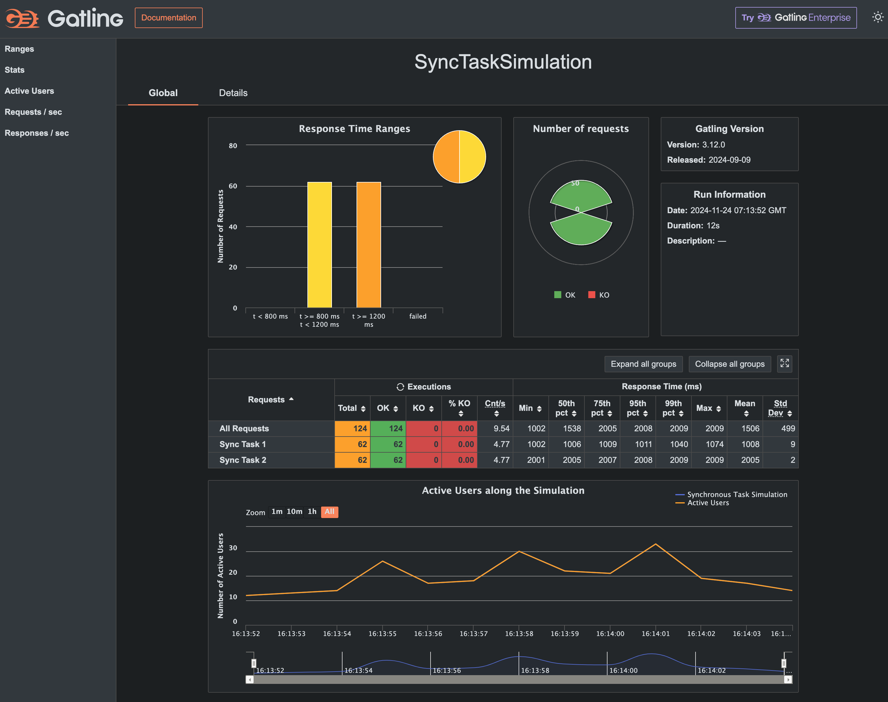
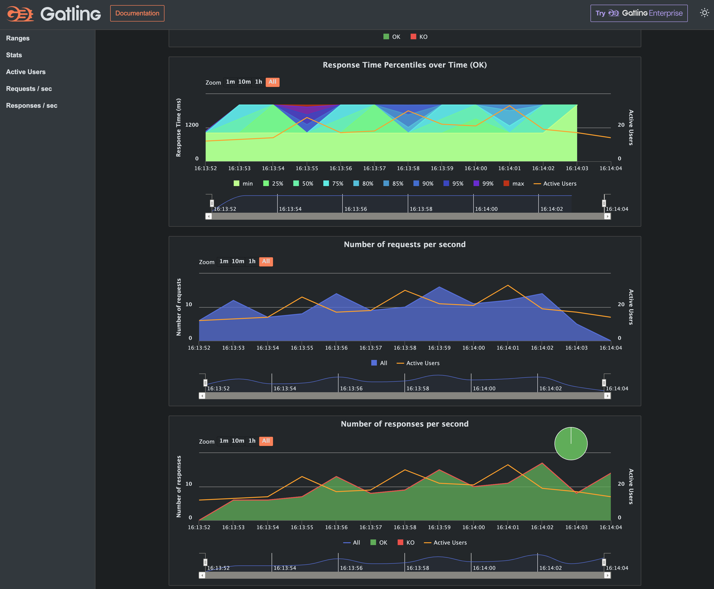
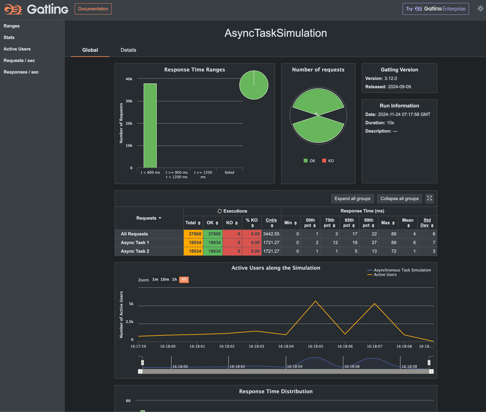
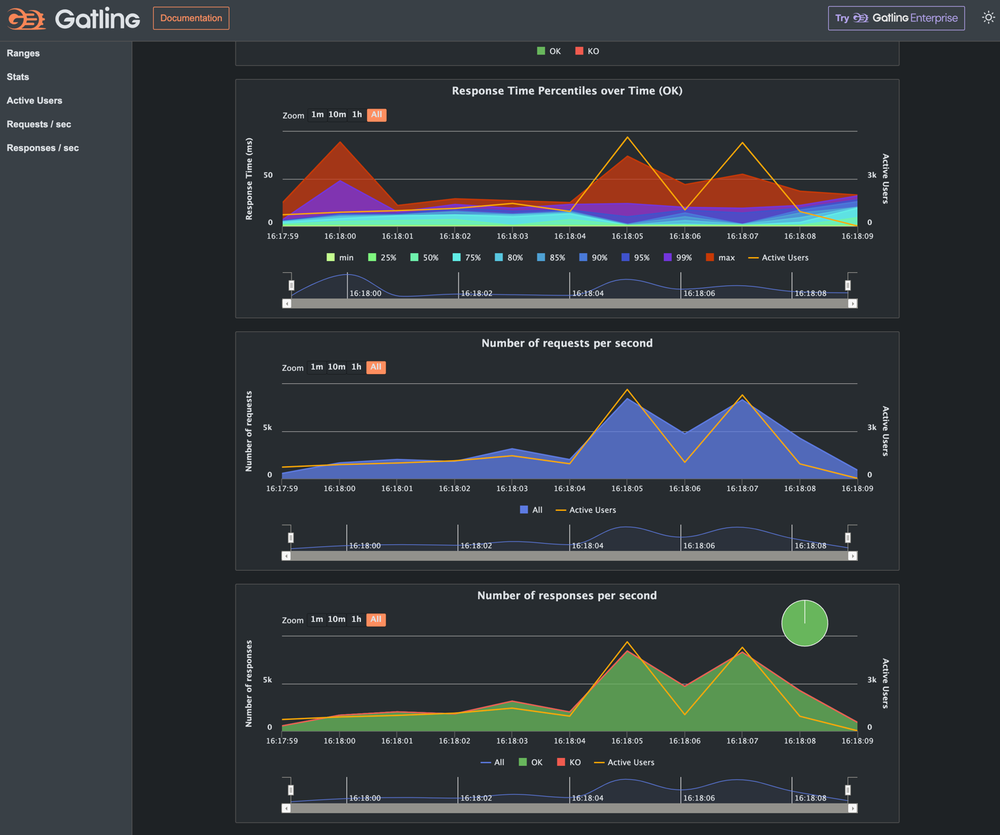

# Gatling Load Testing Tutorial for Kotlin

원본: [github: mdportnov/kotlin-gatling-tutorial](https://github.com/mdportnov/kotlin-gatling-tutorial)

원본에서는 MySQL 를 사용하는 데, 여기서는 편의를 위핸 Testcontainers + MongoDB 를 사용합니다.

This repository contains the code examples and resources for the
article ["Gatling Load Testing Tutorial"](https://medium.com/@mdportnov/stress-testing-with-gatling-kotlin-part-2-1eb13d489dc9),
which provides
an introduction to Gatling, a popular open-source load testing tool for web applications.

### Running the Examples

To run the examples in this repository, you will need to have Gradle installed on your system. Once you have Gradle
installed, you can clone this repository to your local system:

The repository includes several examples of Gatling load testing scenarios, located in the _src/gatling/kotlin_
directory. To run an example, run the following command:

`./gradlew bootRun`

then

`./gradlew gatlingRun`

This will run the Gatling simulation script and generate a report in the build/reports/gatling directory.

### Contributing

If you have suggestions or improvements for the examples in this repository, feel free to submit a pull request. Please
include a description of the changes and the rationale for the changes.

### Resources

For more information on Gatling, see the following resources:

* [Gatling official website](https://gatling.io/)
* [Gatling documentation](https://gatling.io/docs/)
* [Gatling community resources](https://gatling.io/community/)

### Simulation Results

#### Sync Task Simulation

#### Async Task Simulation

