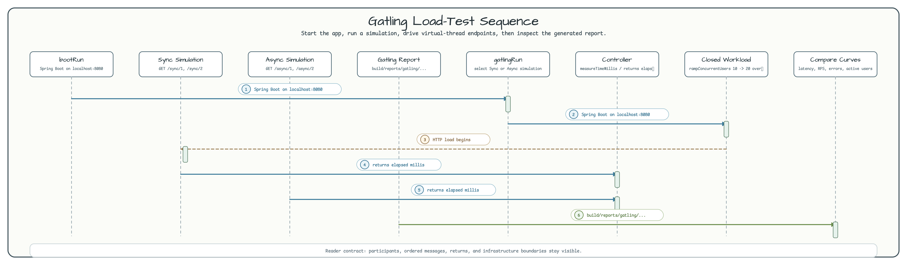

# Gatling Virtual Thread Simulation

[한국어](README.ko.md) | English

## What This Module Shows

This module compares two HTTP endpoints under Gatling load while the Spring Boot
application uses virtual threads:

- `GET /sync/{seconds}` runs a blocking `Thread.sleep(...)` call on the request path.
- `GET /async/{seconds}` delegates the same delay to an `@Async` method backed by a virtual-thread executor.

Both endpoints return the measured elapsed time in milliseconds. The Gatling
simulations call `/sync/1` or `/async/1` and ramp closed concurrent users from
10 to 20 over 10 seconds.
The `{seconds}` path variable is intentionally bounded to 1..10 seconds so a
load-test example cannot create unbounded request-path sleeps.

## Architecture


`TomcatConfig` installs `Executors.newVirtualThreadPerTaskExecutor()` as the
Tomcat protocol handler executor. `AsyncConfig` also exposes Spring's
`applicationTaskExecutor` as a virtual-thread executor and preserves MDC through
`LoggingTaskDecorator`.

## Load-Test Flow



The application must be running on `localhost:8080` before Gatling starts. The
simulation classes live under `src/gatling/kotlin/simulations`.

## Simulation Structure

| Simulation | Endpoint sequence | Injection profile |
|---|---|---|
| `SyncTaskSimulation` | `/sync/1`, `/sync/2` | `rampConcurrentUsers(10).to(20).during(10.seconds)` |
| `AsyncTaskSimulation` | `/async/1`, `/async/2` | `rampConcurrentUsers(10).to(20).during(10.seconds)` |

## Run

Start the Spring Boot application:

```bash
./gradlew :gatling-virtualthread-simulation:bootRun
```

Run all Gatling simulations:

```bash
./gradlew :gatling-virtualthread-simulation:gatlingRun
```

Run one simulation:

```bash
./gradlew :gatling-virtualthread-simulation:gatlingRun --simulation simulations.SyncTaskSimulation
./gradlew :gatling-virtualthread-simulation:gatlingRun --simulation simulations.AsyncTaskSimulation
```

Reports are generated under `build/reports/gatling/`.

## Result Images

### Sync Task Simulation


### Async Task Simulation


## bluetape4k Usage

| Library | Usage |
|---|---|
| `bluetape4k-logging` | `KLogging` in the application, config, controllers, and services |
| `bluetape4k-io` | Available to Gatling source set through the `gatling` configuration |
| `bluetape4k-jackson3` | Spring Boot JSON serialization support |
| `bluetape4k-coroutines` | Test support for suspend-style WebTestClient assertions |
| `bluetape4k-core` | `requireInRange()` validation for bounded delay requests |

## Source References

- `src/main/kotlin/io/bluetape4k/workshop/gatling/config/TomcatConfig.kt`
- `src/main/kotlin/io/bluetape4k/workshop/gatling/config/AsyncConfig.kt`
- `src/main/kotlin/io/bluetape4k/workshop/gatling/controller/SyncTaskController.kt`
- `src/main/kotlin/io/bluetape4k/workshop/gatling/controller/AsyncTaskController.kt`
- `src/main/kotlin/io/bluetape4k/workshop/gatling/validation/DelayRequestValidation.kt`
- `src/main/kotlin/io/bluetape4k/workshop/gatling/web/RequestValidationAdvice.kt`
- `src/gatling/kotlin/simulations/SyncTaskSimulation.kt`
- `src/gatling/kotlin/simulations/AsyncTaskSimulation.kt`

## References

- [Gatling Documentation](https://gatling.io/docs/)
- [Gatling Gradle Plugin](https://docs.gatling.io/reference/extensions/build-tools/gradle-plugin/)
- [Stress Testing with Gatling & Kotlin - Part 2](https://medium.com/@mdportnov/stress-testing-with-gatling-kotlin-part-2-1eb13d489dc9)
