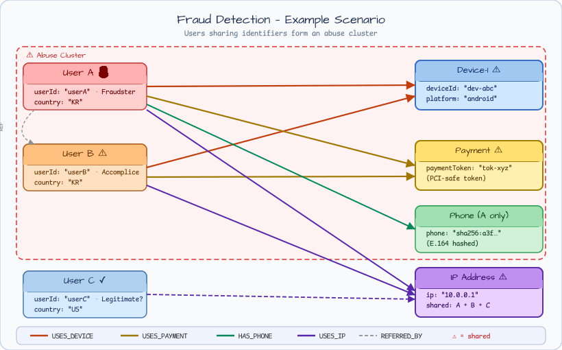
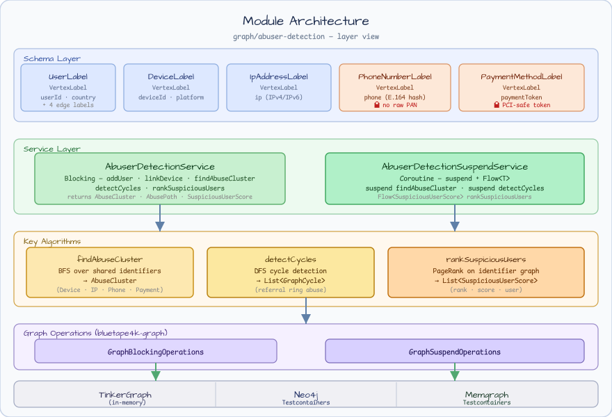
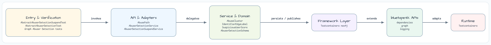

# graph-abuser-detection

[English](README.md) | 한국어

## 흐름 다이어그램

1. `graph-abuser-detection` 예제에 필요한 로컬 런타임을 준비합니다.
2. 예제 시나리오를 담당하는 애플리케이션, 컨트롤러, 서비스 또는 테스트 픽스처를 실행합니다.
3. 반복적인 인프라 처리는 bluetape4k 유틸리티 또는 Spring/Kotlin 통합 기능에 위임합니다.
4. 샘플 출력, HTTP 응답, 저장소 상태, metric, trace 또는 테스트 기대값으로 결과를 검증합니다.

## 시퀀스 다이어그램

핵심 시퀀스는 호출자 또는 테스트 픽스처 -> 워크샵 어댑터 -> bluetape4k 헬퍼/API -> 외부 런타임 또는 인메모리 백엔드 -> 검증/응답 순서입니다. 전용 시퀀스 이미지가 있는 모듈은 아래 이미지가 상호작용 순서를 보여주며, 없는 경우 소스 테스트가 실행 가능한 시퀀스의 기준입니다.

bluetape4k 워크샵 모듈로, 그래프 기반 어뷰저(abuser) 탐지를 시연합니다. 이 모듈은 사용자 계정과 공유 식별자(디바이스, IP 주소, 해시된 전화번호, 결제 토큰)를 연결하는 **신원 그래프(identity graph)**를 구축하고, 그래프 알고리즘을 적용하여 어뷰저 클러스터, 의심스러운 연결 경로, 추천인 루프, PageRank 기반 위험 점수를 탐지합니다.

블로킹 서비스(`AbuserDetectionService`)와 코루틴 서비스(`AbuserDetectionSuspendService`) 두 가지가 제공됩니다. 기본 테스트는 Docker 없이 인-프로세스 TinkerGraph를 사용하며, Neo4j와 Memgraph 통합 테스트는 선택적으로 실행할 수 있습니다.

## 예제 시나리오



동일한 디바이스, 결제 토큰, IP 주소를 공유하는 사용자는 잠재적 어뷰저 클러스터로 탐지됩니다.
위 다이어그램은 User A(사기 행위자)와 User B(공범)가 `Device-1`과 결제 토큰을 공유하는 상황을 보여줍니다.
`findAbuseCluster("userA")` 호출 시 두 사용자를 하나의 클러스터로 반환합니다.
User C는 IP 주소만 공유하며(예: VPN 출구 노드), 클러스터 포함 여부는 별도 판단이 필요합니다.

## 모듈 아키텍처





## 그래프 스키마

### 정점(Vertex)

| 레이블 | 키 프로퍼티 | 기타 프로퍼티 | 비고 |
|---|---|---|---|
| `User` | `userId` (불투명 문자열 / UUID) | `country` (ISO-3166-1 alpha-2) | 주 엔티티 |
| `Device` | `deviceId` (디바이스 핑거프린트) | `platform` (`"android"`, `"ios"`, `"web"`) | |
| `IpAddress` | `ip` (IPv4 또는 IPv6) | — | |
| `PhoneNumber` | `phone` (E.164 SHA-256 hex 해시) | — | 원본 전화번호 저장 금지 |
| `PaymentMethod` | `paymentToken` (결제 프로세서 토큰) | — | 원본 PAN / CVV 저장 금지 |

### 엣지(Edge)

| 레이블 | From | To | 프로퍼티 | 비고 |
|---|---|---|---|---|
| `USES_DEVICE` | `User` | `Device` | `occurredAt` (ISO-8601) | 최초 로그인 시각 |
| `USES_IP` | `User` | `IpAddress` | `occurredAt` (ISO-8601) | 최초 접속 시각 |
| `HAS_PHONE` | `User` | `PhoneNumber` | `occurredAt` (ISO-8601) | 최초 연결 시각 |
| `USES_PAYMENT` | `User` | `PaymentMethod` | `occurredAt` (ISO-8601) | 최초 결제 시도 시각 |
| `REFERRED_BY` | `User` | `User` | `occurredAt` (ISO-8601) | 추천 관계 (추천인 → 피추천인); 클러스터 BFS 탐색에서 제외 |

네 가지 식별자 엣지 타입(`USES_DEVICE`, `USES_IP`, `HAS_PHONE`, `USES_PAYMENT`)은 `IdentifierEdgeLabel`에 타입 안전 값으로 정의되어 있습니다. `REFERRED_BY`는 `IdentifierEdgeLabel.all`에서 의도적으로 제외됩니다 — 추천 관계만으로는 공유 신원을 의미하지 않습니다.

## 핵심 알고리즘

| 메서드 | 설명 |
|---|---|
| `findAbuseCluster(seedUserId)` | 시드 사용자로부터 식별자 엣지를 따라 BFS 탐색하고, 각 식별자 정점에서 역방향으로 연결된 사용자를 수집합니다. 시드 사용자를 제외한 공유 사용자 목록과 공유 식별자 정점을 담은 `AbuseCluster`를 반환합니다. |
| `explainSuspicion(userId)` | 사용자의 모든 식별자 연결 경로를 반환합니다. 블로킹 서비스는 `List<AbusePath>`, 코루틴 서비스는 cold `Flow<AbusePath>`를 반환합니다. 각 `AbusePath`에는 대상 식별자 정점 ID와 엣지 타입이 포함됩니다. |
| `detectReferralLoops(maxDepth, maxCycles)` | `REFERRED_BY` 서브그래프 내 User 정점 사이의 방향성 사이클을 탐지합니다. 블로킹 서비스는 `List<GraphCycle>`, 코루틴 서비스는 cold `Flow<GraphCycle>`을 반환합니다. |
| `rankSuspiciousUsers(limit)` | User 정점에 대해 PageRank를 계산하고 점수 내림차순으로 결과를 반환합니다. 각 `SuspiciousUserScore`에는 1-based 순위가 포함됩니다. PageRank 점수가 높을수록 공유 식별자 연결이 많다는 의미이며, 이는 어뷰징 위험의 지표가 됩니다. |

### 결과 타입

```kotlin
// 공유 식별자로 연결된 사용자 클러스터
data class AbuseCluster(
    val seedUserId: GraphElementId,
    val users: List<GraphVertex>,            // 시드 사용자 제외
    val sharedIdentifiers: List<GraphVertex> // Device/IpAddress/PhoneNumber/PaymentMethod 정점
)

// 사용자와 공유 식별자 정점 사이의 단일 연결 경로
data class AbusePath(
    val identifierVertexId: GraphElementId,
    val edgeLabel: IdentifierEdgeLabel       // USES_DEVICE | USES_IP | HAS_PHONE | USES_PAYMENT
)

// PageRank 기반 위험 순위 항목
data class SuspiciousUserScore(
    val user: GraphVertex,
    val score: Double,   // 원시 PageRank 값; 높을수록 더 의심스러움
    val rank: Int        // 1-based 순위
)
```

## 사용 예시

### 블로킹 서비스

```kotlin
val service = AbuserDetectionService(ops, graphName = "fraud_graph")
service.initialize()

// 정점 추가 (도메인 키로 find-or-create)
val userV   = service.addUser("u-alice", "KR")
val deviceV = service.addDevice("fp-aabbcc", "android")
val ipV     = service.addIpAddress("203.0.113.42")

// 정점 연결
service.linkDevice(userV.id, deviceV.id, Instant.now().toString())
service.linkIp(userV.id, ipV.id, Instant.now().toString())

// 어뷰저 클러스터 탐지
val cluster = service.findAbuseCluster(userV.id)
if (cluster.users.isNotEmpty()) {
    println("클러스터 크기: ${cluster.users.size}")
}

// 사용자 의심 경로 조회
val paths = service.explainSuspicion(userV.id)
paths.forEach { println("${it.edgeLabel.value} -> ${it.identifierVertexId}") }

// 추천인 사기 루프 탐지 (기본값: maxDepth=6, maxCycles=100)
val loops = service.detectReferralLoops()

// PageRank 기반 위험 순위
val top10 = service.rankSuspiciousUsers(limit = 10)
top10.forEach { println("#${it.rank} ${it.user.id} score=${it.score}") }
```

### 코루틴 서비스

```kotlin
val service = AbuserDetectionSuspendService(ops, graphName = "fraud_graph")
service.initialize()

val userV  = service.addUser("u-bob", "US")
val phoneV = service.addPhoneNumber(sha256hex("+11234567890"))  // 저장 전 반드시 해시 처리
val payV   = service.addPaymentMethod("tok_stripe_xxxx")       // 결제 프로세서 토큰만 허용

service.linkPhone(userV.id, phoneV.id, Instant.now().toString())
service.linkPayment(userV.id, payV.id, Instant.now().toString())

val cluster = service.findAbuseCluster(userV.id)

// explainSuspicion은 cold Flow 반환
service.explainSuspicion(userV.id).collect { path ->
    println("${path.edgeLabel.value} -> ${path.identifierVertexId}")
}

// detectReferralLoops는 cold Flow 반환
service.detectReferralLoops(maxDepth = 4).collect { cycle ->
    println("루프: ${cycle.vertices.map { it.id }}")
}

// rankSuspiciousUsers는 cold Flow 반환
service.rankSuspiciousUsers(limit = 5).collect { score ->
    println("#${score.rank} score=${score.score}")
}
```

## 보안 유의사항

- **전화번호** — `addPhoneNumber` 호출 전 호출자가 반드시 E.164 형식의 SHA-256 hex 해시로 변환해야 합니다. 원본 전화번호를 그래프에 저장해서는 안 됩니다.
- **결제 정보** — `addPaymentMethod`에는 PCI-safe 결제 프로세서 토큰(예: Stripe/Braintree 토큰)만 전달해야 합니다. 원본 PAN, 유효기간, CVV는 절대 저장해서는 안 됩니다.

## 테스트 백엔드

| 백엔드 | 스코프 | 요구사항 |
|---|---|---|
| TinkerGraph | `test` (기본) | 없음 — 인-프로세스 실행, 외부 의존성 불필요 |
| Neo4j | `integrationTest` | Docker (`bluetape4k-testcontainers` Neo4j 런처 사용) |
| Memgraph | `integrationTest` | Docker (`bluetape4k-testcontainers` Memgraph 런처 사용) |

`test` 태스크는 `@Tag("integration")`으로 표시된 테스트를 제외합니다. `integrationTest` 태스크는 해당 태그가 붙은 테스트만 실행하며, Docker가 실행 중이어야 합니다.

## 테스트 실행

```bash
# 기본 테스트 — TinkerGraph만 사용, Docker 불필요
./gradlew :graph-abuser-detection:test

# 통합 테스트 — Neo4j + Memgraph (Docker 필요)
./gradlew :graph-abuser-detection:integrationTest

# 전체 테스트
./gradlew :graph-abuser-detection:test :graph-abuser-detection:integrationTest

# 특정 테스트 클래스 실행
./gradlew :graph-abuser-detection:test \
  --tests "io.bluetape4k.workshop.graph.abuser.service.AbuserDetectionServiceTest"
```

## 패키지 구조

```
io.bluetape4k.workshop.graph.abuser
├── model
│   ├── AbuseCluster.kt          — 공유 식별자로 연결된 사용자 클러스터 결과
│   ├── AbusePath.kt             — 사용자-식별자 단일 연결 경로
│   ├── IdentifierEdgeLabel.kt   — 네 가지 식별자 엣지 타입의 타입 안전 열거
│   └── SuspiciousUserScore.kt   — 단일 사용자의 PageRank 결과
├── schema
│   └── AbuserDetectionSchema.kt — 정점 레이블(User, Device, IpAddress, PhoneNumber, PaymentMethod)
│                                   및 엣지 레이블(USES_DEVICE, USES_IP, HAS_PHONE, USES_PAYMENT, REFERRED_BY)
└── service
    ├── AbuserDetectionService.kt        — 블로킹 구현 (GraphOperations)
    └── AbuserDetectionSuspendService.kt — 코루틴 구현 (GraphSuspendOperations + Flow)
```
