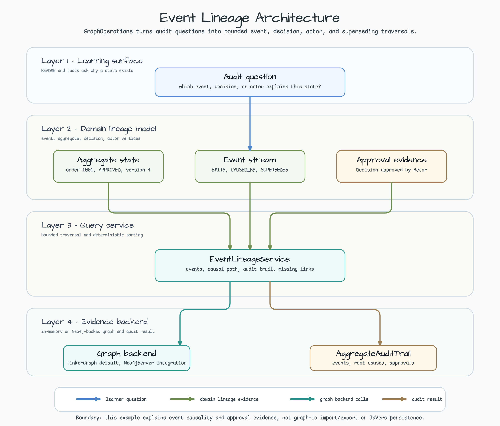
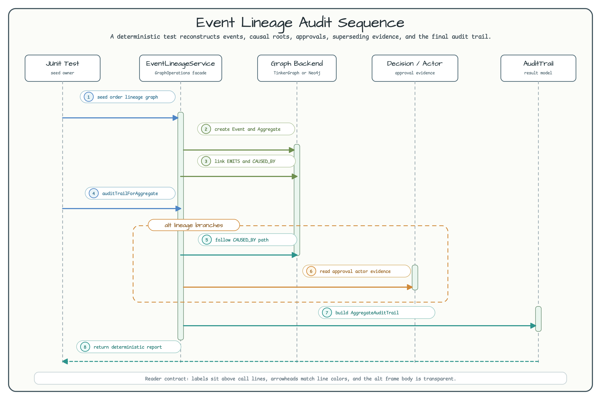

# graph-event-lineage

[한국어](README.ko.md) | English

## Architecture

This module demonstrates business event lineage with `bluetape4k-graph`.
Default tests use in-memory TinkerGraph for fast feedback, and the integration
test uses `bluetape4k-testcontainers` `Neo4jServer` to prove the same
`GraphOperations` contract against a real graph database. The example models
aggregate state, emitted domain events, approval decisions, and actors as graph
vertices, then reconstructs the audit trail that explains why an aggregate
reached its current state.

> **Related issue:** [bluetape4k-workshop #330](https://github.com/bluetape4k/bluetape4k-workshop/issues/330)



SVG source: [graph-event-lineage-readme-architecture-01.svg](../../docs/images/readme-diagrams/graph-event-lineage-readme-architecture-01.svg)

## Overview

The example answers a learner-facing question: when does a graph explain an
audit trail better than a row-by-row audit table?

It shows how to:

- represent `Event`, `Aggregate`, `Decision`, and `Actor` vertices;
- connect events with `EMITS`, `CAUSED_BY`, `APPROVED_BY`, `DECIDED_BY`, and
  `SUPERSEDES` edges;
- reconstruct a deterministic aggregate audit trail from graph structure;
- follow a bounded causal path from a current event back to a root event;
- identify emitted events that are missing causal or superseding evidence;
- keep the default workshop path fast with TinkerGraph while validating the same
  service against Neo4j through `Neo4jServer`.



SVG source: [graph-event-lineage-readme-sequence-01.svg](../../docs/images/readme-diagrams/graph-event-lineage-readme-sequence-01.svg)

## Graph Lineage vs Audit Tables

| Approach | Best at | Tradeoff |
|---|---|---|
| Ordinary audit table | Recording field-level before/after values in time order | Harder to answer "which event caused this state" across aggregates or decisions |
| JaVers-style object history | Explaining object snapshots and property diffs | Great for persistence history, but not a graph of cross-event causality by itself |
| Event lineage graph | Explaining cause, approval, superseding, and impact paths | Requires explicit relationship modeling and bounded traversal rules |

Use this module when the learning goal is why a state exists, which upstream
event caused it, which decision approved it, or which newer event superseded an
older one. Use ordinary audit tables or JaVers examples when the lesson is
object history, persistence snapshots, or field-level diffs.

## Domain Model

### Vertices

| Label | Key property | Other properties | Meaning |
|---|---|---|---|
| `Event` | `eventId` | `type`, `occurredAt`, `summary` | Immutable business fact |
| `Aggregate` | `aggregateId` | `aggregateType`, `state`, `version` | Current aggregate state being explained |
| `Decision` | `decisionId` | `decisionType`, `status`, `reason` | Explicit approval or review outcome |
| `Actor` | `actorId` | `displayName`, `role` | Human or system that made a decision |

### Edges

| Label | From | To | Question answered |
|---|---|---|---|
| `EMITS` | `Aggregate` | `Event` | Which events belong to this aggregate audit stream? |
| `CAUSED_BY` | `Event` | upstream `Event` | Which earlier event caused this event? |
| `APPROVED_BY` | `Event` | `Decision` | Which decision approved this state transition? |
| `DECIDED_BY` | `Decision` | `Actor` | Who or what made the decision? |
| `SUPERSEDES` | `Event` | previous `Event` | Which newer event corrected or replaced an older event? |

## Core Queries

| Method | Description |
|---|---|
| `eventsForAggregate(aggregateId)` | Returns emitted events sorted by `occurredAt`, then `eventId`. |
| `causalPath(eventId, rootEventId, maxDepth)` | Follows `CAUSED_BY` edges from a current event to a root event with a depth bound. |
| `auditTrailForAggregate(aggregateId)` | Reconstructs aggregate state, emitted events, root causes, and approval evidence. |
| `supersededChain(eventId)` | Follows `SUPERSEDES` from newest event to previous events. |
| `missingCausalLinks(aggregateId)` | Finds emitted events without root-cause, causal, or superseding evidence. |

Unknown IDs return empty results. Blank IDs fail fast with bluetape4k validation
helpers.

## Usage

```kotlin
import io.bluetape4k.graph.tinkerpop.TinkerGraphOperations
import io.bluetape4k.workshop.graph.eventlineage.service.EventLineageService

TinkerGraphOperations().use { ops ->
    val service = EventLineageService(ops, graphName = "order_lineage")
    service.initialize()

    val order = service.addAggregate("order-1001", "Order", "APPROVED", version = 4)
    val created = service.addEvent(
        eventId = "order-created",
        type = "OrderCreated",
        occurredAt = "2026-07-02T01:00:00Z",
        summary = "Customer submitted the order.",
    )
    val approved = service.addEvent(
        eventId = "order-approved",
        type = "OrderApproved",
        occurredAt = "2026-07-02T01:04:00Z",
        summary = "Order moved to approved state.",
    )

    service.emit(order.id, created.id)
    service.emit(order.id, approved.id)
    service.causedBy(approved.id, created.id)

    val path = service.causalPath("order-approved", "order-created")
    val trail = service.auditTrailForAggregate("order-1001")

    println(path.nodes.map { it.nodeId })
    println(trail.events.map { it.nodeId })
}
```

## Running Tests

```bash
./gradlew :graph-event-lineage:test
./gradlew :graph-event-lineage:integrationTest
```

The default `test` task uses TinkerGraph only and does not require Docker. The
`integrationTest` task uses `Neo4jServer.Launcher.neo4j` from
`bluetape4k-testcontainers`, so it requires Docker.

## Dependencies

```kotlin
dependencies {
    implementation(libs.bluetape4k.graph.core)
    implementation(libs.bluetape4k.graph.tinkerpop)
    compileOnly(libs.bluetape4k.graph.neo4j)
    implementation(libs.bluetape4k.logging)

    testImplementation(libs.bluetape4k.testcontainers)
    testImplementation(libs.testcontainers.neo4j)
}
```

bluetape4k versions are governed by the repository-level
`bluetape4k-dependencies` platform. This consumer workshop module declares
versionless aliases only and does not import an individual graph BOM.

## Package Structure

```text
io.bluetape4k.workshop.graph.eventlineage
├── model
│   └── AuditTrail.kt           - LineageNode, LineagePath, ApprovalEvidence, AggregateAuditTrail
├── schema
│   └── EventLineageSchema.kt   - Event, Aggregate, Actor, Decision labels and lineage edges
└── service
    └── EventLineageService.kt  - GraphOperations-based mutation and audit queries
```

## See Also

- [bluetape4k-graph](https://github.com/bluetape4k/bluetape4k-graph) - graph library source
- [graph-io-pipeline](../io-pipeline/README.md) - import/export adapter example
- [graph-knowledge-graph](../knowledge-graph/README.md) - heterogeneous graph model example
- [exposed-javers-approval-workflow](../../exposed/javers-approval-workflow/README.md) - JaVers approval history example
- [bluetape4k-workshop #330](https://github.com/bluetape4k/bluetape4k-workshop/issues/330) - tracking issue
