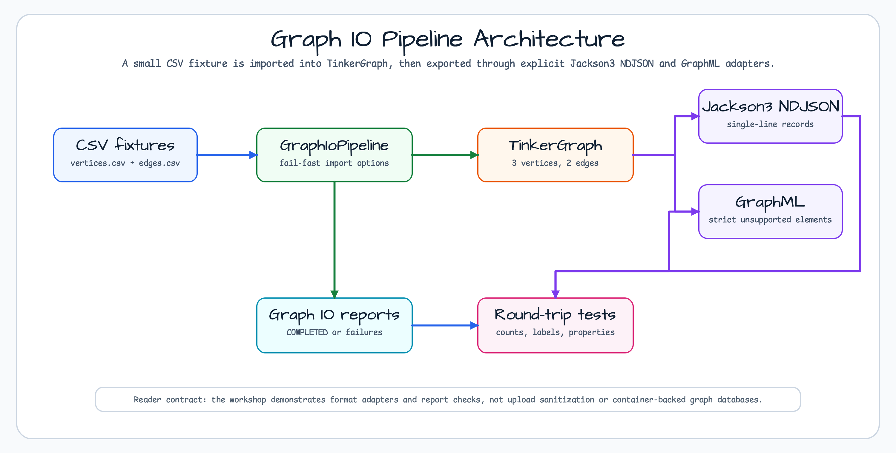
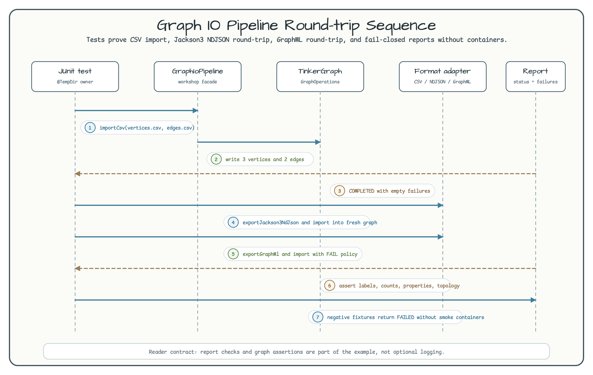

# graph-io-pipeline

[한국어](README.ko.md) | English

## Architecture

This module demonstrates the `bluetape4k-graph` graph-io import/export adapters
with a small, deterministic TinkerGraph pipeline. It is intentionally container
free: the smoke path reads local CSV fixtures, writes a TinkerGraph through
`GraphOperations`, exports Jackson 3 NDJSON and GraphML, then imports each file
into a fresh TinkerGraph and checks the resulting reports.

> **Related issue:** [bluetape4k-workshop #287](https://github.com/bluetape4k/bluetape4k-workshop/issues/287)



SVG source: [graph-io-pipeline-readme-architecture-01.svg](../../docs/images/readme-diagrams/graph-io-pipeline-readme-architecture-01.svg)

## Overview

The example answers a narrow learning question: when should a workshop seed a
graph through graph-io adapters instead of hard-coded TinkerGraph calls?

It shows how to:

- import paired CSV vertex and edge files with `CsvGraphBulkImporter`;
- preserve the original fixture ids in `_graphIoExternalId`;
- export the imported graph through `Jackson3NdJsonBulkExporter` and `GraphMlBulkExporter`;
- import NDJSON and GraphML into fresh `TinkerGraphOperations` instances;
- assert `GraphIoStatus.COMPLETED`, empty `failures`, vertex and edge counts,
  labels, properties, and topology;
- keep generated files inside JUnit `@TempDir`.



SVG source: [graph-io-pipeline-readme-sequence-01.svg](../../docs/images/readme-diagrams/graph-io-pipeline-readme-sequence-01.svg)

## Adapter Decision Table

| Adapter | Input shape | Best use case | Class / format | Strengths | Limitations and cautions | Dependency status | When not to use |
|---------|-------------|---------------|----------------|-----------|--------------------------|-------------------|-----------------|
| CSV | Paired `vertices.csv` + `edges.csv` files | Small deterministic fixtures and spreadsheet-friendly samples | `CsvGraphBulkImporter`, `GraphIoFormat.CSV` | Easy to inspect, simple fixture diffs, explicit endpoint columns | No filename-extension auto-detection; text-heavy values are safest; paired-file shape is different from single-stream formats | Used by this module | Avoid for arbitrary upload endpoints or rich typed property round-trips |
| Jackson3 NDJSON | One line-delimited JSON stream | Machine-friendly export/import tests and appendable local artifacts | `Jackson3NdJsonBulkExporter`, `Jackson3NdJsonBulkImporter`, `GraphIoFormat.NDJSON_JACKSON3` | Single file, compact, friendly to diff and streaming tools | Callers still own path validation, stream ownership, and atomic-write policy | Used by this module | Avoid when a GraphML interchange file is required |
| GraphML | One XML document | Interchange with tools that understand GraphML | `GraphMlBulkExporter`, `GraphMlBulkImporter`, `GraphIoFormat.GRAPHML` | Standard-looking graph document, readable keys and labels | This example uses `UnsupportedGraphMlElementPolicy.FAIL`; `port`, nested graph, hyperedge, and other unsupported constructs fail closed; trusted local/exported files only | Used by this module | Avoid for untrusted upload sanitization or unsupported GraphML dialects |
| Okio-backed streams | Okio source/sink wrappers around graph-io streams | Custom filesystem, buffering, or compression boundaries around graph-io | `bluetape4k-graph-io-okio` bridge APIs | Useful when the caller already owns Okio stream composition | CSV + Okio is a stream bridge, not a high-level compression/encryption policy; callers own stream closing and atomic writes | Documented only; not imported here | Avoid adding it to a smoke example unless source code actually uses Okio APIs |

## Report Semantics

All graph-io methods return reports. Treat the report as the contract, not as a
log message.

- `COMPLETED` with empty `failures`: the workshop happy path.
- `PARTIAL`: some records were skipped according to options; this example does
  not accept partial imports as success.
- `FAILED`: import/export stopped at an error. Failure details are diagnostics
  for maintainers; do not return them verbatim from public endpoints.

The NDJSON and GraphML files exported by this module include graph properties,
including the intentional `_graphIoExternalId` property. Backend-generated graph
ids are not stable across round trips, so tests compare labels, `code` values,
counts, and edge topology instead.

## Usage

### CSV import

```kotlin
import io.bluetape4k.graph.io.report.GraphIoStatus
import io.bluetape4k.graph.tinkerpop.TinkerGraphOperations
import io.bluetape4k.workshop.graph.io.GraphIoPipeline
import java.nio.file.Path

TinkerGraphOperations().use { operations ->
    val pipeline = GraphIoPipeline(operations)
    val report = pipeline.importCsv(
        vertices = Path.of("src/test/resources/graph-io-pipeline/vertices.csv"),
        edges = Path.of("src/test/resources/graph-io-pipeline/edges.csv"),
    )

    check(report.status == GraphIoStatus.COMPLETED)
    check(report.failures.isEmpty())
}
```

### Jackson 3 NDJSON round trip

```kotlin
import io.bluetape4k.graph.io.report.GraphIoStatus
import io.bluetape4k.graph.tinkerpop.TinkerGraphOperations
import io.bluetape4k.workshop.graph.io.GraphIoPipeline
import java.nio.file.Path

val ndjson = Path.of("build/graph-io-pipeline/graph.ndjson")
val vertices = Path.of("src/test/resources/graph-io-pipeline/vertices.csv")
val edges = Path.of("src/test/resources/graph-io-pipeline/edges.csv")

TinkerGraphOperations().use { sourceOps ->
    val source = GraphIoPipeline(sourceOps)
    val seedReport = source.importCsv(vertices, edges)
    check(seedReport.status == GraphIoStatus.COMPLETED)
    check(seedReport.failures.isEmpty())

    val exportReport = source.exportJackson3NdJson(ndjson)
    check(exportReport.status == GraphIoStatus.COMPLETED)
    check(exportReport.failures.isEmpty())
}

TinkerGraphOperations().use { targetOps ->
    val importReport = GraphIoPipeline(targetOps).importJackson3NdJson(ndjson)
    check(importReport.status == GraphIoStatus.COMPLETED)
    check(importReport.failures.isEmpty())
}
```

### GraphML round trip

```kotlin
import io.bluetape4k.graph.io.report.GraphIoStatus
import io.bluetape4k.graph.tinkerpop.TinkerGraphOperations
import io.bluetape4k.workshop.graph.io.GraphIoPipeline
import java.nio.file.Path

val graphml = Path.of("build/graph-io-pipeline/graph.graphml")
val vertices = Path.of("src/test/resources/graph-io-pipeline/vertices.csv")
val edges = Path.of("src/test/resources/graph-io-pipeline/edges.csv")

TinkerGraphOperations().use { sourceOps ->
    val source = GraphIoPipeline(sourceOps)
    val seedReport = source.importCsv(vertices, edges)
    check(seedReport.status == GraphIoStatus.COMPLETED)
    check(seedReport.failures.isEmpty())

    val exportReport = source.exportGraphMl(graphml)
    check(exportReport.status == GraphIoStatus.COMPLETED)
    check(exportReport.failures.isEmpty())
}

TinkerGraphOperations().use { targetOps ->
    val importReport = GraphIoPipeline(targetOps).importGraphMl(graphml)
    check(importReport.status == GraphIoStatus.COMPLETED)
    check(importReport.failures.isEmpty())
}
```

## Migration From Manual TinkerGraph Seeds

Existing graph workshop modules remain domain traversal examples: they teach
schema, repository calls, traversal behavior, and backend differences.
`graph-io-pipeline` is different. Use it when the lesson is repeatable fixture
import/export, adapter choice, and report checking.

Do not use this module as an upload endpoint template. GraphML and NDJSON imports
are trusted local workshop examples, not sanitizers. Validate, sandbox, size
limit, and audit untrusted files before passing them to graph-io.

## Running Tests

```bash
./gradlew :graph-io-pipeline:test
```

The smoke path uses TinkerGraph and local files only. It does not require Docker,
Testcontainers, Neo4j, Memgraph, or PostgreSQL.

## Dependencies

```kotlin
dependencies {
    implementation(libs.bluetape4k.graph.core)
    implementation(libs.bluetape4k.graph.tinkerpop)
    implementation(libs.bluetape4k.graph.io.core)
    implementation(libs.bluetape4k.graph.io.csv)
    implementation(libs.bluetape4k.graph.io.graphml)
    implementation(libs.bluetape4k.graph.io.jackson3)
}
```

bluetape4k versions are governed by the repository-level
`bluetape4k-dependencies` platform. This consumer workshop module declares
versionless aliases only and does not import an individual graph BOM.

## See Also

- [bluetape4k-graph](https://github.com/bluetape4k/bluetape4k-graph) — graph library source
- [graph-social-network](../social-network/README.md) — traversal-focused social graph example
- [graph-knowledge-graph](../knowledge-graph/README.md) — heterogeneous graph model example
- [bluetape4k-workshop #287](https://github.com/bluetape4k/bluetape4k-workshop/issues/287) — tracking issue
