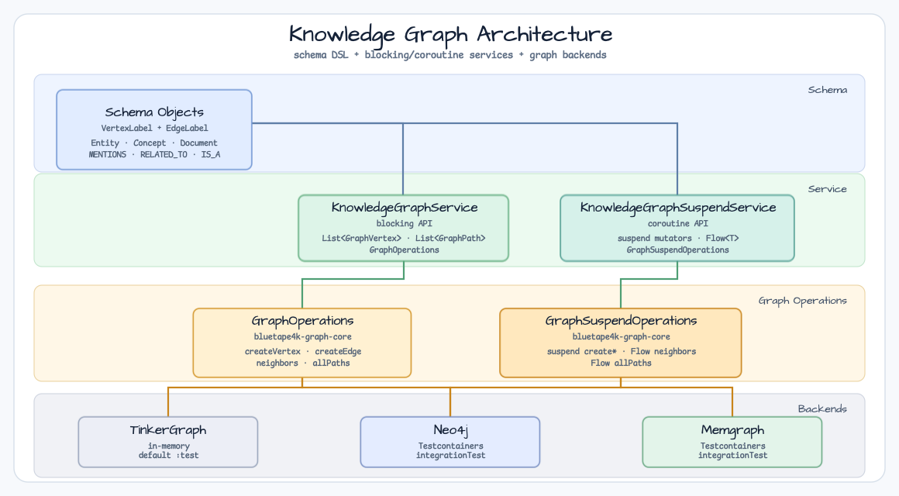
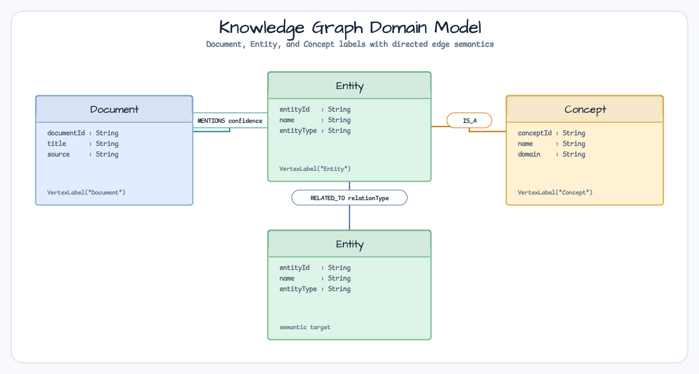
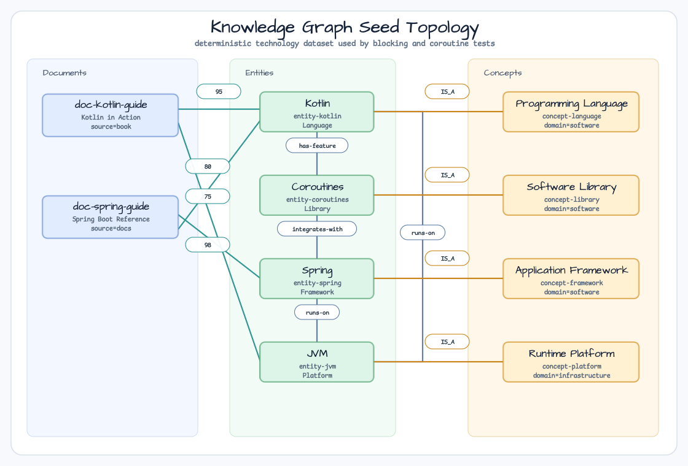

# graph-knowledge-graph

[bluetape4k-graph](https://github.com/bluetape4k/bluetape4k-graph) 라이브러리를 활용한 지식 그래프(knowledge graph) 구축 및 탐색 예제입니다.

> **관련 이슈:** [bluetape4k-workshop #11](https://github.com/bluetape4k/bluetape4k-workshop/issues/11)

[English](README.md) | 한국어

## 개요

이 모듈은 프로그래밍 언어, 프레임워크, 라이브러리, 런타임 플랫폼, 그리고 이들을 참조하는 문서를 모델링한 **기술 지식 그래프**를 구현합니다.

주요 학습 내용:

- `VertexLabel` / `EdgeLabel` 스키마 DSL로 이종 엔티티 타입 모델링
- 문서가 어떤 엔티티를 언급하는지 기록 (`MENTIONS` 엣지 + confidence 점수)
- 엔티티 간 의미 관계 표현 (`RELATED_TO` 엣지 + relationType)
- 엔티티를 어휘 개념으로 분류 (`IS_A` 엣지)
- 설정 가능한 hop 깊이로 그래프 탐색
- 두 엔티티 사이의 연관 경로 추론 (깊이/건수 제한)
- 동일한 서비스 로직을 여러 그래프 백엔드(TinkerGraph, Neo4j, Memgraph)에서 실행

## 아키텍처



## 도메인 모델

시드 그래프는 **기술 도메인** 시나리오를 사용합니다:



### 버텍스 타입

| Label    | 키 프로퍼티 | 예시 값 |
|----------|------------|---------|
| Entity   | entityId   | Kotlin, Spring, JVM, Coroutines |
| Concept  | conceptId  | Programming Language, Framework, Library, Platform |
| Document | documentId | "Kotlin in Action", "Spring Boot Reference" |

### 엣지 타입

| Label      | 방향 | 프로퍼티 | 의미 |
|------------|------|---------|------|
| MENTIONS   | Doc → Entity | confidence (0–100) | 문서가 엔티티를 언급 |
| RELATED_TO | Entity → Entity | relationType | 의미 관계 |
| IS_A       | Entity → Concept | — | 엔티티가 개념으로 분류됨 |

### 시드 토폴로지



## 핵심 기능

### 엔티티/개념/문서 관리

```kotlin
val service = KnowledgeGraphService(ops, "knowledge_graph")
service.initialize()

val paper = service.addDocument("doc-1", "Graph API Guide", "docs")
val kotlin = service.addEntity("entity-kotlin", "Kotlin", "Language")
val language = service.addConcept("concept-language", "Programming Language", "software")

service.mention(paper.id, kotlin.id, confidence = 95)
service.classify(kotlin.id, language.id)
```

### 그래프 탐색

```kotlin
// 문서가 어떤 엔티티를 언급하는가?
val mentioned = service.findMentionedEntities(paper.id)

// Kotlin과 관련된 엔티티는? (최대 2홉)
val related = service.findRelatedEntities(kotlin.id, depth = 2)

// Kotlin이 속한 개념은?
val concepts = service.findConceptsForEntity(kotlin.id)

// Kotlin에서 Spring까지의 관계 경로는?
val paths = service.inferRelationshipPaths(kotlin.id, spring.id, maxDepth = 3, maxPaths = 5)
```

### 코루틴 변형

```kotlin
val service = KnowledgeGraphSuspendService(ops, "knowledge_graph")
service.initialize()

val mentioned: Flow<GraphVertex> = service.findMentionedEntities(paper.id)
val related: Flow<GraphVertex> = service.findRelatedEntities(kotlin.id, depth = 2)
val paths: Flow<GraphPath> = service.inferRelationshipPaths(kotlin.id, spring.id)
```

## 지원 백엔드

| 백엔드      | 클래스                         | Docker 필요 | Gradle 태스크 |
|-------------|-------------------------------|------------|--------------|
| TinkerGraph | `TinkerGraphOperations`       | 불필요      | `test`       |
| Neo4j       | `Neo4jGraphOperations`        | 필요        | `integrationTest` |
| Memgraph    | `MemgraphGraphOperations`     | 필요        | `integrationTest` |

## 테스트 실행

```bash
# 기본 테스트 — TinkerGraph만 (Docker 불필요)
./gradlew :graph-knowledge-graph:test

# 통합 테스트 — Docker 필요 (Neo4j + Memgraph)
./gradlew :graph-knowledge-graph:integrationTest
```

## 의존성

```kotlin
// build.gradle.kts
dependencies {
    implementation(libs.bluetape4k.graph.core)
    implementation(libs.bluetape4k.graph.tinkerpop)
    compileOnly(libs.bluetape4k.graph.neo4j)
    compileOnly(libs.bluetape4k.graph.memgraph)
}
```

## 관련 문서

- [bluetape4k-graph](https://github.com/bluetape4k/bluetape4k-graph) — 그래프 라이브러리 소스
- [graph-social-network](../social-network/README.ko.md) — 소셜 네트워크 예제
- [graph-abuser-detection](../abuser-detection/README.ko.md) — 어뷰저 탐지 예제
- [bluetape4k-workshop #11](https://github.com/bluetape4k/bluetape4k-workshop/issues/11) — 추적 이슈
