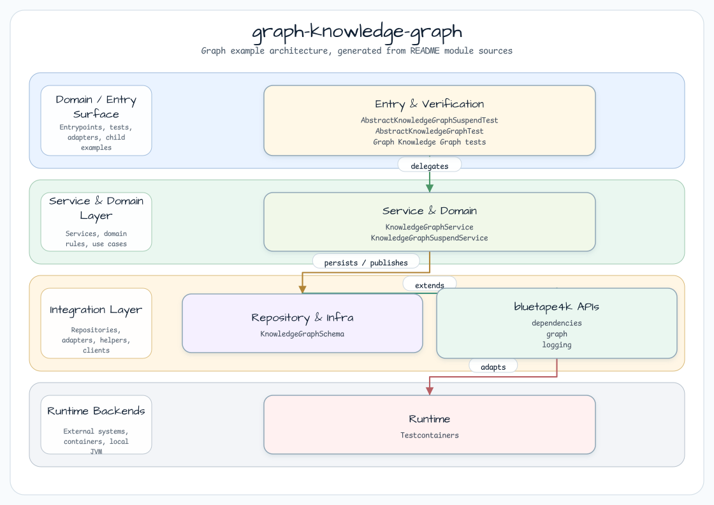
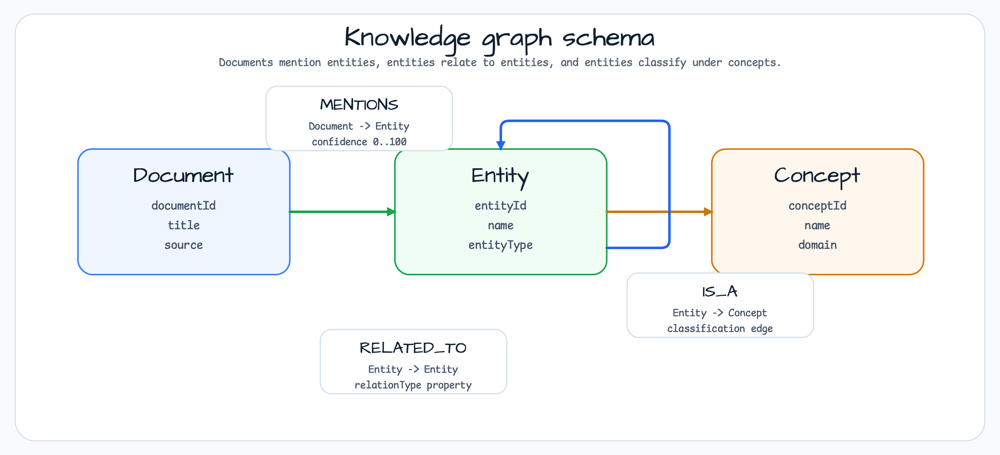
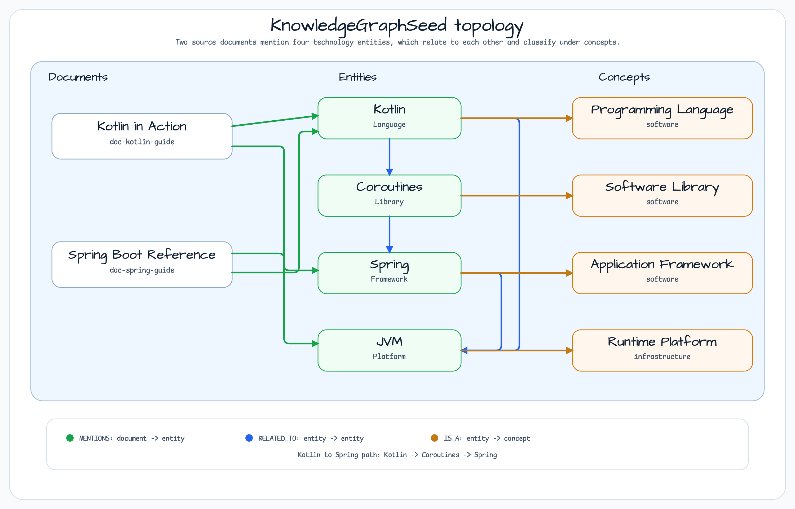

# graph-knowledge-graph

[한국어](README.ko.md) | English

## Architecture

This module demonstrates knowledge graph construction and traversal with
the [bluetape4k-graph](https://github.com/bluetape4k/bluetape4k-graph) library. It exposes the
same graph model through blocking and coroutine services, then runs the same service logic against
TinkerGraph, Neo4j, and Memgraph backends.

Both services validate graph endpoints with the released
`io.bluetape4k.graph.repository.requireEndpoint` extension. Missing vertices and
label mismatches fail fast with `IllegalArgumentException` while preserving the
caller parameter name in the validation message.

> **Related issue:** [bluetape4k-workshop #11](https://github.com/bluetape4k/bluetape4k-workshop/issues/11)



## Overview

This module models a **technology knowledge graph** covering programming languages,
frameworks, libraries, runtime platforms, and the documents that reference them.

It shows how to:

- Model heterogeneous entity types with `VertexLabel` and `EdgeLabel` schema objects
- Record which documents mention which entities (`MENTIONS` edges with confidence scores)
- Express semantic relationships between entities (`RELATED_TO` edges with typed relations)
- Classify entities under vocabulary concepts (`IS_A` edges)
- Traverse the graph at configurable hop depth
- Infer association paths between distant entities with a bounded depth/count limit
- Declare Entity/Concept/Document keys and plan schema drift with the 2.0.0
  `GraphSchemaDriftPlanner` contract (dry-run by default)
- Run the same service logic against multiple graph backends (TinkerGraph, Neo4j, Memgraph)

## Domain Model

The seed graph uses a **technology domain** scenario:



### Vertex types

| Label    | Key property | Example values |
|----------|-------------|----------------|
| Entity   | entityId    | Kotlin, Spring, JVM, Coroutines |
| Concept  | conceptId   | Programming Language, Framework, Library, Platform |
| Document | documentId  | "Kotlin in Action", "Spring Boot Reference" |

### Edge types

| Label      | Direction | Properties | Meaning |
|------------|-----------|------------|---------|
| MENTIONS   | Doc → Entity | confidence (0–100) | document mentions entity |
| RELATED_TO | Entity → Entity | relationType | semantic relationship |
| IS_A       | Entity → Concept | — | entity is classified under concept |

### Seed topology



## Core Features

### Entity + concept + document management

```kotlin
val service = KnowledgeGraphService(ops, "knowledge_graph")
service.initialize()

val paper = service.addDocument("doc-1", "Graph API Guide", "docs")
val kotlin = service.addEntity("entity-kotlin", "Kotlin", "Language")
val language = service.addConcept("concept-language", "Programming Language", "software")

service.mention(paper.id, kotlin.id, confidence = 95)
service.classify(kotlin.id, language.id)
```

### Traversal

```kotlin
// Which entities does a document mention?
val mentioned = service.findMentionedEntities(paper.id)

// Which entities are related to Kotlin (up to 2 hops)?
val related = service.findRelatedEntities(kotlin.id, depth = 2)

// What concept is Kotlin classified under?
val concepts = service.findConceptsForEntity(kotlin.id)

// What are the relationship paths from Kotlin to Spring?
val paths = service.inferRelationshipPaths(kotlin.id, spring.id, maxDepth = 3, maxPaths = 5)
```

### Schema drift planning

`initialize()` plans the desired schema before creating the graph and returns a
`GraphSchemaPlan`. Planning is read-only by default, so it is safe to run before seed
writes. Entity, Concept, and Document domain keys each receive a lookup index and a
unique-constraint plan.

```kotlin
val plan = service.initialize()
check(plan.options.dryRun)
println(plan.items.map { it.action })

// Only an explicitly approved caller may apply DDL:
val approved = service.planSchema(
    GraphSchemaPlanOptions(dryRun = false, allowDestructiveDrops = true),
)
val report = approved.apply(ops.schemaManager())
check(report.unsupported.isEmpty() || report.unsupported.all { it.action == GraphSchemaPlanAction.UNSUPPORTED })
```

The destructive option is never applied by the service automatically. TinkerGraph
reports unique-constraint creation as `UNSUPPORTED`; Neo4j and Memgraph expose their
backend capability through the same plan/report model. A schema planning failure is
raised before graph creation and before any seed data write.

`KnowledgeGraphSchema.desiredSchema()` is deterministic, so the same live metadata and
desired definition produce the same plan ordering across repeated calls.

### Coroutine variant

```kotlin
val service = KnowledgeGraphSuspendService(ops, "knowledge_graph")
val plan = service.initialize() // dry-run schema plan; no DDL mutation

val mentioned: Flow<GraphVertex> = service.findMentionedEntities(paper.id)
val related: Flow<GraphVertex> = service.findRelatedEntities(kotlin.id, depth = 2)
val paths: Flow<GraphPath> = service.inferRelationshipPaths(kotlin.id, spring.id)
```

The suspend service also exposes `planSchema()` and reads backend schema metadata through
the coroutine schema capability without `runBlocking`. The desired schema and the
default dry-run contract are identical to the blocking service.

## Supported Backends

| Backend     | Class                        | Docker required | Task        |
|-------------|------------------------------|-----------------|-------------|
| TinkerGraph | `TinkerGraphOperations`      | No              | `test`      |
| Neo4j       | `Neo4jGraphOperations`       | Yes             | `integrationTest` |
| Memgraph    | `MemgraphGraphOperations`    | Yes             | `integrationTest` |

## Running Tests

```bash
# Default tests — TinkerGraph only (no Docker required)
./gradlew :graph-knowledge-graph:test

# Integration tests — requires Docker (Neo4j + Memgraph)
./gradlew :graph-knowledge-graph:integrationTest
```

## Dependencies

```kotlin
// build.gradle.kts
dependencies {
    implementation(libs.bluetape4k.graph.core)
    implementation(libs.bluetape4k.graph.tinkerpop)
    compileOnly(libs.bluetape4k.graph.neo4j)
    compileOnly(libs.bluetape4k.graph.memgraph)
}
```

The repository root imports `platform(libs.bluetape4k.dependencies)`; these graph aliases
are intentionally versionless and resolve against the workshop's `2.0.0` BOM.

## See Also

- [bluetape4k-graph](https://github.com/bluetape4k/bluetape4k-graph) — graph library source
- [graph-social-network](../social-network/README.md) — social network example
- [graph-abuser-detection](../abuser-detection/README.md) — fraud/abuse detection example
- [bluetape4k-workshop #11](https://github.com/bluetape4k/bluetape4k-workshop/issues/11) — tracking issue
