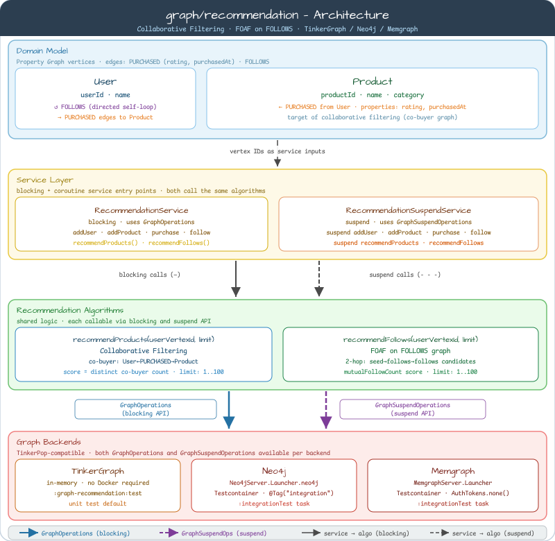
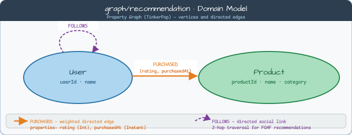

# graph-recommendation

> **언어**: [English](README.md) | 한국어

[bluetape4k-graph](https://github.com/bluetape4k/bluetape4k-graph) 기반의 소셜 커머스 도메인 상품 추천 및 팔로우 추천 예제.
TinkerGraph, Neo4j, Memgraph 백엔드를 지원합니다.

---

## 아키텍처



| 계층 | 구성 요소 |
|------|-----------|
| **도메인 모델** | `User` (userId, name) — `Product` (productId, name, category) |
| **엣지 유형** | `PURCHASED` (rating, purchasedAt) — `FOLLOWS` |
| **서비스** | `RecommendationService` (블로킹) · `RecommendationSuspendService` (코루틴) |
| **알고리즘** | 협업 필터링 (`recommendProducts`) · FOLLOWS FOAF (`recommendFollows`) |
| **백엔드** | TinkerGraph (인메모리) · Neo4j (Testcontainer) · Memgraph (Testcontainer) |

---

## 도메인 모델



* `User` 버텍스: `userId`, `name` 속성
* `Product` 버텍스: `productId`, `name`, `category` 속성
* `PURCHASED` 엣지: 구매자→상품 방향, `rating` 숫자, 타임스탬프 포함
* `FOLLOWS` 엣지: 유저 간 방향성 소셜 관계

---

## 알고리즘

### 협업 필터링 — `recommendProducts()`

시드 유저가 구매하지 않은 상품 중, **공동 구매자**(시드와 구매 이력을 공유하는 유저)가 구매한 상품을 추천합니다.

```
시드 유저 → PURCHASED 상품 → 역방향 PURCHASED 공동구매자
          → 공동구매자의 PURCHASED 상품 (시드 구매 제외)
          → 고유 공동구매자 수(score)로 랭킹
```

결과 타입:

```kotlin
data class ProductRecommendation(
    val product: GraphVertex,            // 추천 상품
    val score: Int,                      // 고유 공동구매자 수
    val sharedBuyers: List<GraphVertex>, // 추천 점수를 만든 공동구매자 버텍스 목록
)
```

동점 처리: `score DESC`, `productId ASC` (결정적 순서 보장)

---

### FOLLOWS FOAF — `recommendFollows()`

**2-hop FOLLOWS 탐색**(친구의 친구)으로 팔로우할 유저를 추천합니다.

```
시드 유저 → FOLLOWS → 직접 팔로우
          → FOLLOWS → 2-hop 후보 (이미 팔로우/본인 제외)
          → 상호 팔로우 수로 랭킹
```

결과 타입:

```kotlin
data class FollowRecommendation(
    val person: GraphVertex,             // 추천 유저
    val mutualFollowCount: Int,          // 상호 팔로우 수
    val mutualFollows: List<GraphVertex>, // 상호 팔로우 버텍스 목록
)
```

---

## 예제 시나리오

### 시드 데이터

6명의 유저와 6개의 상품, 13개의 `PURCHASED` 엣지와 12개의 `FOLLOWS` 엣지:

| 유저 | 구매한 상품 |
|------|------------|
| alice | laptop (⭐5), phone (⭐4), tablet (⭐3) |
| bob | laptop (⭐4), headphones (⭐5) |
| carol | phone (⭐5), headphones (⭐4) |
| dave | tablet (⭐4), headphones (⭐3) |
| eve | laptop (⭐3), keyboard (⭐5) |
| frank | phone (⭐3), mouse (⭐4) |

FOLLOWS 그래프 (방향성):

```
alice → bob, carol
bob   → dave, carol
carol → eve, bob
dave  → frank, eve
eve   → frank, dave
frank → alice, bob
```

### alice의 상품 추천 결과

alice는 **laptop**, **phone**, **tablet**을 구매함.
공동구매자와 해제되는 후보 상품:

| 공동구매자 | 공유 구매 | 후보 상품 |
|-----------|----------|----------|
| bob | laptop | headphones |
| carol | phone | headphones |
| dave | tablet | headphones |
| eve | laptop | keyboard |
| frank | phone | mouse |

결과 (score 내림차순, productId 오름차순):

| 순위 | 상품 | Score | 공동구매자 |
|------|------|-------|-----------|
| 1 | headphones | 3 | bob, carol, dave |
| 2 | keyboard | 1 | eve |
| 3 | mouse | 1 | frank |

### alice의 팔로우 추천 결과

alice는 이미 **bob**, **carol**을 팔로우 중.
2-hop 후보:

| 후보 | 경유 | 이미 팔로우? |
|------|------|------------|
| dave | bob→dave | 아니오 ✓ |
| carol | bob→carol | 예 (제외) |
| eve | carol→eve | 아니오 ✓ |
| bob | carol→bob | 예 (제외) |

결과 (score=1 동점, 알파벳순):

| 순위 | 유저 | 상호 팔로우 |
|------|------|-----------|
| 1 | dave | 1 |
| 2 | eve | 1 |

---

## API 사용법

### 블로킹 서비스

```kotlin
val ops = TinkerGraphOperations()
val service = RecommendationService(ops, graphName = "my-graph")
service.initialize()

// 유저와 상품 추가
val alice = service.addUser("alice", "Alice")
val laptop = service.addProduct("laptop", "Laptop Pro", category = "Electronics")

// 구매 기록
service.purchase(alice.id, laptop.id, rating = 5)

// 팔로우
val bob = service.addUser("bob", "Bob")
service.follow(alice.id, bob.id)

// 추천 조회
val productRecs = service.recommendProducts(alice.id, limit = 10)
productRecs.forEach { rec ->
    println("${rec.product} — score=${rec.score}, 공동구매자=${rec.sharedBuyers.size}")
}

val followRecs = service.recommendFollows(alice.id, limit = 5)
followRecs.forEach { rec ->
    println("${rec.person} — 상호팔로우=${rec.mutualFollowCount}")
}
```

### 코루틴 (Suspend) 서비스

```kotlin
val ops = TinkerGraphSuspendOperations()
val service = RecommendationSuspendService(ops, graphName = "my-graph")
service.initialize()

val productRecs = service.recommendProducts(alice.id, limit = 10)
val followRecs  = service.recommendFollows(alice.id, limit = 5)
```

---

## 알려진 제한사항

이 모듈은 **워크샵 데모** 용도로, 프로덕션 수준의 추천 엔진이 아닙니다. 다음 제한사항은 의도적인 설계 결정으로 투명하게 문서화합니다.

| 제한사항 | 설명 | 프로덕션 대안 |
|---------|------|------------|
| **N+1 탐색** | `recommendProducts`는 시드 상품마다, 공동구매자마다 쿼리를 1회씩 발행; `recommendFollows`는 2-hop 후보마다 1회. `limit`은 출력 건수를 제한하지 I/O 호출 횟수를 제한하지 않음 | 전체 탐색을 단일 Cypher / Gremlin 쿼리로 대체 |
| **`initialize()` TOCTOU** | `graphExists → createGraph` 가 원자적이지 않아, 동시 호출 시 그래프 중복 생성 시도 가능 | 어드바이저리 락 또는 서버 측 upsert 시맨틱 |
| **런타임 버텍스 타입 검증 없음** | `purchase()`/`follow()`는 전달받은 버텍스 ID가 User/Product 타입인지 런타임에 검증하지 않음. 호출자가 `addUser()`/`addProduct()` 반환 ID를 사용해야 함 | 그래프 백엔드 스키마 제약 |
| **`CancellationException` 전파** | suspend 서비스 자체는 취소 예외를 올바르게 전파하지만, 하위 `GraphSuspendOperations` 구현이 구조적 동시성을 지원해야 함 | 각 백엔드의 코루틴 계약 확인 |

---

## 백엔드 지원

| 백엔드 | 클래스 | 비고 |
|--------|--------|------|
| TinkerGraph | `TinkerGraphOperations` / `TinkerGraphSuspendOperations` | 인메모리; 외부 서비스 불필요 |
| Neo4j | `Neo4jGraphOperations` / `Neo4jGraphSuspendOperations` | Testcontainer; 테스트에서 인증 없음 |
| Memgraph | `MemgraphGraphOperations` / `MemgraphGraphSuspendOperations` | Testcontainer; Bolt 프로토콜 |

Neo4j, Memgraph 통합 테스트는 `integration` 태그로 기본 테스트 태스크에서 제외됩니다.

---

## 테스트 실행

```bash
# TinkerGraph 테스트 (인메모리, Docker 불필요)
./gradlew :graph-recommendation:test

# 통합 테스트 (Docker 필요)
./gradlew :graph-recommendation:integrationTest

# 전체 테스트
./gradlew :graph-recommendation:test :graph-recommendation:integrationTest
```

---

## 의존성

```kotlin
// build.gradle.kts
dependencies {
    implementation(libs.bluetape4k.graph.core)
    implementation(libs.bluetape4k.graph.tinkerpop)

    // 선택적 백엔드
    implementation(libs.bluetape4k.graph.neo4j)
    implementation(libs.bluetape4k.graph.memgraph)
}
```
