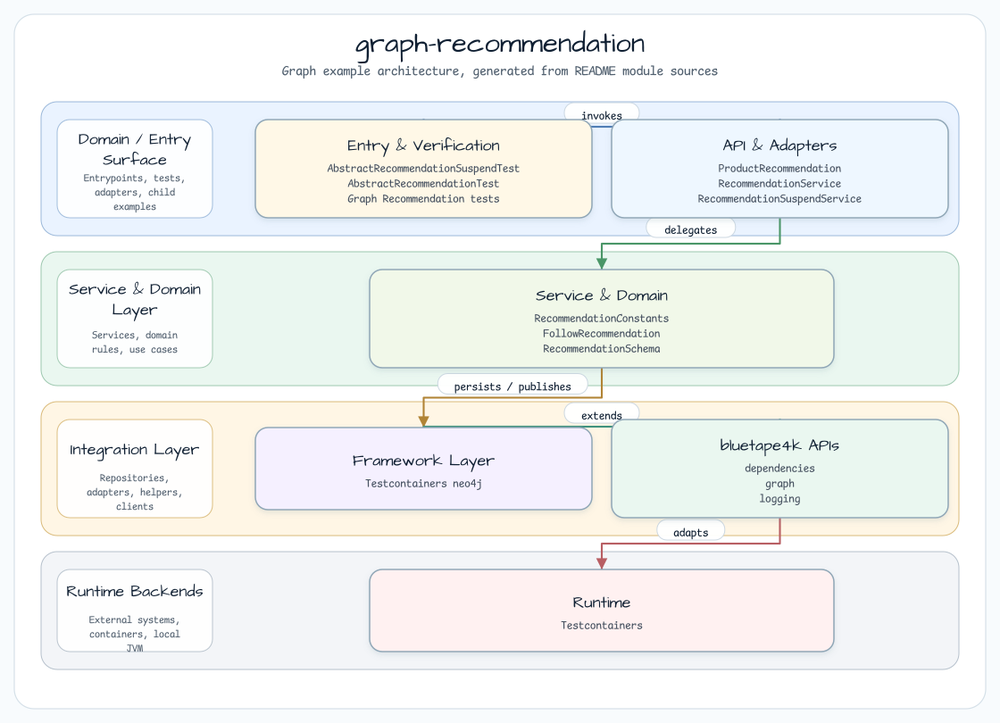

# graph-recommendation

[한국어](README.ko.md) | English

## Sequence Diagram

Graph-based product and follow recommendations for a social commerce domain, built on
[bluetape4k-graph](https://github.com/bluetape4k/bluetape4k-graph) with TinkerGraph,
Neo4j, and Memgraph backends.

---

## Architecture



| Layer | Components |
|-------|-----------|
| **Domain Model** | `User` (userId, name) — `Product` (productId, name, category) |
| **Edge types** | `PURCHASED` (rating, purchasedAt) — `FOLLOWS` |
| **Service** | `RecommendationService` (blocking) · `RecommendationSuspendService` (coroutine) |
| **Algorithms** | Collaborative Filtering (`recommendProducts`) · FOAF on FOLLOWS (`recommendFollows`) |
| **Backends** | TinkerGraph (in-memory) · Neo4j (Testcontainer) · Memgraph (Testcontainer) |

---

## Domain Model


* A `User` vertex carries `userId` and `name`.
* A `Product` vertex carries `productId`, `name`, and `category`.
* A `PURCHASED` edge connects a buyer to a product, with a numeric `rating` and timestamp.
* A `FOLLOWS` edge expresses a directed social relationship between users.

---

## Algorithms

### Collaborative Filtering — `recommendProducts()`

Finds products a seed user has **not** purchased that were bought by **co-buyers**
(users who share at least one purchase with the seed):

```
seed user → PURCHASED products → reverse PURCHASED co-buyers
         → co-buyers' PURCHASED products (excluding seed's own)
         → rank by distinct co-buyer count (score)
```

Result type:

```kotlin
data class ProductRecommendation(
    val product: GraphVertex,       // recommended product
    val score: Int,                 // distinct co-buyer count
    val sharedBuyers: List<GraphVertex>, // co-buyer vertices that drove the score
)
```

Tie-breaking: `score DESC`, then `productId ASC` for deterministic ordering.

---

### FOAF on FOLLOWS — `recommendFollows()`

Recommends users to follow via **2-hop FOLLOWS traversal** (Friend-of-a-Friend):

```
seed user → FOLLOWS → direct follows
          → FOLLOWS → candidates (2 hops away, not already followed, not self)
          → rank by mutual-follow count
```

Result type:

```kotlin
data class FollowRecommendation(
    val person: GraphVertex,        // recommended user to follow
    val mutualFollowCount: Int,     // mutual follows count
    val mutualFollows: List<GraphVertex>, // mutual-follow vertices
)
```

---

## Example Scenario

### Seed Data

Six users and six products, connected by 13 `PURCHASED` and 12 `FOLLOWS` edges:

| User | Purchased Products |
|------|--------------------|
| alice | laptop (⭐5), phone (⭐4), tablet (⭐3) |
| bob | laptop (⭐4), headphones (⭐5) |
| carol | phone (⭐5), headphones (⭐4) |
| dave | tablet (⭐4), headphones (⭐3) |
| eve | laptop (⭐3), keyboard (⭐5) |
| frank | phone (⭐3), mouse (⭐4) |

FOLLOWS graph (directed):

```
alice → bob, carol
bob   → dave, carol
carol → eve, bob
dave  → frank, eve
eve   → frank, dave
frank → alice, bob
```

### Product Recommendations for Alice

Alice bought **laptop**, **phone**, **tablet**.
Co-buyers and the candidate products they unlock:

| Co-buyer | Shared purchase | Candidate products |
|----------|-----------------|--------------------|
| bob | laptop | headphones |
| carol | phone | headphones |
| dave | tablet | headphones |
| eve | laptop | keyboard |
| frank | phone | mouse |

Result (sorted by score DESC, productId ASC):

| Rank | Product | Score | Shared Buyers |
|------|---------|-------|---------------|
| 1 | headphones | 3 | bob, carol, dave |
| 2 | keyboard | 1 | eve |
| 3 | mouse | 1 | frank |

### Follow Recommendations for Alice

Alice already follows **bob** and **carol**.
2-hop candidates:

| Candidate | Via | Already followed? |
|-----------|-----|-------------------|
| dave | bob→dave | No ✓ |
| carol | bob→carol | Yes (skip) |
| eve | carol→eve | No ✓ |
| bob | carol→bob | Yes (skip) |

Result (score=1 each, alphabetical tie-break):

| Rank | Person | Mutual Follows |
|------|--------|----------------|
| 1 | dave | 1 |
| 2 | eve | 1 |

---

## API Usage

### Blocking Service

```kotlin
val ops = TinkerGraphOperations()
val service = RecommendationService(ops, graphName = "my-graph")
service.initialize()

// Add users and products
val alice = service.addUser("alice", "Alice")
val laptop = service.addProduct("laptop", "Laptop Pro", category = "Electronics")

// Record a purchase
service.purchase(alice.id, laptop.id, rating = 5)

// Add a follow
val bob = service.addUser("bob", "Bob")
service.follow(alice.id, bob.id)

// Get recommendations
val productRecs = service.recommendProducts(alice.id, limit = 10)
productRecs.forEach { rec ->
    println("${rec.product} — score=${rec.score}, buyers=${rec.sharedBuyers.size}")
}

val followRecs = service.recommendFollows(alice.id, limit = 5)
followRecs.forEach { rec ->
    println("${rec.person} — mutual=${rec.mutualFollowCount}")
}
```

### Coroutine (Suspend) Service

```kotlin
val ops = TinkerGraphSuspendOperations()
val service = RecommendationSuspendService(ops, graphName = "my-graph")
service.initialize()

val productRecs = service.recommendProducts(alice.id, limit = 10)
val followRecs  = service.recommendFollows(alice.id, limit = 5)
```

---

## Known Limitations

This module is a **workshop demo**, not a production-ready recommendation engine. The following
constraints are intentional trade-offs documented here for transparency:

| Limitation | Detail | Production alternative |
|-----------|--------|----------------------|
| **N+1 traversal** | `recommendProducts` issues one neighbor query per seed product and one per co-buyer; `recommendFollows` issues one per depth-2 candidate. `limit` bounds output, not I/O calls. | Native Cypher / Gremlin query for the full traversal |
| **TOCTOU in `initialize()`** | `graphExists → createGraph` is not atomic; concurrent callers on a shared backend may attempt duplicate graph creation. | Advisory lock or server-side upsert semantics |
| **No vertex-type enforcement** | `purchase()` and `follow()` accept any vertex ID without verifying it is a User or Product vertex at runtime. | Schema constraints on the graph backend |
| **`CancellationException` propagation** | The suspend service propagates `CancellationException` correctly, but underlying `GraphSuspendOperations` implementations must also honor structured concurrency. | Verify each backend's coroutine contract |

---

## Backend Support

| Backend | Class | Notes |
|---------|-------|-------|
| TinkerGraph | `TinkerGraphOperations` / `TinkerGraphSuspendOperations` | In-memory; no external service needed |
| Neo4j | `Neo4jGraphOperations` / `Neo4jGraphSuspendOperations` | Testcontainer; no auth in tests |
| Memgraph | `MemgraphGraphOperations` / `MemgraphGraphSuspendOperations` | Testcontainer; Bolt protocol |

Integration tests (Neo4j, Memgraph) are tagged `integration` and excluded from the default test task.

---

## Running Tests

```bash
# TinkerGraph tests (in-memory, no Docker required)
./gradlew :graph-recommendation:test

# Integration tests (requires Docker)
./gradlew :graph-recommendation:integrationTest

# All tests
./gradlew :graph-recommendation:test :graph-recommendation:integrationTest
```

---

## Dependencies

```kotlin
// build.gradle.kts
dependencies {
    implementation(libs.bluetape4k.graph.core)
    implementation(libs.bluetape4k.graph.tinkerpop)

    // Optional backends
    implementation(libs.bluetape4k.graph.neo4j)
    implementation(libs.bluetape4k.graph.memgraph)
}
```
