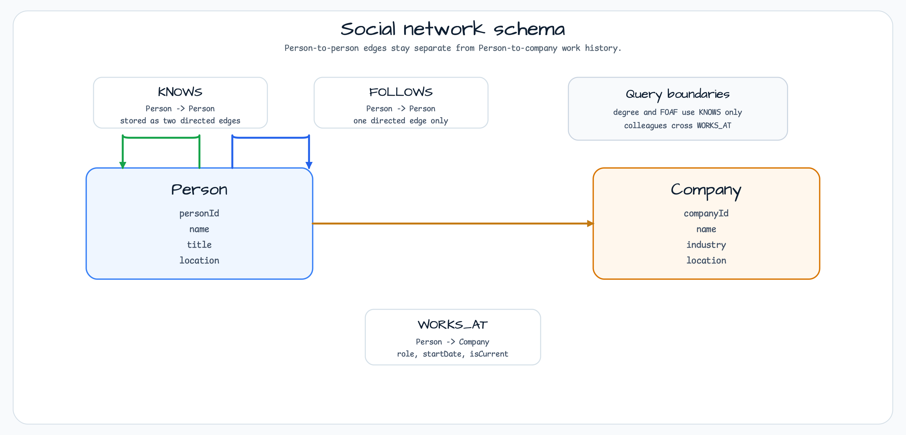
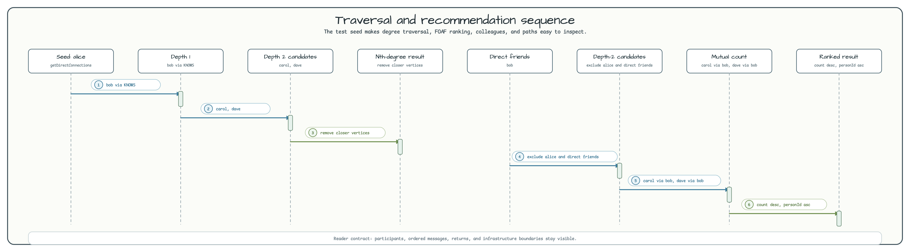

# graph-social-network

[English](README.md) | 한국어

## 개요

**graph-social-network**는 [bluetape4k-graph](https://github.com/bluetape4k/bluetape4k-graph)를
사용한 LinkedIn 스타일 그래프 도메인 예제입니다. 사람, 회사, 전문 네트워크 관계, 탐색
쿼리를 TinkerGraph, Neo4j, Memgraph에서 같은 서비스 계약으로 다루는 방법을 보여줍니다.

작지만 완전한 소셜 그래프를 확인하고 싶을 때 이 모듈을 보면 됩니다. 멱등 vertex 생성,
양방향 `KNOWS`, 단방향 `FOLLOWS`, 회사 연결 `WORKS_AT`, FOAF 추천, 동료 탐색,
최단 경로 탐색을 한 흐름에서 확인할 수 있습니다.

---

## 아키텍처


블로킹 서비스와 코루틴 서비스는 같은 소셜 네트워크 기능을 제공합니다. 두 서비스 모두
`GraphOperations` 또는 `GraphSuspendOperations`를 통해 typed schema를 기록하고, 선택한
그래프 백엔드에서 동일한 탐색 계약을 실행합니다.

```
graph/social-network/
├── src/main/kotlin/
│   └── io/bluetape4k/workshop/graph/social/
│       ├── model/
│       │   └── ConnectionRecommendation.kt   # FOAF 추천 결과 모델
│       ├── schema/
│       │   └── SocialNetworkSchema.kt        # Vertex/Edge 레이블 DSL
│       └── service/
│           ├── SocialNetworkService.kt        # 블로킹 서비스
│           └── SocialNetworkSuspendService.kt # 코루틴/Flow 서비스
└── src/test/kotlin/
    └── io/bluetape4k/workshop/graph/social/
        ├── AbstractSocialNetworkTest.kt         # 34개 블로킹 테스트
        ├── AbstractSocialNetworkSuspendTest.kt  # 34개 suspend 테스트
        ├── SocialNetworkTinkerGraphTest.kt      # 인메모리 TinkerGraph
        ├── SocialNetworkSuspendTinkerGraphTest.kt
        ├── Neo4jSocialNetworkTest.kt            # @Tag("integration")
        ├── Neo4jSocialNetworkSuspendTest.kt
        ├── MemgraphSocialNetworkTest.kt
        └── MemgraphSocialNetworkSuspendTest.kt
```

## 그래프 스키마



### Vertex 레이블

| 레이블 | ID 프로퍼티 | 기타 프로퍼티 |
|---|---|---|
| `Person` | `personId` | `name`, `title`, `location` |
| `Company` | `companyId` | `name`, `industry`, `location` |

### Edge 레이블

| 레이블 | 방향 | 프로퍼티 |
|---|---|---|
| `KNOWS` | 양방향 (두 개의 방향성 edge) | `since`, `strength` (1–10) |
| `FOLLOWS` | 단방향 | `since` |
| `WORKS_AT` | `Person` → `Company` | `role`, `startDate`, `endDate`, `isCurrent` |

## 시드 토폴로지 (테스트 데이터)



```
alice ──KNOWS──► bob ──KNOWS──► carol ──KNOWS──► dave
                 └───KNOWS──► dave
eve  ──FOLLOWS──► alice

alice ──WORKS_AT──► acme (role="Engineer")
bob   ──WORKS_AT──► acme (role="Designer")
carol ──WORKS_AT──► startup (role="Developer")
```

## 기능

### `SocialNetworkService` (블로킹)

```kotlin
val service = SocialNetworkService(ops, graphName)
service.initialize()

// Vertex 생성 (멱등)
val alice = service.addPerson("alice", "Alice Smith", title = "Engineer", location = "Seoul")
val acme  = service.addCompany("acme", "Acme Corp", industry = "Technology")

// Edge 생성
service.connect(alice.id, bob.id, since = "2024-01-01", strength = 8)    // 양방향 KNOWS
service.follow(eve.id, alice.id, since = "2024-06-01")                    // 단방향 FOLLOWS
service.addWorkExperience(alice.id, acme.id, role = "Engineer", isCurrent = true)

// 1촌 연결
val direct: List<GraphVertex> = service.getDirectConnections(alice.id)

// N촌 이내 연결 (1..maxDegree 포함)
val within2: List<GraphVertex> = service.getConnectionsWithinDegree(alice.id, maxDegree = 2)

// 정확히 N촌
val secondDegree: List<GraphVertex> = service.getNthDegreeConnections(alice.id, degree = 2)

// FOAF 추천 (공통인맥 수 내림차순 → personId 오름차순)
val recs: List<ConnectionRecommendation> = service.recommendConnections(alice.id)
// recs[0].person, recs[0].mutualConnectionCount, recs[0].mutualConnections

// 동료 탐색 (같은 회사)
val colleagues: List<GraphVertex> = service.findColleagues(alice.id)

// 최단 경로
val path: GraphPath? = service.findConnectionPath(alice.id, dave.id)
// path.vertices.size == 3  (alice → bob → dave)

// maxDepth 이내 모든 경로
val paths: List<GraphPath> = service.findAllConnectionPaths(alice.id, dave.id, maxDepth = 3)

// 공통 인맥
val mutual: List<GraphVertex> = service.findMutualConnections(alice.id, dave.id)
```

### `SocialNetworkSuspendService` (코루틴 / Flow)

블로킹 서비스와 동일한 API. 스트리밍 결과는 `Flow<T>`, 단일 결과는 `suspend` 함수로 제공:

```kotlin
val service = SocialNetworkSuspendService(ops, graphName)

val direct: Flow<GraphVertex>  = service.getDirectConnections(alice.id)
val paths:  Flow<GraphPath>    = service.findAllConnectionPaths(alice.id, dave.id)
val recs:   List<ConnectionRecommendation> = service.recommendConnections(alice.id)  // suspend
```

## 상수

```kotlin
SocialNetworkService.MAX_TRAVERSAL_DEPTH        // 6
SocialNetworkSuspendService.MAX_TRAVERSAL_DEPTH // 6
```

## 테스트 실행

### 단위 테스트 (TinkerGraph, Docker 불필요)

```bash
./gradlew :graph-social-network:test
```

### 통합 테스트 (Neo4j + Memgraph — Testcontainers)

Docker가 필요합니다.

```bash
./gradlew :graph-social-network:integrationTest
```

## 의존성

```kotlin
// build.gradle.kts
implementation(platform(libs.bluetape4k.graph.bom))
implementation(libs.bluetape4k.graph.core)
implementation(libs.bluetape4k.graph.tinkerpop)

// 통합 테스트 전용
compileOnly(libs.bluetape4k.graph.neo4j)
compileOnly(libs.bluetape4k.graph.memgraph)
```

> **참고:** `bluetape4k-graph`는 `mavenLocal`에서 해석됩니다.
> 먼저 `./gradlew -p bluetape4k-graph publishBluetapeGraphPublicationToMavenLocalRepository`를 실행하세요.
