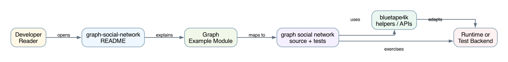
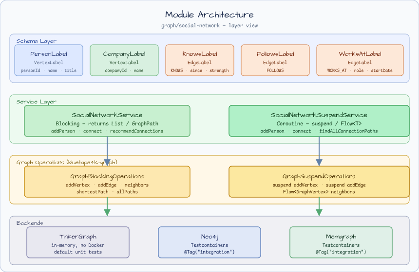
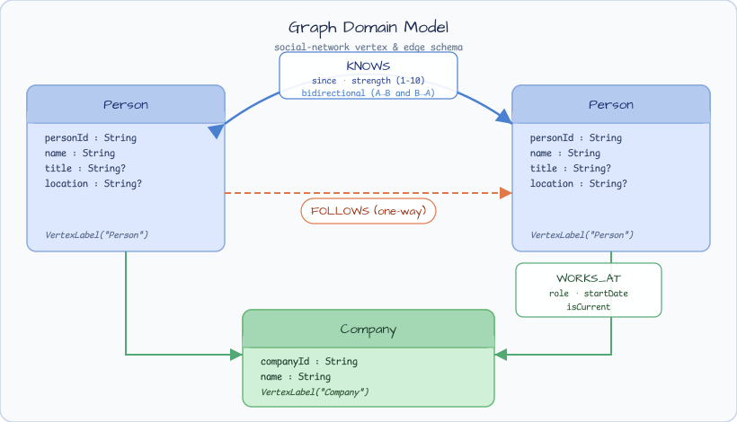

# graph-social-network

[한국어](README.ko.md) | English

## Example Scenario

This example exercises **graph-social-network** as a runnable graph-domain modeling workshop slice. It focuses on the path a developer would inspect first: configure the module, run the sample or tests, and observe the library or framework APIs that remove repetitive infrastructure code.

## Flow Diagram

1. Prepare the local runtime required by `graph-social-network`.
2. Execute the application, controller, service, or test fixture that owns the example scenario.
3. Delegate repetitive infrastructure work to bluetape4k utilities or Spring/Kotlin integrations.
4. Assert the visible result through the sample output, HTTP response, repository state, metric, trace, or test expectation.

## Sequence Diagram

The core sequence is: caller or test fixture -> workshop adapter -> bluetape4k helper/API -> external runtime or in-memory backend -> assertion/response. When this module has a dedicated sequence asset, the image below shows that interaction order; otherwise the source tests are the authoritative executable sequence.

LinkedIn-style social network graph example using [bluetape4k-graph](https://github.com/bluetape4k/bluetape4k-graph).

Demonstrates **Person–Company relationship modelling**, **multi-hop BFS traversal**, **FOAF recommendation**, and **shortest-path search** against TinkerGraph (in-memory), Neo4j, and Memgraph backends.

---

## Architecture





```
graph/social-network/
├── src/main/kotlin/
│   └── io/bluetape4k/workshop/graph/social/
│       ├── model/
│       │   └── ConnectionRecommendation.kt   # FOAF recommendation result
│       ├── schema/
│       │   └── SocialNetworkSchema.kt        # Vertex/Edge label DSL
│       └── service/
│           ├── SocialNetworkService.kt        # Blocking service
│           └── SocialNetworkSuspendService.kt # Coroutine/Flow service
└── src/test/kotlin/
    └── io/bluetape4k/workshop/graph/social/
        ├── AbstractSocialNetworkTest.kt         # 34 blocking test cases
        ├── AbstractSocialNetworkSuspendTest.kt  # 34 suspend test cases
        ├── SocialNetworkTinkerGraphTest.kt      # In-memory TinkerGraph
        ├── SocialNetworkSuspendTinkerGraphTest.kt
        ├── Neo4jSocialNetworkTest.kt            # @Tag("integration")
        ├── Neo4jSocialNetworkSuspendTest.kt
        ├── MemgraphSocialNetworkTest.kt
        └── MemgraphSocialNetworkSuspendTest.kt
```

## Graph Schema



### Vertex Labels

| Label | ID property | Other properties |
|---|---|---|
| `Person` | `personId` | `name`, `title`, `location` |
| `Company` | `companyId` | `name`, `industry`, `location` |

### Edge Labels

| Label | Direction | Properties |
|---|---|---|
| `KNOWS` | bidirectional (two directed edges) | `since`, `strength` (1–10) |
| `FOLLOWS` | unidirectional | `since` |
| `WORKS_AT` | `Person` → `Company` | `role`, `startDate`, `endDate`, `isCurrent` |

## Seed Topology (test data)

```
alice ──KNOWS──► bob ──KNOWS──► carol ──KNOWS──► dave
                 └───KNOWS──► dave
eve  ──FOLLOWS──► alice

alice ──WORKS_AT──► acme (role="Engineer")
bob   ──WORKS_AT──► acme (role="Designer")
carol ──WORKS_AT──► startup (role="Developer")
```

## Features

### `SocialNetworkService` (blocking)

```kotlin
val service = SocialNetworkService(ops, graphName)
service.initialize()

// Vertex creation (idempotent)
val alice = service.addPerson("alice", "Alice Smith", title = "Engineer", location = "Seoul")
val acme  = service.addCompany("acme", "Acme Corp", industry = "Technology")

// Edge creation
service.connect(alice.id, bob.id, since = "2024-01-01", strength = 8)     // bidirectional KNOWS
service.follow(eve.id, alice.id, since = "2024-06-01")                     // unidirectional FOLLOWS
service.addWorkExperience(alice.id, acme.id, role = "Engineer", isCurrent = true)

// 1st-degree connections
val direct: List<GraphVertex> = service.getDirectConnections(alice.id)

// Within N hops (1..maxDegree inclusive)
val within2: List<GraphVertex> = service.getConnectionsWithinDegree(alice.id, maxDegree = 2)

// Exactly N-th hop
val secondDegree: List<GraphVertex> = service.getNthDegreeConnections(alice.id, degree = 2)

// FOAF recommendations (sorted by mutual count desc, then personId asc)
val recs: List<ConnectionRecommendation> = service.recommendConnections(alice.id)
// recs[0].person, recs[0].mutualConnectionCount, recs[0].mutualConnections

// Colleagues (same company)
val colleagues: List<GraphVertex> = service.findColleagues(alice.id)

// Shortest path
val path: GraphPath? = service.findConnectionPath(alice.id, dave.id)
// path.vertices.size == 3  (alice → bob → dave)

// All paths within depth limit
val paths: List<GraphPath> = service.findAllConnectionPaths(alice.id, dave.id, maxDepth = 3)

// Mutual connections
val mutual: List<GraphVertex> = service.findMutualConnections(alice.id, dave.id)
```

### `SocialNetworkSuspendService` (coroutine / Flow)

Same API as the blocking service, with `suspend` functions and `Flow<T>` return types for streaming results:

```kotlin
val service = SocialNetworkSuspendService(ops, graphName)

val direct: Flow<GraphVertex>    = service.getDirectConnections(alice.id)
val paths:  Flow<GraphPath>      = service.findAllConnectionPaths(alice.id, dave.id)
val recs:   List<ConnectionRecommendation> = service.recommendConnections(alice.id)  // suspend
```

## Constants

```kotlin
SocialNetworkService.MAX_TRAVERSAL_DEPTH        // 6
SocialNetworkSuspendService.MAX_TRAVERSAL_DEPTH // 6
```

## Running Tests

### Unit tests (TinkerGraph, no Docker required)

```bash
./gradlew :graph-social-network:test
```

### Integration tests (Neo4j + Memgraph via Testcontainers)

Requires Docker.

```bash
./gradlew :graph-social-network:integrationTest
```

## Dependencies

```kotlin
// build.gradle.kts
implementation(platform(libs.bluetape4k.graph.bom))
implementation(libs.bluetape4k.graph.core)
implementation(libs.bluetape4k.graph.tinkerpop)

// integration test only
compileOnly(libs.bluetape4k.graph.neo4j)
compileOnly(libs.bluetape4k.graph.memgraph)
```

> **Note:** `bluetape4k-graph` is resolved from `mavenLocal`.
> Run `./gradlew -p bluetape4k-graph publishBluetapeGraphPublicationToMavenLocalRepository` first.
