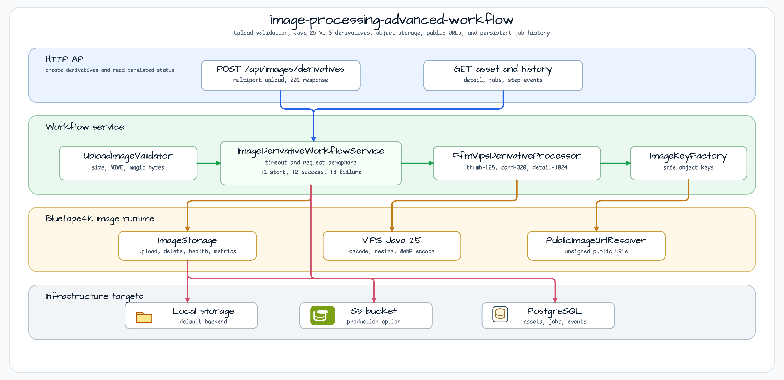
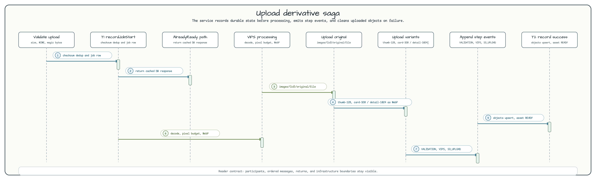
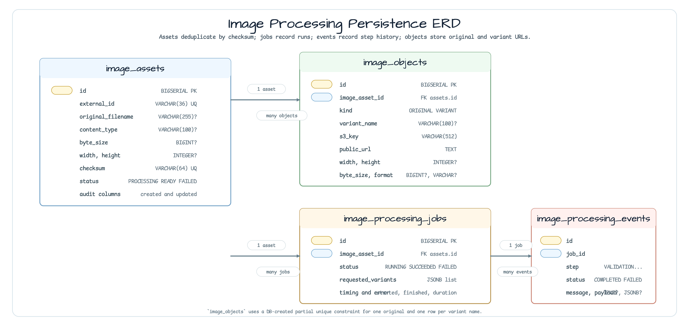

# image-processing-advanced-workflow

[English](README.md) | 한국어

## 개요

**image-processing-advanced-workflow**는 이미지를 검증하고, checksum으로 중복을 판별하고,
Java 25 libvips로 WebP 파생 이미지를 생성하고, 모든 객체를 Bluetape4k `ImageStorage`로
저장한 뒤 job/event 이력을 영속화하는 Spring Boot 4 업로드 workflow입니다.

메인 경로는 unsigned public URL을 반환합니다. 운영에서는 S3 또는 CDN이 연결된 public
bucket을 사용하고, 개발 중에는 local storage backend를 사용하면 됩니다.

## 아키텍처



Controller는 업로드 작업 전체를 `ImageDerivativeWorkflowService`에 위임합니다. Workflow
service는 검증, libvips 파생 이미지 생성, object key 생성, `ImageStorage` 업로드, public
URL 해석, Micrometer metric, Exposed 기반 persistence를 조율합니다.

## 처리 시퀀스



이 workflow는 작은 saga로 동작합니다.

- `T1 recordJobStart`는 asset/job row를 만들거나 재사용하고, 이미 `READY`인 중복 이미지는 바로 응답합니다.
- 정상 경로는 validation, VIPS processing, upload, completion event를 기록합니다.
- 실패 시 업로드된 object를 정리한 뒤 `NonCancellable` IO block에서 job/asset 실패 상태를 기록합니다.

## Persistence 모델



## 사용한 Bluetape4k 기능

| 기능 | 모듈/artifact | 코드 위치 | 이점 |
|---|---|---|---|
| Java 25 VIPS runtime | `bluetape4k-images-vips-java25` | `FfmVipsDerivativeProcessor` | 픽셀 한도를 둔 빠른 native 썸네일 생성 |
| 공통 VIPS API | `bluetape4k-images-vips-api` | `VipsImage`, `VipsEncodeOptions`, `VipsImageFormat` | 백엔드 중립 resize/encode 계약 |
| 저장소 추상화 | `bluetape4k-images-spring-boot` | `ImageDerivativeWorkflowService`가 `ImageStorage` 주입 | 같은 workflow가 S3와 local storage에서 동작 |
| S3/local 자동 구성 | `bluetape4k-images-spring-boot` | `application.yml` `bluetape4k.images.storage.*` | 운영은 S3, 개발/테스트는 local fallback |
| 객체 key 검증 | `ImageKeyFactory` + `ImageObjectKey` | `ImageKeyFactory` | 파일명을 sanitize하고 검증된 object key 생성 |
| 업로드 검증 | `UploadOptions` | `UploadImageValidator` | 제한된 image content-type allowlist와 magic-byte 검사 적용 |
| 저장소 health/metrics | `images-spring-boot` health/metrics auto-config | Actuator endpoints | 별도 wrapper 없이 저장소 상태와 upload/download timing 확인 |
| Workflow metrics | Micrometer + `bluetape4k-micrometer` ecosystem | `ImageDerivativeWorkflowService` | 낮은 cardinality의 upload, duration, failure, variant counter |

## 사전 준비

이 모듈은 `bluetape4k-images-vips-java25`를 사용하므로 Java 25가 필요합니다.

```bash
# macOS
brew install vips

# Ubuntu/Debian
sudo apt-get install libvips-tools libvips-dev
```

Gradle test task는 `--enable-native-access=ALL-UNNAMED`를 추가합니다. 앱을 직접 실행할 때도 같은 JVM flag를 넣어야 합니다.

## 실행

```bash
./gradlew :image-processing-advanced-workflow:bootRun \
  --args='--workshop.images.advanced.public-base-url=http://localhost:8080/public-images'
```

이미지 업로드:

```bash
curl -F "file=@photo.jpg;type=image/jpeg" \
  http://localhost:8080/api/images/derivatives
```

## 응답 예시

```json
{
  "imageId": "2bb4f9c9-7133-46f2-bcc8-71a7e43ec1c4",
  "original": {
    "key": "images/2bb4f9c9-7133-46f2-bcc8-71a7e43ec1c4/original/photo.jpg",
    "url": "http://localhost:8080/public-images/images/2bb4f9c9-7133-46f2-bcc8-71a7e43ec1c4/original/photo.jpg",
    "width": 1600,
    "height": 1200,
    "contentType": "image/jpeg",
    "sizeBytes": 245763
  },
  "thumbnailUrl": "http://localhost:8080/public-images/images/2bb4f9c9-7133-46f2-bcc8-71a7e43ec1c4/variants/thumb-128.webp",
  "variants": [
    {
      "name": "thumb-128",
      "key": "images/2bb4f9c9-7133-46f2-bcc8-71a7e43ec1c4/variants/thumb-128.webp",
      "url": "http://localhost:8080/public-images/images/2bb4f9c9-7133-46f2-bcc8-71a7e43ec1c4/variants/thumb-128.webp",
      "width": 128,
      "height": 96,
      "contentType": "image/webp",
      "sizeBytes": 7612
    }
  ],
  "durationMillis": 84,
  "warnings": []
}
```

## 객체 이름 규칙

```text
images/{imageId}/original/{safeFilename}
images/{imageId}/variants/thumb-128.webp
images/{imageId}/variants/card-320.webp
images/{imageId}/variants/detail-1024.webp
```

## S3 Public URL 설정

메인 경로는 unsigned public URL을 반환합니다. S3 storage와 public bucket, S3 website endpoint, CDN domain을 설정합니다.

```yaml
bluetape4k:
  images:
    storage:
      backend: s3
      bucket: public-image-bucket
      key-prefix: workshop

workshop:
  images:
    advanced:
      public-base-url: https://cdn.example.com/workshop
```

Unsigned URL은 bucket/CDN policy와 object ownership 설정이 public read를 허용해야 합니다. 비공개 이미지나 사용자 민감 이미지는 이 public URL resolver 대신 `S3PreSignedUrlSigner` 또는 `CloudFrontUrlSigner`를 사용하세요.

## Before / After

Raw framework 방식은 object key 검증, S3 upload, 이미지 decode limit, WebP encoding, cleanup, metrics를 반복 구현하기 쉽습니다.

```kotlin
val key = "images/$id/variants/thumb-128.webp"
s3Client.putObject(request, RequestBody.fromBytes(bytes))
timer.recordCallable { resizeWithNativeLibrary(bytes) }
```

이 예제는 framework glue를 작게 유지하고 Bluetape4k 계약을 사용합니다.

```kotlin
val key = ImageObjectKey.of("images/$imageId/variants", "thumb-128.webp")
val variant = image.thumbnail(128).use { it.suspendToBytes(VipsImageFormat.WEBP, options) }
storage.upload(key, variant, UploadOptions(contentType = "image/webp"))
```

## 검증과 제한

지원 업로드 타입은 JPEG, PNG, WebP입니다. Validator는 지원하지 않는 MIME type과 선언된 content type에 맞지 않는 magic byte payload를 거부합니다.

| 제한 | 기본값 |
|---|---:|
| Multipart file size | 25 MB |
| Service input bytes | 25 MB |
| Pixel budget | 100,000,000 pixels |
| Concurrent requests | 2 |
| Concurrent variants per request | 2 |
| Processing timeout | 30 seconds |

## 테스트

```bash
# Runs deterministic unit tests and explicitly skips native VIPS tests by default.
./gradlew :image-processing-advanced-workflow:test

# Runs VIPS integration tests when Java 25 and libvips are available.
./gradlew :image-processing-advanced-workflow:test -Dvips.enabled=true
```

Local storage 기본 위치는 `${java.io.tmpdir}/bluetape4k-workshop-images`입니다. 깨끗한 local 실행이 필요하면 이 디렉터리를 삭제하세요.
