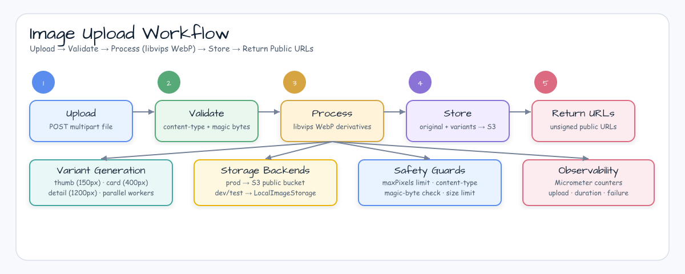
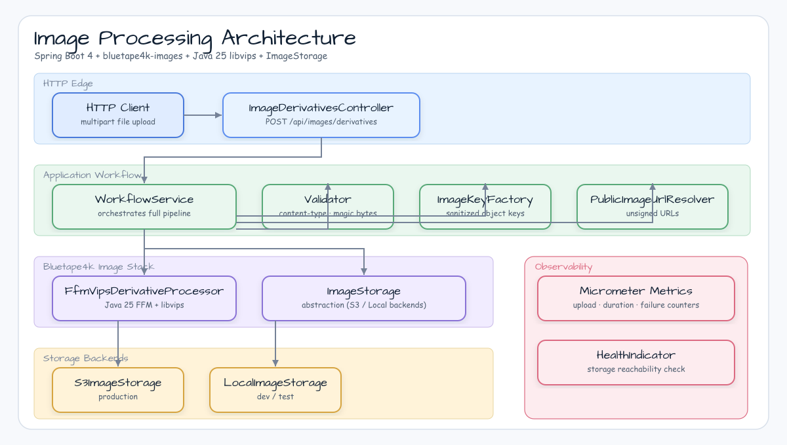

# image-processing-advanced-workflow

[한국어](README.ko.md) | English

## Example Scenario

This example exercises **image-processing-advanced-workflow** as a runnable image-processing workflow workshop slice. It focuses on the path a developer would inspect first: configure the module, run the sample or tests, and observe the library or framework APIs that remove repetitive infrastructure code.



## Sequence Diagram

Advanced Spring Boot 4 workflow for uploaded images: validate, store the original, generate WebP derivatives with Java 25 libvips, store every object through Bluetape4k `ImageStorage`, and return unsigned public URLs.

## Architecture



## Used Bluetape4k Features

| Feature | Module/artifact | Code reference | Benefit |
|---|---|---|---|
| Java 25 VIPS runtime | `bluetape4k-images-vips-java25` | `FfmVipsDerivativeProcessor` | Fast native thumbnail generation with bounded pixel limits |
| Shared VIPS API | `bluetape4k-images-vips-api` | `VipsImage`, `VipsEncodeOptions`, `VipsImageFormat` | Backend-neutral resize/encode contract |
| Storage abstraction | `bluetape4k-images-spring-boot` | `ImageDerivativeWorkflowService` injects `ImageStorage` | Same workflow works with S3 or local storage |
| S3/local auto-configuration | `bluetape4k-images-spring-boot` | `application.yml` `bluetape4k.images.storage.*` | S3 in production, local fallback in development |
| Object key validation | `ImageKeyFactory` + `ImageObjectKey` | `ImageKeyFactory` | Sanitizes filenames and builds validated object keys |
| Upload validation | `UploadOptions` | `UploadImageValidator` | Enforces a bounded image content-type allowlist plus magic-byte checks |
| Storage health/metrics | `images-spring-boot` health and metrics auto-config | Actuator endpoints | Storage reachability and upload/download timing without custom wrappers |
| Workflow metrics | Micrometer + `bluetape4k-micrometer` ecosystem | `ImageDerivativeWorkflowService` | Low-cardinality upload, duration, failure, and variant counters |

## Prerequisites

This module is Java 25-only because it uses `bluetape4k-images-vips-java25`.

```bash
# macOS
brew install vips

# Ubuntu/Debian
sudo apt-get install libvips-tools libvips-dev
```

The Gradle test task adds `--enable-native-access=ALL-UNNAMED`. For manual app runs, add the same JVM flag.

## Run

```bash
./gradlew :image-processing-advanced-workflow:bootRun \
  --args='--workshop.images.advanced.public-base-url=http://localhost:8080/public-images'
```

Upload an image:

```bash
curl -F "file=@photo.jpg;type=image/jpeg" \
  http://localhost:8080/api/images/derivatives
```

## Sample Response

```json
{
  "imageId": "2bb4f9c9-7133-46f2-bcc8-71a7e43ec1c4",
  "original": {
    "key": "images/2bb4f9c9-7133-46f2-bcc8-71a7e43ec1c4/original/photo.jpg",
    "url": "http://localhost:8080/public-images/images/2bb4f9c9-7133-46f2-bcc8-71a7e43ec1c4/original/photo.jpg",
    "width": 1600,
    "height": 1200,
    "contentType": "image/jpeg",
    "sizeBytes": 245763
  },
  "thumbnailUrl": "http://localhost:8080/public-images/images/2bb4f9c9-7133-46f2-bcc8-71a7e43ec1c4/variants/thumb-128.webp",
  "variants": [
    {
      "name": "thumb-128",
      "key": "images/2bb4f9c9-7133-46f2-bcc8-71a7e43ec1c4/variants/thumb-128.webp",
      "url": "http://localhost:8080/public-images/images/2bb4f9c9-7133-46f2-bcc8-71a7e43ec1c4/variants/thumb-128.webp",
      "width": 128,
      "height": 96,
      "contentType": "image/webp",
      "sizeBytes": 7612
    }
  ],
  "durationMillis": 84,
  "warnings": []
}
```

## Object Naming

```text
images/{imageId}/original/{safeFilename}
images/{imageId}/variants/thumb-128.webp
images/{imageId}/variants/card-320.webp
images/{imageId}/variants/detail-1024.webp
```

## S3 Public URL Setup

The main path returns unsigned public URLs. Configure S3 storage and a public bucket, S3 website endpoint, or CDN domain:

```yaml
bluetape4k:
  images:
    storage:
      backend: s3
      bucket: public-image-bucket
      key-prefix: workshop

workshop:
  images:
    advanced:
      public-base-url: https://cdn.example.com/workshop
```

Unsigned URLs require bucket/CDN policy and object ownership settings that allow public reads. For private or user-sensitive images, use `S3PreSignedUrlSigner` or `CloudFrontUrlSigner` instead of this public URL resolver.

## Before / After

Raw framework code tends to repeat object key validation, S3 upload calls, image decode limits, WebP encoding, cleanup, and metrics:

```kotlin
val key = "images/$id/variants/thumb-128.webp"
s3Client.putObject(request, RequestBody.fromBytes(bytes))
timer.recordCallable { resizeWithNativeLibrary(bytes) }
```

The workshop path keeps framework glue small and uses Bluetape4k contracts:

```kotlin
val key = ImageObjectKey.of("images/$imageId/variants", "thumb-128.webp")
val variant = image.thumbnail(128).use { it.suspendToBytes(VipsImageFormat.WEBP, options) }
storage.upload(key, variant, UploadOptions(contentType = "image/webp"))
```

## Validation and Limits

Supported upload types are JPEG, PNG, and WebP. The validator rejects unsupported MIME types and rejects payloads whose magic bytes do not match the declared content type.

| Limit | Default |
|---|---:|
| Multipart file size | 25 MB |
| Service input bytes | 25 MB |
| Pixel budget | 100,000,000 pixels |
| Concurrent requests | 2 |
| Concurrent variants per request | 2 |
| Processing timeout | 30 seconds |

## Tests

```bash
# Runs deterministic unit tests and explicitly skips native VIPS tests by default.
./gradlew :image-processing-advanced-workflow:test

# Runs VIPS integration tests when Java 25 and libvips are available.
./gradlew :image-processing-advanced-workflow:test -Dvips.enabled=true
```

Local storage defaults to `${java.io.tmpdir}/bluetape4k-workshop-images`. Remove that directory when you want a clean local run.
