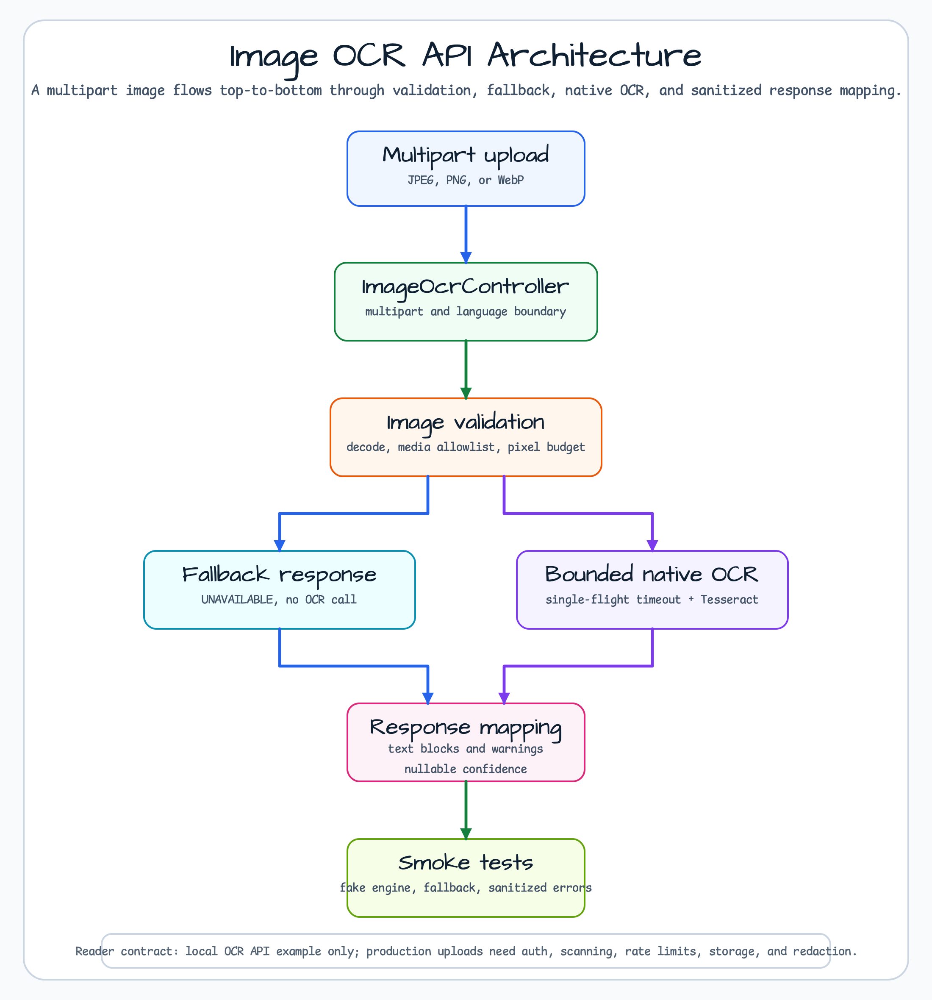
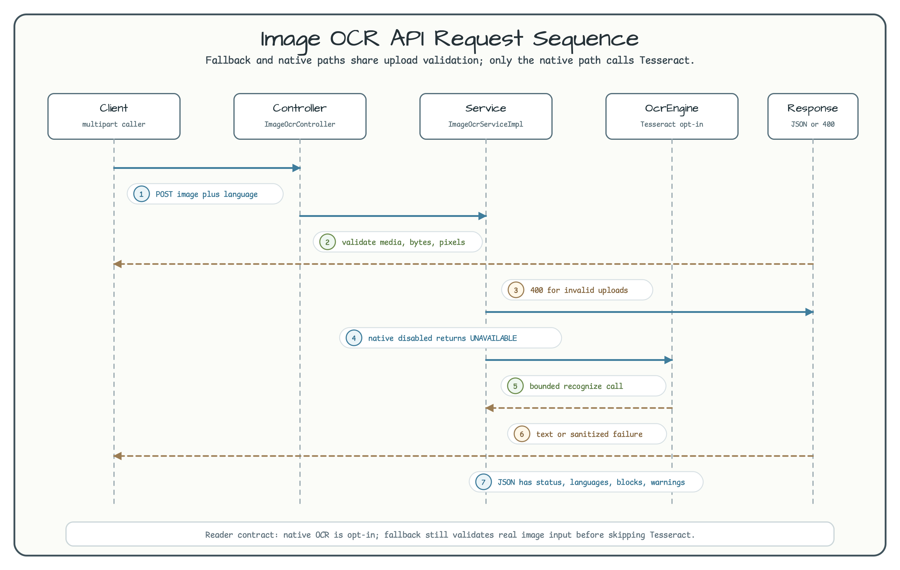

# image-processing-ocr-api

[English](README.md) | 한국어

## 개요

**image-processing-ocr-api**는 `bluetape4k-images-ocr`를 Spring Boot 4
multipart API로 노출하는 예제입니다. JPEG, PNG, WebP 업로드를 검증하고,
`immutableImageOf`로 실제 이미지인지 확인한 뒤 구조화된 OCR 응답을 반환합니다.
기본 경로는 native Tesseract 없이도 동작하도록 이미지를 검증한 다음
`UNAVAILABLE` fallback 응답을 돌려줍니다.

이 모듈은 OCR API 경계를 배우기 위한 워크숍 예제입니다. 운영용 업로드 서비스가
아닙니다.

## 아키텍처



흐름은 위에서 아래로 이어집니다. `ImageOcrController`가 multipart 입력을 받고,
`ImageOcrServiceImpl`이 metadata와 decoded pixel을 검증한 뒤 fallback 응답으로
short-circuit하거나 제한된 native `OcrEngine`을 호출합니다.

## 요청 흐름



기본 smoke 경로는 실제로 decode 가능한 이미지를 검증하고 Tesseract 호출은 건너뛴
뒤 `UNAVAILABLE`을 반환합니다. Native OCR은 `workshop.ocr.native-enabled` 또는
`-Docr.enabled=true`로 명시적으로 켭니다.
설정과 decoded-pixel limit은 bluetape4k `require*` helper로 검증하고, HTTP 경계의
public upload error message는 명시적인 메시지를 유지합니다.

## 엔드포인트

```text
POST /api/images/ocr
Content-Type: multipart/form-data

file      필수 image/jpeg, image/png, image/webp
language  선택 반복 파라미터 또는 comma-separated Tesseract language code
```

```bash
curl -F "file=@docs/images/readme-diagrams/image-ocr-api-readme-architecture-01.png;type=image/png" \
  -F "language=eng" \
  http://localhost:8080/api/images/ocr
```

잘못된 업로드는 `400 Bad Request`입니다. 유효한 업로드지만 native OCR을 실행할 수
없는 경우에는 `status=UNAVAILABLE`인 구조화된 `200 OK` 응답을 반환합니다.

## Fallback 응답

```json
{
  "requestId": "ocr-sample-request",
  "status": "UNAVAILABLE",
  "engine": "disabled",
  "languages": ["eng"],
  "confidence": null,
  "text": "",
  "blocks": [],
  "warnings": [
    "Native OCR is disabled. Enable workshop.ocr.native-enabled=true or -Docr.enabled=true."
  ]
}
```

## 완료 응답

```json
{
  "requestId": "ocr-sample-request",
  "status": "COMPLETED",
  "engine": "tesseract",
  "languages": ["eng", "kor"],
  "confidence": null,
  "text": "Bluetape OCR\nSecond line",
  "blocks": [
    { "index": 0, "text": "Bluetape OCR", "confidence": null },
    { "index": 1, "text": "Second line", "confidence": null }
  ],
  "warnings": [
    "Confidence is not available from the current OCR engine."
  ]
}
```

`confidence`가 nullable인 이유는 현재 `OcrResult` 계약이 text와 effective options만
제공하고, line/word 단위 confidence를 제공하지 않기 때문입니다.

## 설정

| Property | 기본값 | 용도 |
|---|---:|---|
| `workshop.ocr.native-enabled` | `false` | native `TesseractOcrEngine` bean 활성화 |
| `workshop.ocr.max-upload-bytes` | `5242880` | service byte 제한 |
| `workshop.ocr.max-image-pixels` | `12000000` | decode된 이미지 pixel 예산 |
| `workshop.ocr.timeout` | `10s` | native OCR timeout |
| `workshop.ocr.languages` | `eng` | 기본 language 목록 |
| `workshop.ocr.tessdata-path` | empty | 선택 Tesseract trained-data 디렉터리 |
| `spring.servlet.multipart.max-file-size` | `5MB` | container multipart 제한 |
| `spring.servlet.multipart.max-request-size` | `5MB` | container multipart request 제한 |

Spring multipart limit은 `workshop.ocr.max-upload-bytes`와 같은 수준으로 맞춰야 합니다.
`ImageOcrProperties` 생성 시 byte/pixel/time limit이 양수인지, 기본 language 목록이
비어 있지 않은지 검증합니다.

## 실행

기본 fallback 모드:

```bash
./gradlew :image-processing-ocr-api:bootRun
curl -F "file=@docs/images/readme-diagrams/image-ocr-api-readme-architecture-01.png;type=image/png" \
  http://localhost:8080/api/images/ocr
```

Native OCR 모드:

```bash
./gradlew :image-processing-ocr-api:bootRun \
  --args='--workshop.ocr.native-enabled=true --workshop.ocr.tessdata-path=/opt/homebrew/share/tessdata'
```

테스트나 앱 실행에 `-Docr.enabled=true`를 사용할 수도 있습니다. 다만 기본 테스트
모음은 완료 응답 검증에 fake engine을 사용합니다. 로컬에 Tesseract와 language pack이
설치되어 있을 때 수동 `bootRun` + curl 경로로 확인하세요.

## Native 사전 준비

```bash
# macOS
brew install tesseract
ls /opt/homebrew/share/tessdata/eng.traineddata

# Ubuntu/Debian
sudo apt-get update
sudo apt-get install -y tesseract-ocr tesseract-ocr-eng
ls /usr/share/tesseract-ocr/5/tessdata/eng.traineddata
```

Tesseract가 trained data를 기본 lookup path에서 찾지 못하면
`workshop.ocr.tessdata-path`를 지정하세요.

한국어 OCR을 확인하려면 `kor.traineddata`도 설치하고 확인한 뒤 curl 명령에
`-F "language=eng,kor"`를 추가하세요.

## Troubleshooting

| 증상 | 응답 | 확인할 것 |
|---|---|---|
| Tesseract library 또는 tessdata가 없음 | `200 OK`, `status=UNAVAILABLE` | Tesseract를 설치하고 필요하면 `workshop.ocr.tessdata-path`를 지정 |
| language pack이 없음 | `200 OK`, `status=UNAVAILABLE` 또는 낮은 품질의 text | `eng.traineddata`, `kor.traineddata` 등 요청한 pack 확인 |
| 빈 파일, 깨진 파일, 이미지가 아닌 bytes | `400 Bad Request` | 실제 JPEG, PNG, WebP 파일 사용 |
| 선언한 type과 실제 bytes가 다름 | `400 Bad Request` | `;type=image/png`와 실제 파일 형식 맞추기 |
| GIF 같은 미지원 subtype | `400 Bad Request` | JPEG, PNG, WebP로 변환 |
| 이미지가 pixel budget을 초과 | `400 Bad Request` | `workshop.ocr.max-image-pixels`보다 작게 resize |

## 워크숍 경계

이 예제에는 인증, antivirus scanning, persistence, rate limiting, storage policy,
queueing, audit workflow, PII 관리, 운영용 upload hardening이 없습니다. OCR text에는
민감한 정보가 들어갈 수 있습니다. 이 서비스는 uploaded bytes나 OCR text를 로그에 남기지
않습니다. 운영 시스템에서는 별도의 redaction과 retention policy가 필요합니다.

## 테스트

```bash
# 결정적인 smoke 경로입니다. Native OCR은 꺼져 있습니다.
./gradlew :image-processing-ocr-api:test

# 로컬 opt-in 경로입니다. Native Tesseract와 language pack이 필요합니다.
./gradlew :image-processing-ocr-api:test -Docr.enabled=true
```

테스트는 완료 응답을 위해 fake `OcrEngine`을 주입하고 fallback, validation,
sanitized failure mapping, language normalization, cancellation propagation을 검증합니다.

## 의존성 메모

이 모듈은 root `bluetape4k-dependencies` BOM을 사용합니다. 개별 `bluetape4k-image`
BOM이나 하드코딩된 OCR artifact version을 추가하지 않습니다.
