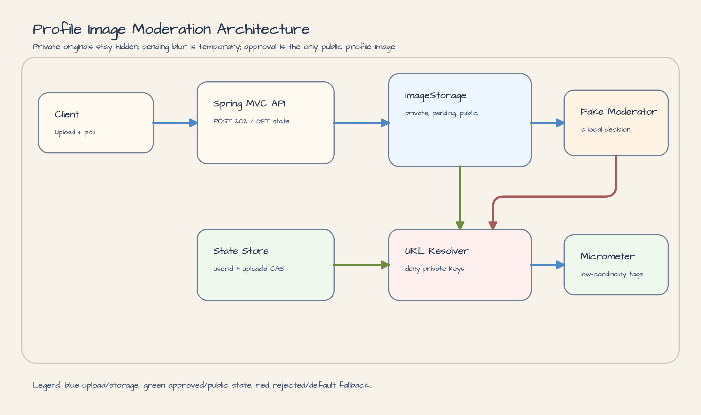
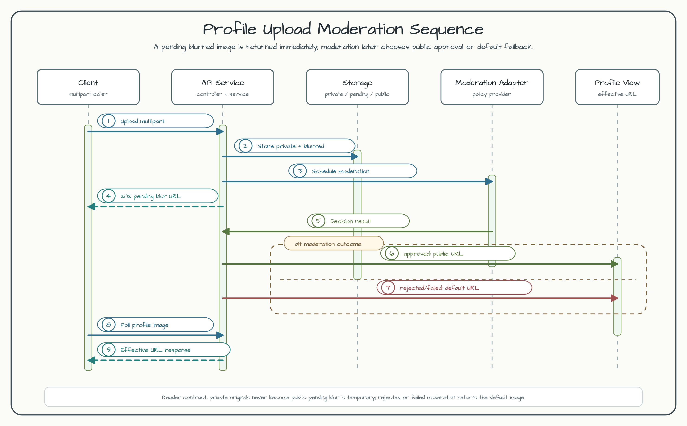

# Profile Image Moderation

[한국어](README.ko.md) | English

This example demonstrates a production-shaped profile image flow:

1. upload a user profile image;
2. store the original under a private object key;
3. publish a small blurred JPEG while moderation is pending;
4. approve the upload into a public profile image, or reject/fail it back to the default image.





## Bluetape4k Features

| Concern | Bluetape4k feature | Where to look |
|---|---|---|
| Object storage | `ImageStorage`, `ImageObjectKey`, `UploadOptions` | `ProfileImageService`, `ProfileImageKeyFactory` |
| Safe validation | `require*` helpers and stable ProblemDetail mapping | `UploadImageValidator`, `ProfileImageExceptionHandler` |
| Coroutines | bounded background moderation runner | `ProfileImageModerationRunner` |
| Moderation policy | profile content policy adapter | `ProfileImageModerationPolicyProvider` |
| Metrics | low-cardinality Micrometer counters/timers | `ProfileImageMetrics` |
| ID generation | Base58 upload ids | `ProfileImageService` |
| Privacy derivatives | strict metadata/GPS removal, orientation normalization, and redaction reports | `ProfileImageProcessor`, `PrivacyDerivativePipeline` |

## API

Start the app:

```bash
./gradlew :image-processing-profile-image-moderation:bootRun
```

Upload a safe image. The API responds with `202 Accepted` and a pending blurred URL before moderation completes.

```bash
curl -i -F file=@safe.jpg http://localhost:8080/api/users/alice/profile-image
```

Pending response:

```json
{
  "userId": "alice",
  "status": "PENDING_MODERATION",
  "uploadId": "upload-a",
  "effectiveUrl": "http://localhost:8080/public-images/profile-images/alice/upload-a/pending/blurred.jpg",
  "pendingUrl": "http://localhost:8080/public-images/profile-images/alice/upload-a/pending/blurred.jpg",
  "approvedUrl": null,
  "defaultImageUrl": "http://localhost:8080/public-images/profile-images/default/default-profile.jpg",
  "reason": null
}
```

Poll the current profile image:

```bash
curl http://localhost:8080/api/users/alice/profile-image
```

Approved response:

```json
{
  "status": "APPROVED",
  "effectiveUrl": "http://localhost:8080/public-images/profile-images/alice/upload-a/public/approved.jpg"
}
```

Rejected uploads use the default profile image. The demo fake moderator rejects filenames containing `reject`.

```bash
curl -i -F file=@reject.jpg http://localhost:8080/api/users/alice/profile-image
```

```json
{
  "status": "REJECTED",
  "effectiveUrl": "http://localhost:8080/public-images/profile-images/default/default-profile.jpg",
  "reason": "demo filename marker matched"
}
```

If the moderation provider times out or fails, the status becomes `MODERATION_FAILED` and the effective URL is also the default image. A user with no upload returns `NO_IMAGE` and the same default URL.

Invalid uploads return RFC 9457 ProblemDetail JSON:

```json
{
  "type": "about:blank",
  "title": "Bad Request",
  "status": 400,
  "detail": "unsupported image contentType: text/plain"
}
```

## Privacy-safe Derivatives

Both the pending blurred JPEG and the approved public JPEG are re-encoded through the
bluetape4k-images `2.0.0` `PrivacyDerivativePipeline`. The default policy strips EXIF, GPS, XMP, IPTC, and ICC
metadata, normalizes EXIF orientation, and strictly re-reads the output before storage.
The consumer adapter is `ProfileImageProcessor.processPrivacySafe`.
The bounded `PrivacyDerivativeReport` records requested/remaining categories and applied
redaction geometry without raw metadata or image bytes. A metadata reader failure or a
remaining category fails closed, so no public derivative is uploaded; the private original
and moderation state machine are unchanged.

The policy can be tuned without changing the example's storage contract:

```yaml
workshop:
  profile-image-moderation:
    privacy:
      strip-metadata: true
      remove-gps: true
      normalize-orientation: true
      max-metadata-bytes: 5242880
```

## Privacy and Storage Boundaries

- `private/original/*` keys are never returned as effective URLs and the local public controller returns `404` for private paths.
- `pending/blurred.jpg` is intentionally public for the workshop UX, but it is still derived from user content. It is served with `Cache-Control: no-store` in local mode.
- `public/approved.jpg` is exposed only after moderation approves the current `userId + uploadId` state.
- For S3/CDN deployment, deny public reads for `profile-images/*/*/private/**` and keep pending cache TTL short or disabled.

## Moderation Provider

The default provider is deterministic and local so the example can run without cloud credentials: it waits for `workshop.profile-image-moderation.decision-delay` (1 second by default) and maps filename markers such as `nazi`, `rising-sun`, `rising-sun-flag`, `욱일기`, `旭日旗`, `hate-text`, and `reject` into banned profile-content detections. The local policy then rejects banned hate symbols or hate-expression text. Production code should replace the demo detection step with [AWS Rekognition `DetectModerationLabels`](https://docs.aws.amazon.com/rekognition/latest/dg/moderation-api.html) for supported hate-symbol labels such as Nazi Party, a Custom Labels model for local policy symbols such as Rising Sun Flag / 욱일기 imagery when required, and OCR/text moderation for embedded hate expressions. When the newer bluetape4k-image moderation policy artifacts are available in the dependency train, this adapter is the seam that should map backend detections into those shared policy models. Filename markers are demo-only and must not be used for real safety decisions.

## TODO

- After the bluetape4k-images release train publishes the newer moderation policy artifacts, replace the local demo policy mapping in `ProfileImageModerationPolicyProvider` with the shared bluetape4k-image moderation policy models. Keep the S3/Rekognition/Custom Labels/OCR adapter seam and the banned profile-content tests.

## Operations

Health and metrics:

```bash
curl http://localhost:8080/actuator/health
curl http://localhost:8080/actuator/metrics/workshop.profile.images.upload.accepted
curl http://localhost:8080/actuator/metrics/workshop.profile.images.moderation.duration
```

Local storage defaults to `${java.io.tmpdir}/bluetape4k-profile-images`. Remove that directory to clean workshop objects between runs. The default image URL is stable even when no user upload exists.

## Tests

```bash
./gradlew :image-processing-profile-image-moderation:test
```

The tests cover pending/approved/rejected/failed/no-image states, stale moderation completion, private URL denial, cleanup after storage failure, strict privacy metadata verification, orientation/redaction report geometry, source-reader fail-closed handling, JPEG derivative signatures, no-store pending responses, and low-cardinality metrics.
