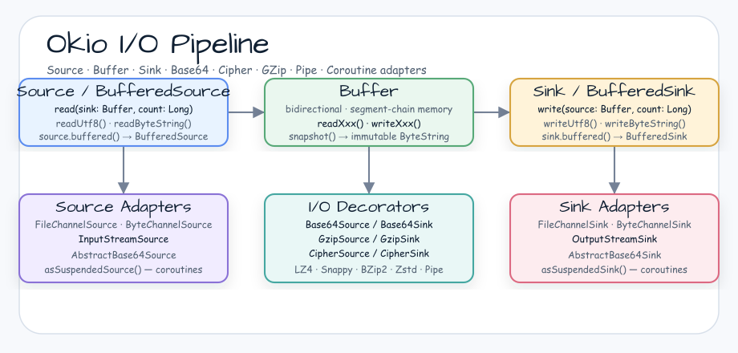
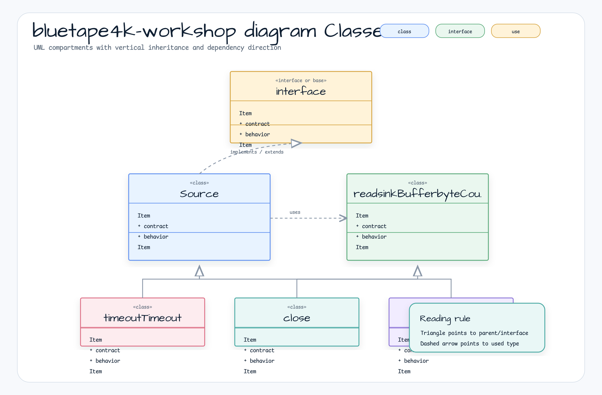

# Okio Examples

[English](README.md) | 한국어

## 예제 시나리오

이 예제는 **Okio Examples**를 실행 가능한 I/O 유틸리티 워크플로우 워크샵 조각으로 다룹니다. 개발자가 가장 먼저 확인할 흐름인 모듈 설정, 샘플 또는 테스트 실행, 반복적인 인프라 코드를 줄여 주는 라이브러리/프레임워크 API 관찰에 초점을 둡니다.

## 아키텍처 다이어그램


이 모듈은 샘플 진입점 또는 테스트 픽스처, bluetape4k 확장 계층, 예제가 사용하는 런타임 의존성을 중심으로 구성됩니다. 이 README를 코드와 비교할 때는 `io.bluetape4k.workshop.io` 패키지를 기준으로 삼습니다.



## 흐름 다이어그램

1. `io-okio-examples`에 필요한 로컬 런타임을 준비합니다.
2. 예제 시나리오를 담당하는 애플리케이션, 컨트롤러, 서비스 또는 테스트 픽스처를 실행합니다.
3. 반복적인 인프라 작업을 bluetape4k 유틸리티 또는 Spring/Kotlin 통합 기능에 위임합니다.
4. 샘플 출력, HTTP 응답, 저장소 상태, 메트릭, 트레이스 또는 테스트 기대값으로 보이는 결과를 검증합니다.

## 시퀀스 다이어그램

핵심 시퀀스는 호출자 또는 테스트 픽스처 -> 워크샵 어댑터 -> bluetape4k 헬퍼/API -> 외부 런타임 또는 인메모리 백엔드 -> 검증/응답 순서입니다. 이 모듈에 전용 시퀀스 자산이 있으면 아래 이미지가 상호작용 순서를 보여 줍니다. 그렇지 않으면 소스 테스트가 실행 가능한 시퀀스의 기준입니다.

[Okio](Provides an example using the https://github.com/square/okio/) 라이브러리를 사용하는 예제입니다.

## I/O 흐름 구성


---

## 핵심 개념

### Buffer

`Buffer`는 Okio의 핵심 인메모리 I/O 컨테이너입니다. `BufferedSource`와 `BufferedSink`를 동시에 구현하므로 읽기와 쓰기를 모두 수행할 수 있습니다. 내부적으로는 segment linked list로 메모리를 관리해 데이터를 복사하지 않고 이동할 수 있습니다.

- Segment 크기: 기본 8 KiB (`SEGMENT_SIZE`)
- byte, integer, Long, UTF-8 문자열, `ByteString` 등 다양한 타입 지원
- `snapshot()`으로 `ByteString`의 불변 복사본 생성 가능

### Source / Sink

| interface | role | core method |
|-----------|------|------------|
| `Source` | 데이터 읽기 스트림 | `read(sink: Buffer, byteCount: Long): Long` |
| `Sink` | 데이터 쓰기 스트림 | `write(source: Buffer, byteCount: Long)` |
| `BufferedSource` | 버퍼링된 읽기(High-Level API) | `readUtf8()`, `readByteString()`, `readInt()`, etc. |
| `BufferedSink` | 버퍼링된 쓰기(High-Level API) | `writeUtf8()`, `write()`, `writeInt()`, etc. |

`source.buffered()` / `sink.buffered()` 확장 함수로 언제든 버퍼링 계층을 추가할 수 있습니다.

### ByteString

불변 byte array 래퍼입니다. UTF-8, Base64, Hex 인코딩/디코딩을 기본 제공합니다.

```kotlin
val bs = "East Sea and Baekdu Mountain".encodeUtf8()
bs.hex()    // "eb8f99ed95b4ebacbceab3bc20ebb0b1eb9190ec82b0ec9db4"
bs.base64() // Base64 encoded string
```

---

## 클래스 계층 다이어그램



---

## 주요 기능

| classification | Class/Extension Function | explanation |
|------|----------------|------|
| File I/O | `FileChannelSource`, `FileChannelSink` | NIO `FileChannel` 기반 파일 읽기/쓰기 |
| Base64 | `asBase64Sink()`, `asBase64Source()` | Base64 인코딩/디코딩 Sink·Source 래퍼 |
| compression | `asCompressSink()`, `asDecompressSource()` | BZip2, Deflate, GZip, LZ4, Snappy, Zstd 지원 |
| encryption | `CipherSink`, `CipherSource` | JCE `Cipher`를 사용한 암호화/복호화 |
| pipe | `Pipe` | 비동기 Producer-Consumer 연결, timeout 지원 |
| coroutine | `asSuspendedSource()`, `asSuspendedSink()` | socket을 coroutine 친화적인 Source/Sink로 변환 |
| NIO Channel | `asSource()` | `ReadableByteChannel`을 Okio `Source`로 변환 |
| hashing | `HashingSink` | SHA-1, MD5, SHA-256 등 hash 계산 |

---

## 사용 예제

### BufferedSink — 여러 타입 쓰기

```kotlin
val buffer = Buffer()

// write bytes directly
buffer.writeByte(0xab)
buffer.writeByte(0xcd)
// buffer -> "[hex=abcd]"

// write UTF-8 string
buffer.writeUtf8("East Sea and Baekdu Mountain")
buffer.readByteString().utf8() // "East Sea and Baekdu Mountain"

// write integer (big-endian / little-endian)
buffer.writeInt(-0x543210ff) // Big Endian
buffer.writeIntLe(-0x543210ff) // little endian

// Write Long
buffer.writeLong(-0x543210fe789abcdfL)

// Write in NIO ByteBuffer
val nioBuffer = ByteBuffer.wrap("hello".toByteArray())
buffer.write(nioBuffer)
```

### BufferedSource — 여러 타입 읽기

```kotlin
val buffer = Buffer().also { it.writeUtf8("hello world") }

buffer.readUtf8(5)          // "hello"
buffer.readByte()           // ' ' (0x20)
buffer.readUtf8()           // "world"
buffer.exhausted()          // true

// Selective reading using Options
val options = Options.of("GET ".encodeUtf8(), "POST ".encodeUtf8())
buffer.select(options) // 0 (GET) or 1 (POST)
```

### Pipe — 비동기 Producer-Consumer

`Pipe`는 고정 크기 버퍼를 가진 단방향 채널입니다. 버퍼가 가득 차면 쓰기가 block되고, 비어 있으면 읽기가 block됩니다.

```kotlin
val pipe = Pipe(1000L) // buffer size 1000 bytes

// write thread
val sinkHash = executor.submit<ByteString> {
    val hashingSink = HashingSink.sha1(pipe.sink)
    val buffer = Buffer()
// ... write data
    hashingSink.close()
    hashingSink.hash
}

// read thread
val sourceHash = executor.submit<ByteString> {
    val buffer = Buffer()
    while (pipe.source.read(buffer, Long.MAX_VALUE) != -1L) {
// ... data processing
    }
    pipe.source.close()
}
```

**코루틴에서 Pipe 사용:**

```kotlin
runSuspendIO {
    val pipe = Pipe(1000L)

    val sinkHash = async {
        val hashingSink = HashingSink.sha1(pipe.sink)
// ... write data asynchronously
        hashingSink.hash
    }

    val sourceHash = async {
        val buffer = Buffer()
        while (pipe.source.read(buffer, Long.MAX_VALUE) != -1L) {
// ... read data asynchronously
        }
        pipe.source.close()
    }

    sinkHash.await() shouldBeEqualTo sourceHash.await()
}
```

**Timeout 설정:**

```kotlin
val pipe = Pipe(3)

// Sink write timeout: InterruptedIOException if Consumer does not read within 1 second
pipe.sink.timeout().timeout(1000L, TimeUnit.MILLISECONDS)

// Source read timeout: InterruptedIOException if producer does not write within 1 second
pipe.source.timeout().timeout(1000L, TimeUnit.MILLISECONDS)
```

---

## 암호화/압축

### CipherSink / CipherSource — 스트림 암호화

`CipherSink`는 쓸 때 JCE `Cipher`로 데이터를 암호화하고, `CipherSource`는 읽을 때 복호화합니다. AES, DES 같은 모든 JCE 표준 알고리즘을 지원합니다.

```kotlin
// Write with encryption sink
val buffer = Buffer()
val cipherSink = CipherSink(buffer, encryptCipher)
val input = bufferOf(plaintext.toUtf8Bytes())
cipherSink.write(input, input.size)
cipherSink.flush()

// Read with decryption source
val cipherSource = CipherSource(buffer, decryptCipher)
val output = Buffer()
cipherSource.readAll(output)
output.readUtf8() // restore original plaintext
```

**파일 암호화 예제:**

```kotlin
// Encrypt and save to file
FileChannelSink(FileChannel.open(path, WRITE), Timeout.NONE).use { fileSink ->
    val cipherSink = CipherSink(fileSink, encryptCipher)
    val input = bufferOf(expected)
    cipherSink.write(input, input.size)
    cipherSink.flush()
}

// Decrypt and read from file
FileChannelSource(FileChannel.open(path, READ), Timeout.NONE).use { fileSource ->
    val cipherSource = CipherSource(fileSource, decryptCipher)
    val output = Buffer()
    cipherSource.readAll(output)
output.readUtf8() // Decrypted original string
}
```

### asCompressSink / asDecompressSource — 다양한 압축 알고리즘

`bluetape4k-okio`는 `Compressor` 인터페이스를 통해 여러 압축 알고리즘을 Okio Sink/Source에 투명하게 연결합니다.

지원 알고리즘: `BZip2`, `Deflate`, `GZip`, `LZ4`, `Snappy`, `Zstd`

```kotlin
val original = "Long string to compress..."
val data = bufferOf(original)

// Write to Compressed Sink
val sink = Buffer()
val compressSink = sink.asCompressSink(Compressors.LZ4)
compressSink.write(data, data.size)
compressSink.flush()

// Read from unzipped source
val source = Buffer()
val decompressSource = sink.asDecompressSource(Compressors.LZ4)
decompressSource.read(source, sink.size)

source.readUtf8() // restore original string
```

---

## 코루틴 지원

### SuspendedSocket — 논블로킹 socket I/O

`asSuspendedSource()` / `asSuspendedSink()` 확장 함수는 `java.net.Socket`을 코루틴 친화적인 Okio Source/Sink로 변환합니다. 내부적으로 NIO는 `SocketChannel`의 `SelectionKey`를 `await()`로 처리해 스레드 blocking을 피합니다.

```kotlin
runSuspendIO {
// Set up NIO non-blocking socket channel
    SocketChannel.open().use { clientChannel ->
        clientChannel.configureBlocking(false)
        clientChannel.connect(serverAddress)
        clientChannel.await(SelectionKey.OP_CONNECT)
        clientChannel.finishConnect()

        val client = clientChannel.socket()

// Convert to coroutine-friendly Source/Sink
        val source = client.asSuspendedSource().buffered()
        val sink   = client.asSuspendedSink().buffered()

// non-blocking write
sink.writeUtf8("East Sea and Baekdu Mountain").flush()

// non-blocking read
        source.readUtf8(byteCount.toLong())
    }
}
```

**핵심 특성:**

- socket이 닫히면 `IOException`이 발생합니다.
- 읽기/쓰기 중 socket이 닫히면 코루틴은 `IOException`으로 취소될 수 있습니다.
- `Timeout` 설정으로 최대 지연 시간을 제어합니다.

---

## 참고 자료

| link | explanation |
|------|------|
| [Okio GitHub](https://github.com/square/okio/) | 공식 소스 코드와 이슈 |
| [Okio official document](https://square.github.io/okio/) | API Reference와 Guide |
| [Okio Recipes](https://square.github.io/okio/recipes/) | 공식 예제 Recipe |
| [bluetape4k-okio](https://github.com/bluetape4k/bluetape4k) | bluetape4k Okio 확장 모듈 |
