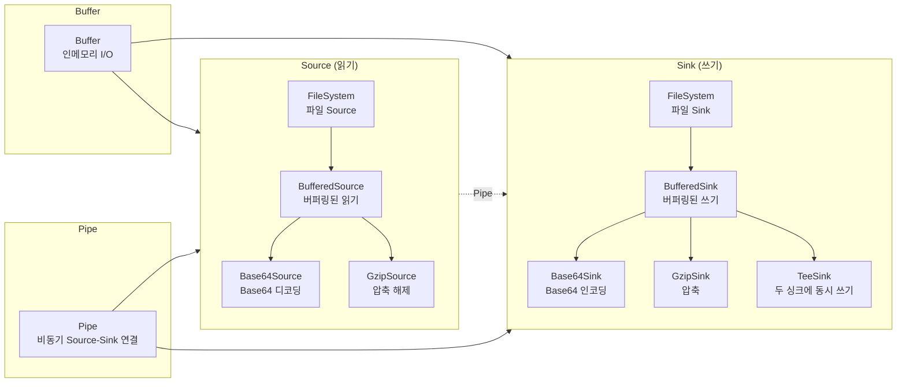
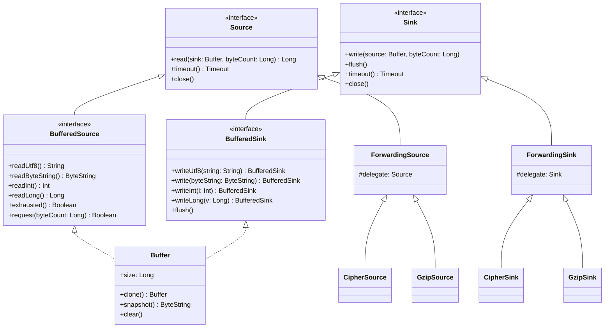

# Okio Examples

[Okio](https://github.com/square/okio/) 라이브러리를 사용하는 예제를 제공합니다.

## I/O 흐름 구성



---

## 핵심 개념

### Buffer

`Buffer`는 Okio의 핵심 인메모리 I/O 컨테이너입니다. `BufferedSource`와 `BufferedSink`를 동시에 구현하므로 읽기·쓰기 모두 가능합니다. 내부적으로 세그먼트(Segment) 연결 리스트로 메모리를 관리하여 복사 없이 데이터를 이동할 수 있습니다.

- 세그먼트 크기: 기본 8 KiB (`SEGMENT_SIZE`)
- 바이트, 정수, Long, UTF-8 문자열, `ByteString` 등 다양한 타입 지원
- `snapshot()` 으로 불변 `ByteString` 복사본 생성 가능

### Source / Sink

| 인터페이스 | 역할 | 핵심 메서드 |
|-----------|------|------------|
| `Source` | 데이터 읽기 스트림 | `read(sink: Buffer, byteCount: Long): Long` |
| `Sink` | 데이터 쓰기 스트림 | `write(source: Buffer, byteCount: Long)` |
| `BufferedSource` | 버퍼링된 읽기 (고수준 API) | `readUtf8()`, `readByteString()`, `readInt()` 등 |
| `BufferedSink` | 버퍼링된 쓰기 (고수준 API) | `writeUtf8()`, `write()`, `writeInt()` 등 |

`source.buffered()` / `sink.buffered()` 확장 함수로 언제든지 버퍼링 레이어를 추가할 수 있습니다.

### ByteString

불변(immutable) 바이트 배열 래퍼입니다. UTF-8, Base64, Hex 인코딩/디코딩을 내장합니다.

```kotlin
val bs = "동해물과 백두산이".encodeUtf8()
bs.hex()    // "eb8f99ed95b4ebacbceab3bc20ebb0b1eb9190ec82b0ec9db4"
bs.base64() // Base64 인코딩 문자열
```

---

## 클래스 계층 다이어그램



---

## 주요 기능

| 분류 | 클래스/확장함수 | 설명 |
|------|----------------|------|
| 파일 I/O | `FileChannelSource`, `FileChannelSink` | NIO `FileChannel` 기반 파일 읽기/쓰기 |
| Base64 | `asBase64Sink()`, `asBase64Source()` | Base64 인코딩/디코딩 Sink·Source 래퍼 |
| 압축 | `asCompressSink()`, `asDecompressSource()` | BZip2, Deflate, GZip, LZ4, Snappy, Zstd 지원 |
| 암호화 | `CipherSink`, `CipherSource` | JCE `Cipher`를 이용한 암호화/복호화 |
| 파이프 | `Pipe` | 비동기 Producer-Consumer 연결, 타임아웃 지원 |
| 코루틴 | `asSuspendedSource()`, `asSuspendedSink()` | 소켓을 코루틴 친화적 Source/Sink 로 변환 |
| NIO 채널 | `asSource()` | `ReadableByteChannel`을 Okio `Source`로 변환 |
| 해싱 | `HashingSink` | SHA-1, MD5, SHA-256 등 해시 계산 |

---

## 사용 예제

### BufferedSink — 다양한 타입 쓰기

```kotlin
val buffer = Buffer()

// 바이트 직접 쓰기
buffer.writeByte(0xab)
buffer.writeByte(0xcd)
// buffer -> "[hex=abcd]"

// UTF-8 문자열 쓰기
buffer.writeUtf8("동해물과 백두산이")
buffer.readByteString().utf8() // "동해물과 백두산이"

// 정수 쓰기 (빅엔디안 / 리틀엔디안)
buffer.writeInt(-0x543210ff)      // 빅엔디안
buffer.writeIntLe(-0x543210ff)    // 리틀엔디안

// Long 쓰기
buffer.writeLong(-0x543210fe789abcdfL)

// NIO ByteBuffer 에서 쓰기
val nioBuffer = ByteBuffer.wrap("hello".toByteArray())
buffer.write(nioBuffer)
```

### BufferedSource — 다양한 타입 읽기

```kotlin
val buffer = Buffer().also { it.writeUtf8("hello world") }

buffer.readUtf8(5)          // "hello"
buffer.readByte()           // ' ' (0x20)
buffer.readUtf8()           // "world"
buffer.exhausted()          // true

// Options 를 이용한 선택적 읽기
val options = Options.of("GET ".encodeUtf8(), "POST ".encodeUtf8())
buffer.select(options)      // 0 (GET) 또는 1 (POST)
```

### Pipe — 비동기 Producer-Consumer

`Pipe`는 고정 크기 버퍼를 가진 단방향 채널입니다. 버퍼가 가득 차면 쓰기가 블로킹되고, 비어 있으면 읽기가 블로킹됩니다.

```kotlin
val pipe = Pipe(1000L)  // 버퍼 크기 1000 바이트

// 쓰기 스레드
val sinkHash = executor.submit<ByteString> {
    val hashingSink = HashingSink.sha1(pipe.sink)
    val buffer = Buffer()
    // ... 데이터 쓰기
    hashingSink.close()
    hashingSink.hash
}

// 읽기 스레드
val sourceHash = executor.submit<ByteString> {
    val buffer = Buffer()
    while (pipe.source.read(buffer, Long.MAX_VALUE) != -1L) {
        // ... 데이터 처리
    }
    pipe.source.close()
}
```

**코루틴에서의 Pipe 사용:**

```kotlin
runSuspendIO {
    val pipe = Pipe(1000L)

    val sinkHash = async {
        val hashingSink = HashingSink.sha1(pipe.sink)
        // ... 비동기 데이터 쓰기
        hashingSink.hash
    }

    val sourceHash = async {
        val buffer = Buffer()
        while (pipe.source.read(buffer, Long.MAX_VALUE) != -1L) {
            // ... 비동기 데이터 읽기
        }
        pipe.source.close()
    }

    sinkHash.await() shouldBeEqualTo sourceHash.await()
}
```

**타임아웃 설정:**

```kotlin
val pipe = Pipe(3)

// Sink 쓰기 타임아웃: 1초 내에 Consumer 가 읽지 않으면 InterruptedIOException
pipe.sink.timeout().timeout(1000L, TimeUnit.MILLISECONDS)

// Source 읽기 타임아웃: 1초 내에 Producer 가 쓰지 않으면 InterruptedIOException
pipe.source.timeout().timeout(1000L, TimeUnit.MILLISECONDS)
```

---

## 암호화 / 압축

### CipherSink / CipherSource — 스트림 암호화

`CipherSink`는 데이터를 쓸 때 JCE `Cipher`로 암호화하고, `CipherSource`는 읽을 때 복호화합니다. AES, DES 등 JCE 표준 알고리즘을 모두 지원합니다.

```kotlin
// 암호화 Sink 로 쓰기
val buffer = Buffer()
val cipherSink = CipherSink(buffer, encryptCipher)
val input = bufferOf(plaintext.toUtf8Bytes())
cipherSink.write(input, input.size)
cipherSink.flush()

// 복호화 Source 로 읽기
val cipherSource = CipherSource(buffer, decryptCipher)
val output = Buffer()
cipherSource.readAll(output)
output.readUtf8() // 원본 plaintext 복원
```

**파일 암호화 예:**

```kotlin
// 파일에 암호화하여 저장
FileChannelSink(FileChannel.open(path, WRITE), Timeout.NONE).use { fileSink ->
    val cipherSink = CipherSink(fileSink, encryptCipher)
    val input = bufferOf(expected)
    cipherSink.write(input, input.size)
    cipherSink.flush()
}

// 파일에서 복호화하여 읽기
FileChannelSource(FileChannel.open(path, READ), Timeout.NONE).use { fileSource ->
    val cipherSource = CipherSource(fileSource, decryptCipher)
    val output = Buffer()
    cipherSource.readAll(output)
    output.readUtf8() // 복호화된 원본 문자열
}
```

### asCompressSink / asDecompressSource — 다양한 압축 알고리즘

`bluetape4k-okio`는 `Compressor` 인터페이스를 통해 여러 압축 알고리즘을 Okio Sink/Source 에 투명하게 연결합니다.

지원 알고리즘: `BZip2`, `Deflate`, `GZip`, `LZ4`, `Snappy`, `Zstd`

```kotlin
val original = "압축할 긴 문자열..."
val data = bufferOf(original)

// 압축 Sink 에 쓰기
val sink = Buffer()
val compressSink = sink.asCompressSink(Compressors.LZ4)
compressSink.write(data, data.size)
compressSink.flush()

// 압축 해제 Source 에서 읽기
val source = Buffer()
val decompressSource = sink.asDecompressSource(Compressors.LZ4)
decompressSource.read(source, sink.size)

source.readUtf8() // 원본 문자열 복원
```

---

## 코루틴 지원

### SuspendedSocket — 비차단 소켓 I/O

`asSuspendedSource()` / `asSuspendedSink()` 확장 함수로 `java.net.Socket`을 코루틴 친화적인 Okio Source/Sink 로 변환합니다. 내부적으로 NIO `SocketChannel`의 `SelectionKey`를 `await()` 으로 처리하여 스레드를 차단하지 않습니다.

```kotlin
runSuspendIO {
    // NIO 비차단 소켓 채널 설정
    SocketChannel.open().use { clientChannel ->
        clientChannel.configureBlocking(false)
        clientChannel.connect(serverAddress)
        clientChannel.await(SelectionKey.OP_CONNECT)
        clientChannel.finishConnect()

        val client = clientChannel.socket()

        // 코루틴 친화적 Source/Sink 로 변환
        val source = client.asSuspendedSource().buffered()
        val sink   = client.asSuspendedSink().buffered()

        // 비차단 쓰기
        sink.writeUtf8("동해물과 백두산이").flush()

        // 비차단 읽기
        source.readUtf8(byteCount.toLong())
    }
}
```

**주요 특성:**

- 소켓이 닫혀 있으면 `IOException` 발생
- 읽기/쓰기 중 소켓 닫힘 → `IOException` 으로 코루틴 취소 가능
- `Timeout` 설정으로 최대 대기 시간 제어

---

## 참고

| 링크 | 설명 |
|------|------|
| [Okio GitHub](https://github.com/square/okio/) | 공식 소스 코드 및 이슈 |
| [Okio 공식 문서](https://square.github.io/okio/) | API 레퍼런스 및 가이드 |
| [Okio Recipes](https://square.github.io/okio/recipes/) | 공식 예제 레시피 |
| [bluetape4k-okio](https://github.com/bluetape4k/bluetape4k) | bluetape4k Okio 확장 모듈 |
