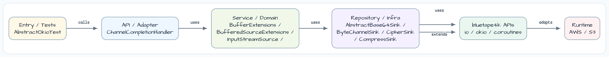
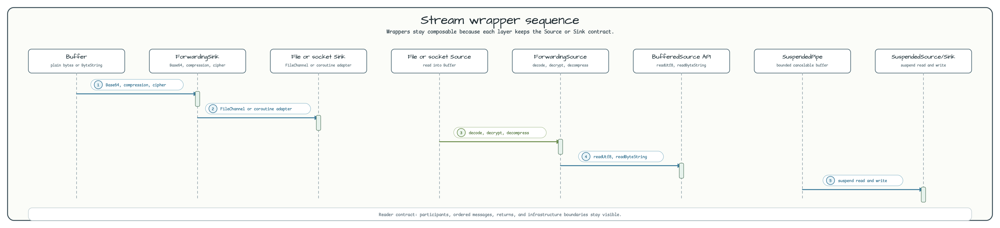

# Okio Examples

[한국어](README.ko.md) | English

## Overview

This module collects Okio `Source`, `Sink`, `Buffer`, and coroutine interop examples used by the
workshop. It is useful when you want to understand how bluetape4k wraps Okio streams for Base64,
compression, encryption, file channels, sockets, pipes, hashing, and suspend-friendly I/O.

## Architecture



The code under `io.bluetape4k.okio` is organized as composable wrappers around Okio's core
contracts. Each wrapper keeps the `Source` or `Sink` shape, so it can be layered with buffering,
file channels, sockets, or coroutine adapters.

## Stream Flow



---

## Key concepts

### Buffer

`Buffer` is Okio's core in-memory I/O container. Since `BufferedSource` and `BufferedSink` are implemented simultaneously, both reading and writing are possible. Internally, memory is managed using a segment linked list, allowing data to be moved without copying.

- Segment size: default 8 KiB (`SEGMENT_SIZE`)
- Supports various types such as byte, integer, Long, UTF-8 string, `ByteString`, etc.
- An immutable copy of `ByteString` can be created with `snapshot()`

### Source / Sink

| interface | role | core method |
|-----------|------|------------|
| `Source` | data read stream | `read(sink: Buffer, byteCount: Long): Long` |
| `Sink` | data write stream | `write(source: Buffer, byteCount: Long)` |
| `BufferedSource` | Buffered Reads (High-Level API) | `readUtf8()`, `readByteString()`, `readInt()`, etc. |
| `BufferedSink` | Buffered Writes (High-Level API) | `writeUtf8()`, `write()`, `writeInt()`, etc. |

You can add a buffering layer at any time with the `source.buffered()` / `sink.buffered()` extension functions.

### ByteString

An immutable byte array wrapper. Built-in UTF-8, Base64, and Hex encoding/decoding.

```kotlin
val bs = "East Sea and Baekdu Mountain".encodeUtf8()
bs.hex()    // "eb8f99ed95b4ebacbceab3bc20ebb0b1eb9190ec82b0ec9db4"
bs.base64() // Base64 encoded string
```

---

## Main features

| classification | Class/Extension Function | explanation |
|------|----------------|------|
| File I/O | `FileChannelSource`, `FileChannelSink` | NIO `FileChannel` based file read/write |
| Base64 | `asBase64Sink()`, `asBase64Source()` | Base64 encoding/decoding Sink·Source wrapper |
| compression | `asCompressSink()`, `asDecompressSource()` | Supports BZip2, Deflate, GZip, LZ4, Snappy, Zstd |
| encryption | `CipherSink`, `CipherSource` | Encryption/decryption using JCE `Cipher` |
| pipe | `Pipe` | Asynchronous Producer-Consumer connection, timeout support |
| coroutine | `asSuspendedSource()`, `asSuspendedSink()` | Convert socket to coroutine friendly Source/Sink |
| validation | `requirePositiveNumber()`, `requireInRange()` | Validate coroutine pipe buffer sizes and byte-array read ranges |
| NIO Channel | `asSource()` | Convert `ReadableByteChannel` to Okio `Source` |
| hashing | `HashingSink` | Hash calculations such as SHA-1, MD5, SHA-256, etc. |

---

## Usage example

### BufferedSink — Write different types

```kotlin
val buffer = Buffer()

// write bytes directly
buffer.writeByte(0xab)
buffer.writeByte(0xcd)
// buffer -> "[hex=abcd]"

// write UTF-8 string
buffer.writeUtf8("East Sea and Baekdu Mountain")
buffer.readByteString().utf8() // "East Sea and Baekdu Mountain"

// write integer (big-endian / little-endian)
buffer.writeInt(-0x543210ff) // Big Endian
buffer.writeIntLe(-0x543210ff) // little endian

// Write Long
buffer.writeLong(-0x543210fe789abcdfL)

// Write in NIO ByteBuffer
val nioBuffer = ByteBuffer.wrap("hello".toByteArray())
buffer.write(nioBuffer)
```

### BufferedSource — Read various types

```kotlin
val buffer = Buffer().also { it.writeUtf8("hello world") }

buffer.readUtf8(5)          // "hello"
buffer.readByte()           // ' ' (0x20)
buffer.readUtf8()           // "world"
buffer.exhausted()          // true

// Selective reading using Options
val options = Options.of("GET ".encodeUtf8(), "POST ".encodeUtf8())
buffer.select(options) // 0 (GET) or 1 (POST)
```

### Pipe — Asynchronous Producer-Consumer

`Pipe` is a unidirectional channel with a fixed size buffer. When the buffer is full, writes block, and when empty, reads block.
`SuspendedPipe` validates the buffer size with bluetape4k `requirePositiveNumber()` before creating the
coroutine-friendly pipe.

```kotlin
val pipe = Pipe(1000L) // buffer size 1000 bytes

// write thread
val sinkHash = executor.submit<ByteString> {
    val hashingSink = HashingSink.sha1(pipe.sink)
    val buffer = Buffer()
// ... write data
    hashingSink.close()
    hashingSink.hash
}

// read thread
val sourceHash = executor.submit<ByteString> {
    val buffer = Buffer()
    while (pipe.source.read(buffer, Long.MAX_VALUE) != -1L) {
// ... data processing
    }
    pipe.source.close()
}
```

**Pipe usage in coroutines:**

```kotlin
runSuspendIO {
    val pipe = Pipe(1000L)

    val sinkHash = async {
        val hashingSink = HashingSink.sha1(pipe.sink)
// ... write data asynchronously
        hashingSink.hash
    }

    val sourceHash = async {
        val buffer = Buffer()
        while (pipe.source.read(buffer, Long.MAX_VALUE) != -1L) {
// ... read data asynchronously
        }
        pipe.source.close()
    }

    sinkHash.await() shouldBeEqualTo sourceHash.await()
}
```

**Timeout Settings:**

```kotlin
val pipe = Pipe(3)

// Sink write timeout: InterruptedIOException if Consumer does not read within 1 second
pipe.sink.timeout().timeout(1000L, TimeUnit.MILLISECONDS)

// Source read timeout: InterruptedIOException if producer does not write within 1 second
pipe.source.timeout().timeout(1000L, TimeUnit.MILLISECONDS)
```

---

## Encryption/Compression

### CipherSink / CipherSource — Stream encryption

`CipherSink` encrypts data with JCE `Cipher` when writing, and `CipherSource` decrypts when reading. Supports all JCE standard algorithms such as AES and DES.

```kotlin
// Write with encryption sink
val buffer = Buffer()
val cipherSink = CipherSink(buffer, encryptCipher)
val input = bufferOf(plaintext.toUtf8Bytes())
cipherSink.write(input, input.size)
cipherSink.flush()

// Read with decryption source
val cipherSource = CipherSource(buffer, decryptCipher)
val output = Buffer()
cipherSource.readAll(output)
output.readUtf8() // restore original plaintext
```

**File encryption example:**

```kotlin
// Encrypt and save to file
FileChannelSink(FileChannel.open(path, WRITE), Timeout.NONE).use { fileSink ->
    val cipherSink = CipherSink(fileSink, encryptCipher)
    val input = bufferOf(expected)
    cipherSink.write(input, input.size)
    cipherSink.flush()
}

// Decrypt and read from file
FileChannelSource(FileChannel.open(path, READ), Timeout.NONE).use { fileSource ->
    val cipherSource = CipherSource(fileSource, decryptCipher)
    val output = Buffer()
    cipherSource.readAll(output)
output.readUtf8() // Decrypted original string
}
```

### asCompressSink / asDecompressSource — Various compression algorithms

`bluetape4k-okio` transparently connects several compression algorithms to Okio Sink/Source via the `Compressor` interface.

Supported algorithms: `BZip2`, `Deflate`, `GZip`, `LZ4`, `Snappy`, `Zstd`

```kotlin
val original = "Long string to compress..."
val data = bufferOf(original)

// Write to Compressed Sink
val sink = Buffer()
val compressSink = sink.asCompressSink(Compressors.LZ4)
compressSink.write(data, data.size)
compressSink.flush()

// Read from unzipped source
val source = Buffer()
val decompressSource = sink.asDecompressSource(Compressors.LZ4)
decompressSource.read(source, sink.size)

source.readUtf8() // restore original string
```

---

## Coroutine support

### SuspendedSocket — Non-blocking socket I/O

`asSuspendedSource()` / `asSuspendedSink()` extension functions convert `java.net.Socket` to a coroutine-friendly Okio Source/Sink. Internally, NIO treats `SelectionKey` in `SocketChannel` as `await()` to avoid blocking the thread.
`BufferedSuspendedSource.read(ByteArray, offset, byteCount)` validates the requested range with
bluetape4k `requireInRange()` and returns `0` immediately for zero-byte reads.

```kotlin
runSuspendIO {
// Set up NIO non-blocking socket channel
    SocketChannel.open().use { clientChannel ->
        clientChannel.configureBlocking(false)
        clientChannel.connect(serverAddress)
        clientChannel.await(SelectionKey.OP_CONNECT)
        clientChannel.finishConnect()

        val client = clientChannel.socket()

// Convert to coroutine-friendly Source/Sink
        val source = client.asSuspendedSource().buffered()
        val sink   = client.asSuspendedSink().buffered()

// non-blocking write
sink.writeUtf8("East Sea and Baekdu Mountain").flush()

// non-blocking read
        source.readUtf8(byteCount.toLong())
    }
}
```

**Key Characteristics:**

- `IOException` occurs when the socket is closed.
- Socket closed during reading/writing → Coroutine can be canceled with `IOException`
- Control maximum latency with `Timeout` settings

---

## reference

| link | explanation |
|------|------|
| [Okio GitHub](https://github.com/square/okio/) | Official source code and issues |
| [Okio official document](https://square.github.io/okio/) | API Reference and Guide |
| [Okio Recipes](https://square.github.io/okio/recipes/) | Official Example Recipe |
| [bluetape4k-okio](https://github.com/bluetape4k/bluetape4k) | bluetape4k Okio expansion module |
