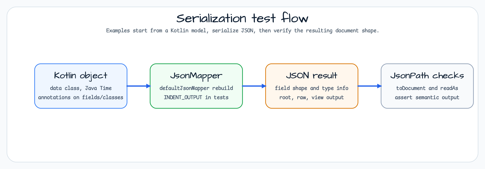

# Jackson Examples

[English](README.md) | 한국어

## 개요

이 모듈은 bluetape4k의 `Jackson.defaultJsonMapper`로 Jackson 3.x 직렬화 패턴을 보여줍니다.
공유 mapper는 Kotlin, Java Time, Blackbird module을 이미 등록하므로 예제는 mapper bootstrap
코드가 아니라 annotation 동작에 집중합니다.

## 아키텍처


테스트 suite가 실행 가능한 가이드입니다. `AbstractJacksonTest`는 mapper, faker 데이터,
JsonPath parsing을 제공하고, 각 annotation 예제는 field filtering, polymorphism, root
wrapping, circular reference, Java Time formatting, dynamic properties처럼 하나의 JSON shape
관심사를 분리해서 보여줍니다.

## 직렬화 흐름



## 사용한 bluetape4k 기능

| function | artifact | code location | advantage |
|---|---|---|---|
| `Jackson.defaultJsonMapper` | `bluetape4k-jackson3` | `AbstractJacksonTest` | KotlinModule + JavaTimeModule + Blackbird 사전 등록 — 별도 설정 불필요 |
| `KLogging` | `bluetape4k-logging` | companion object | 지연 Lambda Logging (`log.debug { "..." }`) |
| `Fakers.faker` | `bluetape4k-junit5` | `AbstractJacksonTest` | JavaFaker 기반 테스트 데이터 생성 |

## Before / After

```kotlin
// Before — Manually register KotlinModule and JavaTimeModule
val mapper = JsonMapper.builder()
    .addModule(KotlinModule.Builder().build())
    .addModule(JavaTimeModule())
    .configure(SerializationFeature.WRITE_DATES_AS_TIMESTAMPS, false)
    .build()

// After — bluetape4k Jackson.defaultJsonMapper (already registered)
val mapper: JsonMapper = Jackson.defaultJsonMapper
    .rebuild()
    .apply { configure(SerializationFeature.INDENT_OUTPUT, true) }
    .build()
```

## 주요 기능

- **Serialization / Deserialization** — `ObjectMapper.writeValueAsString()` / `readValue()`를 사용한 기본 변환
- **Field Control** — `@JsonIgnore`, `@JsonProperty`로 필드 노출과 이름 제어
- **Flattening Nested Objects** — `@JsonUnwrapped(prefix = "...")`로 중첩 객체를 단일 레벨로 펼치기
- **Polymorphism handling** — `@JsonTypeInfo` + `@JsonSubTypes`로 상속 계층 직렬화
- **Insert raw JSON** — `@JsonRawValue`로 JSON 문자열을 그대로 삽입
- **View-based filtering** — `@JsonView`로 응답 context에 따라 필드 선택 노출
- **Date/Time Serialization** — `JavaTimeModule` + `@JsonFormat`으로 Java Time API 지원
- **Circular reference handling** — `@JsonManagedReference` / `@JsonBackReference`로 양방향 관계 처리
- **Dynamic properties** — `@JsonAnySetter` / `@JsonAnyGetter`로 임의 key-value 처리
- **Root Wrapping** — `@JsonRootValue`로 최상위 객체 이름 wrapping
- **One-way serialization** — `@JsonIgnoreProperties(allowGetters = true)` 패턴 활용

## 핵심 annotation

| annotation | location | explanation |
|---|---|---|
| `@JsonIgnore` | field | serialization/deserialization에서 필드 제외 |
| `@JsonProperty("name")` | field | JSON key 이름을 지정한 값으로 변경 |
| `@JsonUnwrapped(prefix = "p_")` | field | 중첩 객체 필드를 상위 레벨로 flatten |
| `@JsonView(Views.Public::class)` | field | 특정 view에서만 필드 노출 |
| `@JsonTypeInfo` | class | JSON에 polymorphic type 정보 포함 |
| `@JsonSubTypes` | class | polymorphic subtype 목록 등록 |
| `@JsonRawValue` | field | 필드 값을 JSON 문자열로 그대로 출력 |
| `@JsonRootValue` | class | 최상위 객체를 class 이름으로 wrapping |
| `@JsonManagedReference` | field | 순환 참조에서 serialization 방향 지정(parent side) |
| `@JsonBackReference` | field | 순환 참조의 reverse(child side, serialized 안 됨) |
| `@JsonAnySetter` | method | JSON의 알 수 없는 key를 동적으로 수신 |
| `@JsonAnyGetter` | method | Map property를 JSON root level로 펼쳐 serialize |
| `@JsonFormat(pattern = "...")` | field | date/time format 사용자 정의 |

## 사용 예제

### ObjectMapper 설정

```kotlin
// bluetape4k Jackson default settings (including KotlinModule + JavaTimeModule)
val mapper: JsonMapper = Jackson.defaultJsonMapper
    .rebuild()
    .apply {
        configure(SerializationFeature.INDENT_OUTPUT, true)
    }
    .build()
```

### Serialization (object → JSON)

```kotlin
data class Friend(
    val name: String,
    @JsonIgnore
    val secret: String? = null,
)

val friend = Friend("Alice", "secret value")
val json = mapper.writeValueAsString(friend)
// Result: {"name":"Alice"} — excluding secret field
```

### Deserialize (JSON → Object)

```kotlin
val json = """{"name":"Alice","secret":"ignored"}"""
val friend = mapper.readValue<Friend>(json)
// friend.secret == null — also exclude deserialization with @JsonIgnore
```

### @JsonUnwrapped — 중첩 객체 flatten

```kotlin
data class Address(val street: String?, val number: Int?)

class Person {
    var name: String? = null

    @get:JsonUnwrapped(prefix = "mainAddress_")
    var mainAddress: Address? = null
}

// Serialization results:
// {"name":"John","mainAddress_street":"Main Street","mainAddress_number":100}
```

### @JsonTypeInfo — 다형성 처리

```kotlin
@JsonTypeInfo(use = JsonTypeInfo.Id.NAME, include = JsonTypeInfo.As.PROPERTY, property = "type")
@JsonSubTypes(
    JsonSubTypes.Type(value = Student::class, name = "student"),
    JsonSubTypes.Type(value = Employee::class, name = "employee"),
)
open class Person(var name: String)

// Serialized result: {"type":"student","name":"Bob","school":"Seoul Univ"}
```

### @JsonFormat — Date/time custom format

```kotlin
class Report {
    @JsonFormat(shape = JsonFormat.Shape.STRING, pattern = "dd/MM/yyyy")
    var reportDate: LocalDate? = null

    @JsonFormat(shape = JsonFormat.Shape.STRING, pattern = "dd/MM/yyyy|HH:mm|XXX")
    var createdAt: ZonedDateTime? = null
}

// reportDate serialization result: "01/01/2024"
// createdAt serialization result: "01/01/2024 | 14:30 | +09:00"
```

## Kotlin module

Jackson 3.x에서 Kotlin data class를 올바르게 deserialize하려면 `KotlinModule`이 필요합니다.
`bluetape4k-jackson3`는 `Jackson.defaultJsonMapper`에 `KotlinModule`과 `JavaTimeModule`을 사전 등록합니다.

```kotlin
// When setting directly
val mapper = JsonMapper.builder()
    .addModule(KotlinModule.Builder().build())
    .addModule(JavaTimeModule())
    .build()
```

`jackson-module-blackbird`는 reflection 기반 accessor를 bytecode generation으로 대체해 성능을 향상합니다.

```kotlin
// build.gradle.kts
implementation(Libs.jackson3_module_blackbird)
```

## 테스트 목록

| test file | What we cover |
|---|---|
| `IgnoreExample` | `@JsonIgnore` Serialization/Deserialization |
| `JsonUnwrappedExample` | `@JsonUnwrapped` Flattening |
| `JsonViewExample` | `@JsonView` View-based filtering |
| `PolymorphismExample` | `@JsonTypeInfo` / `@JsonSubTypes` polymorphism |
| `RawValueExample` | `@JsonRawValue` Insert raw JSON |
| `RenameExample` | `@JsonProperty` Change field name |
| `JavaTimeExample` | `@JsonFormat` Date/Time Format Conversion |
| `CyclicExample` | `@JsonManagedReference` / `@JsonBackReference` circular reference |
| `DynamicAttributeExample` | `@JsonAnySetter` / `@JsonAnyGetter` Dynamic properties |
| `OnewayExample` | One-way serialization |
| `RootValueExample` | `@JsonRootValue` Root Wrapping |
| `SimpleExamples` | Basic serialization/deserialization example |

## 참고 자료

- [Jackson Official Document](https://github.com/FasterXML/jackson)
- [Jackson Annotations Wiki](https://github.com/FasterXML/jackson-annotations/wiki/Jackson-Annotations)
- [jackson-module-kotlin](https://github.com/FasterXML/jackson-module-kotlin)
- [Jackson JavaTimeModule](https://github.com/FasterXML/jackson-modules-java8)
