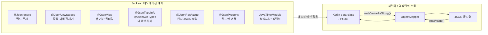

# Jackson Examples

Jackson 3.x 라이브러리를 사용하여 JSON 데이터를 Java 객체로 변환하거나 Java 객체를 JSON 데이터로 변환하는 방법을 설명합니다.



## 주요 기능

- **직렬화 / 역직렬화** — `ObjectMapper.writeValueAsString()` / `readValue()` 를 이용한 기본 변환
- **필드 제어** — `@JsonIgnore`, `@JsonProperty` 로 필드 노출·이름 제어
- **중첩 객체 평탄화** — `@JsonUnwrapped(prefix = "...")` 로 중첩 객체를 단일 레벨로 펼치기
- **다형성 처리** — `@JsonTypeInfo` + `@JsonSubTypes` 로 상속 계층 직렬화
- **원시 JSON 삽입** — `@JsonRawValue` 로 JSON 문자열을 그대로 삽입
- **뷰 기반 필터링** — `@JsonView` 로 응답 컨텍스트별 필드 선별 노출
- **날짜/시간 직렬화** — `JavaTimeModule` + `@JsonFormat` 으로 Java Time API 지원
- **순환 참조 처리** — `@JsonManagedReference` / `@JsonBackReference` 로 양방향 관계 처리
- **동적 속성** — `@JsonAnySetter` / `@JsonAnyGetter` 로 임의 키-값 처리
- **루트 래핑** — `@JsonRootValue` 로 최상위 객체 이름 래핑
- **단방향 직렬화** — `@JsonIgnoreProperties(allowGetters = true)` 패턴 활용

## 핵심 애노테이션

| 애노테이션 | 위치 | 설명 |
|---|---|---|
| `@JsonIgnore` | 필드 | 직렬화·역직렬화에서 해당 필드 제외 |
| `@JsonProperty("name")` | 필드 | JSON 키 이름을 지정된 값으로 변경 |
| `@JsonUnwrapped(prefix = "p_")` | 필드 | 중첩 객체 필드를 상위 레벨로 평탄화 |
| `@JsonView(Views.Public::class)` | 필드 | 특정 뷰에서만 해당 필드 노출 |
| `@JsonTypeInfo` | 클래스 | 다형성 타입 정보를 JSON 에 포함 |
| `@JsonSubTypes` | 클래스 | 다형성 하위 타입 목록 등록 |
| `@JsonRawValue` | 필드 | 필드 값을 JSON 문자열로 그대로 출력 |
| `@JsonRootValue` | 클래스 | 최상위 객체를 클래스명으로 래핑 |
| `@JsonManagedReference` | 필드 | 순환 참조에서 직렬화 방향 지정 (부모 측) |
| `@JsonBackReference` | 필드 | 순환 참조에서 역방향 (자식 측, 직렬화 제외) |
| `@JsonAnySetter` | 메서드 | JSON 에서 알 수 없는 키를 동적으로 수신 |
| `@JsonAnyGetter` | 메서드 | Map 속성을 JSON 루트 레벨로 펼쳐서 직렬화 |
| `@JsonFormat(pattern = "...")` | 필드 | 날짜/시간 형식 커스터마이징 |

## 사용 예제

### ObjectMapper 설정

```kotlin
// bluetape4k Jackson 기본 설정 (KotlinModule + JavaTimeModule 포함)
val mapper: JsonMapper = Jackson.defaultJsonMapper
    .rebuild()
    .apply {
        configure(SerializationFeature.INDENT_OUTPUT, true)
    }
    .build()
```

### 직렬화 (객체 → JSON)

```kotlin
data class Friend(
    val name: String,
    @JsonIgnore
    val secret: String? = null,
)

val friend = Friend("Alice", "비밀값")
val json = mapper.writeValueAsString(friend)
// 결과: {"name":"Alice"}  — secret 필드 제외
```

### 역직렬화 (JSON → 객체)

```kotlin
val json = """{"name":"Alice","secret":"무시됨"}"""
val friend = mapper.readValue<Friend>(json)
// friend.secret == null  — @JsonIgnore 로 역직렬화도 제외
```

### @JsonUnwrapped — 중첩 객체 평탄화

```kotlin
data class Address(val street: String?, val number: Int?)

class Person {
    var name: String? = null

    @get:JsonUnwrapped(prefix = "mainAddress_")
    var mainAddress: Address? = null
}

// 직렬화 결과:
// {"name":"John","mainAddress_street":"Main Street","mainAddress_number":100}
```

### @JsonTypeInfo — 다형성 처리

```kotlin
@JsonTypeInfo(use = JsonTypeInfo.Id.NAME, include = JsonTypeInfo.As.PROPERTY, property = "type")
@JsonSubTypes(
    JsonSubTypes.Type(value = Student::class, name = "student"),
    JsonSubTypes.Type(value = Employee::class, name = "employee"),
)
open class Person(var name: String)

// 직렬화 결과: {"type":"student","name":"Bob","school":"Seoul Univ"}
```

### @JsonFormat — 날짜/시간 커스텀 형식

```kotlin
class Report {
    @JsonFormat(shape = JsonFormat.Shape.STRING, pattern = "dd/MM/yyyy")
    var reportDate: LocalDate? = null

    @JsonFormat(shape = JsonFormat.Shape.STRING, pattern = "dd/MM/yyyy|HH:mm|XXX")
    var createdAt: ZonedDateTime? = null
}

// reportDate 직렬화 결과: "01/01/2024"
// createdAt  직렬화 결과: "01/01/2024|14:30|+09:00"
```

## Kotlin 모듈

Jackson 3.x 에서 Kotlin data class 를 올바르게 역직렬화하려면 `KotlinModule` 이 필요합니다.
`bluetape4k-jackson3` 는 `Jackson.defaultJsonMapper` 에 `KotlinModule` 과 `JavaTimeModule` 을 사전 등록합니다.

```kotlin
// 직접 설정 시
val mapper = JsonMapper.builder()
    .addModule(KotlinModule.Builder().build())
    .addModule(JavaTimeModule())
    .build()
```

`jackson-module-blackbird` 는 리플렉션 기반 접근자를 바이트코드 생성으로 대체하여 성능을 향상시킵니다.

```kotlin
// build.gradle.kts
implementation(Libs.jackson3_module_blackbird)
```

## 테스트 목록

| 테스트 파일 | 다루는 내용 |
|---|---|
| `IgnoreExample` | `@JsonIgnore` 직렬화·역직렬화 |
| `JsonUnwrappedExample` | `@JsonUnwrapped` 평탄화 |
| `JsonViewExample` | `@JsonView` 뷰 기반 필터링 |
| `PolymorphismExample` | `@JsonTypeInfo` / `@JsonSubTypes` 다형성 |
| `RawValueExample` | `@JsonRawValue` 원시 JSON 삽입 |
| `RenameExample` | `@JsonProperty` 필드명 변경 |
| `JavaTimeExample` | `@JsonFormat` 날짜/시간 형식 변환 |
| `CyclicExample` | `@JsonManagedReference` / `@JsonBackReference` 순환 참조 |
| `DynamicAttributeExample` | `@JsonAnySetter` / `@JsonAnyGetter` 동적 속성 |
| `OnewayExample` | 단방향 직렬화 |
| `RootValueExample` | `@JsonRootValue` 루트 래핑 |
| `SimpleExamples` | 기본 직렬화·역직렬화 예제 |

## 참고

- [Jackson 공식 문서](https://github.com/FasterXML/jackson)
- [Jackson Annotations Wiki](https://github.com/FasterXML/jackson-annotations/wiki/Jackson-Annotations)
- [jackson-module-kotlin](https://github.com/FasterXML/jackson-module-kotlin)
- [Jackson JavaTimeModule](https://github.com/FasterXML/jackson-modules-java8)
