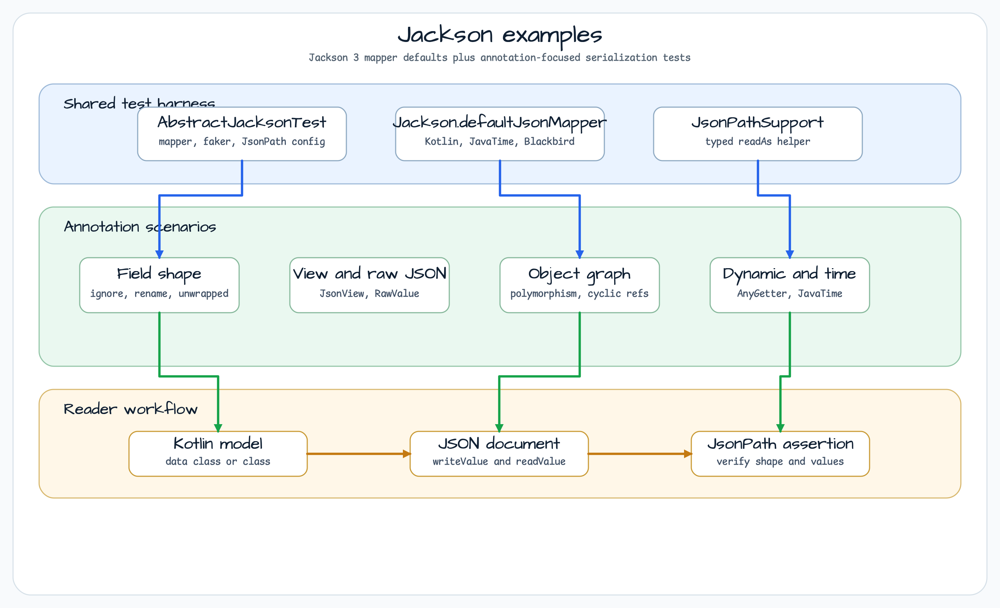

# Jackson Examples

[한국어](README.ko.md) | English

## Example Scenario

This example exercises **Jackson Examples** as a runnable JSON serialization workflow workshop slice. It focuses on the path a developer would inspect first: configure the module, run the sample or tests, and observe the library or framework APIs that remove repetitive infrastructure code.

## Architecture Diagram



The module is organized around the sample entry point or test fixture, the bluetape4k extension layer, and the runtime dependency used by the example. Keep the package under `io.bluetape4k.workshop.json` as the source of truth when comparing this README with the code.

## Sequence Diagram

Describes how to convert JSON data to Java objects or Java objects to JSON data using the Jackson 3.x library.
Automatically registers KotlinModules and JavaTimeModules with bluetape4k's `Jackson.defaultJsonMapper` to instantly serialize Kotlin data classes and Java Time APIs.

## bluetape4k features used

| function | artifact | code location | advantage |
|---|---|---|---|
| `Jackson.defaultJsonMapper` | `bluetape4k-jackson3` | `AbstractJacksonTest` | KotlinModule + JavaTimeModule + Blackbird pre-registration — no separate configuration required |
| `KLogging` | `bluetape4k-logging` | companion object | Lazy Lambda Logging (`log.debug { "..." }`) |
| `Fakers.faker` | `bluetape4k-junit5` | `AbstractJacksonTest` | JavaFaker-based test data generation |

## Before / After

```kotlin
// Before — Manually register KotlinModule and JavaTimeModule
val mapper = JsonMapper.builder()
    .addModule(KotlinModule.Builder().build())
    .addModule(JavaTimeModule())
    .configure(SerializationFeature.WRITE_DATES_AS_TIMESTAMPS, false)
    .build()

// After — bluetape4k Jackson.defaultJsonMapper (already registered)
val mapper: JsonMapper = Jackson.defaultJsonMapper
    .rebuild()
    .apply { configure(SerializationFeature.INDENT_OUTPUT, true) }
    .build()
```

## Main features

- **Serialization / Deserialization** — Basic conversion using `ObjectMapper.writeValueAsString()` / `readValue()`
- **Field Control** — Control field exposure and name with `@JsonIgnore`, `@JsonProperty`
- **Flattening Nested Objects** — Unfolding nested objects into a single level with `@JsonUnwrapped(prefix = "...")`
- **Polymorphism handling** — Serialize inheritance hierarchy with `@JsonTypeInfo` + `@JsonSubTypes`
- **Insert raw JSON** — Insert the JSON string as is into `@JsonRawValue`
- **View-based filtering** — Selectively expose fields by response context with `@JsonView`
- **Date/Time Serialization** — Java Time API support with `JavaTimeModule` + `@JsonFormat`
- **Circular reference handling** — Handling bi-directional relationships with `@JsonManagedReference` / `@JsonBackReference`
- **Dynamic properties** — Arbitrary key-value processing with `@JsonAnySetter` / `@JsonAnyGetter`
- **Root Wrapping** — Wrap the top-level object name with `@JsonRootValue`
- **One-way serialization** — Utilizing the `@JsonIgnoreProperties(allowGetters = true)` pattern

## Core annotations

| annotation | location | explanation |
|---|---|---|
| `@JsonIgnore` | field | Exclude the field from serialization/deserialization |
| `@JsonProperty("name")` | field | Change JSON key name to specified value |
| `@JsonUnwrapped(prefix = "p_")` | field | Flatten nested object fields to higher level |
| `@JsonView(Views.Public::class)` | field | Expose the field only in certain views |
| `@JsonTypeInfo` | class | Include polymorphic type information in JSON |
| `@JsonSubTypes` | class | Register polymorphic subtype list |
| `@JsonRawValue` | field | Output field values ​​as JSON strings |
| `@JsonRootValue` | class | Wrapping the top-level object with a class name |
| `@JsonManagedReference` | field | Specifying serialization direction in circular references (parent side) |
| `@JsonBackReference` | field | Reverse from circular references (child side, not serialized) |
| `@JsonAnySetter` | method | Dynamically receiving an unknown key from JSON |
| `@JsonAnyGetter` | method | Serialize Map properties by expanding them to the JSON root level |
| `@JsonFormat(pattern = "...")` | field | Customizing date/time format |

## Usage example

### ObjectMapper settings

```kotlin
// bluetape4k Jackson default settings (including KotlinModule + JavaTimeModule)
val mapper: JsonMapper = Jackson.defaultJsonMapper
    .rebuild()
    .apply {
        configure(SerializationFeature.INDENT_OUTPUT, true)
    }
    .build()
```

### Serialization (object → JSON)

```kotlin
data class Friend(
    val name: String,
    @JsonIgnore
    val secret: String? = null,
)

val friend = Friend("Alice", "secret value")
val json = mapper.writeValueAsString(friend)
// Result: {"name":"Alice"} — excluding secret field
```

### Deserialize (JSON → Object)

```kotlin
val json = """{"name":"Alice","secret":"ignored"}"""
val friend = mapper.readValue<Friend>(json)
// friend.secret == null — also exclude deserialization with @JsonIgnore
```

### @JsonUnwrapped — Flatten nested objects

```kotlin
data class Address(val street: String?, val number: Int?)

class Person {
    var name: String? = null

    @get:JsonUnwrapped(prefix = "mainAddress_")
    var mainAddress: Address? = null
}

// Serialization results:
// {"name":"John","mainAddress_street":"Main Street","mainAddress_number":100}
```

### @JsonTypeInfo — Polymorphism handling

```kotlin
@JsonTypeInfo(use = JsonTypeInfo.Id.NAME, include = JsonTypeInfo.As.PROPERTY, property = "type")
@JsonSubTypes(
    JsonSubTypes.Type(value = Student::class, name = "student"),
    JsonSubTypes.Type(value = Employee::class, name = "employee"),
)
open class Person(var name: String)

// Serialized result: {"type":"student","name":"Bob","school":"Seoul Univ"}
```

### @JsonFormat — Date/time custom format

```kotlin
class Report {
    @JsonFormat(shape = JsonFormat.Shape.STRING, pattern = "dd/MM/yyyy")
    var reportDate: LocalDate? = null

    @JsonFormat(shape = JsonFormat.Shape.STRING, pattern = "dd/MM/yyyy|HH:mm|XXX")
    var createdAt: ZonedDateTime? = null
}

// reportDate serialization result: "01/01/2024"
// createdAt serialization result: "01/01/2024 | 14:30 | +09:00"
```

## Kotlin module

`KotlinModule` is required to properly deserialize Kotlin data classes in Jackson 3.x.
`bluetape4k-jackson3` pre-registers `KotlinModule` and `JavaTimeModule` in `Jackson.defaultJsonMapper`.

```kotlin
// When setting directly
val mapper = JsonMapper.builder()
    .addModule(KotlinModule.Builder().build())
    .addModule(JavaTimeModule())
    .build()
```

`jackson-module-blackbird` improves performance by replacing reflection-based accessors with bytecode generation.

```kotlin
// build.gradle.kts
implementation(Libs.jackson3_module_blackbird)
```

## Test list

| test file | What we cover |
|---|---|
| `IgnoreExample` | `@JsonIgnore` Serialization/Deserialization |
| `JsonUnwrappedExample` | `@JsonUnwrapped` Flattening |
| `JsonViewExample` | `@JsonView` View-based filtering |
| `PolymorphismExample` | `@JsonTypeInfo` / `@JsonSubTypes` polymorphism |
| `RawValueExample` | `@JsonRawValue` Insert raw JSON |
| `RenameExample` | `@JsonProperty` Change field name |
| `JavaTimeExample` | `@JsonFormat` Date/Time Format Conversion |
| `CyclicExample` | `@JsonManagedReference` / `@JsonBackReference` circular reference |
| `DynamicAttributeExample` | `@JsonAnySetter` / `@JsonAnyGetter` Dynamic properties |
| `OnewayExample` | One-way serialization |
| `RootValueExample` | `@JsonRootValue` Root Wrapping |
| `SimpleExamples` | Basic serialization/deserialization example |

## reference

- [Jackson Official Document](https://github.com/FasterXML/jackson)
- [Jackson Annotations Wiki](https://github.com/FasterXML/jackson-annotations/wiki/Jackson-Annotations)
- [jackson-module-kotlin](https://github.com/FasterXML/jackson-module-kotlin)
- [Jackson JavaTimeModule](https://github.com/FasterXML/jackson-modules-java8)
