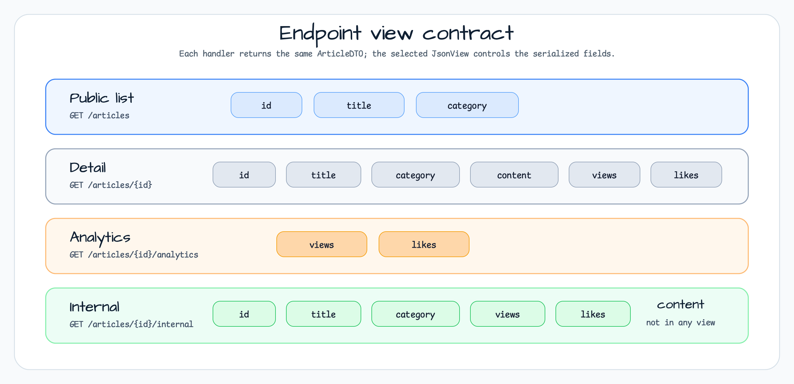

# JsonView in Spring Boot Demo

[English](README.md) | 한국어

이 모듈은 Spring Boot와 Jackson `@JsonView`로 같은 `ArticleDTO`를 여러 endpoint에서 반환하면서,
대상에 따라 노출 필드를 다르게 제어하는 예제입니다. `bluetape4k-jackson3`의
`Jackson.defaultJsonMapper`, coroutine controller, WebFlux 테스트를 함께 사용해 실제 응답 JSON의
형태를 검증합니다.

## 아키텍처


`ArticleController`는 endpoint별 `@JsonView` 선언을 담당합니다. `ArticleDTO`는
`Views.Public`, `Views.Analytics`에 포함될 필드를 표시하고, `Views.Internal`은 두 view를 모두
상속합니다. Spring은 선택된 view를 Jackson 직렬화 단계에 전달합니다.

## Endpoint view 계약



| endpoint | 적용 view | 직렬화되는 필드 |
|---|---|---|
| `GET /articles` | `Views.Public` | `id`, `title`, `category` |
| `GET /articles/{id}` | 없음 | `id`, `title`, `category`, `content`, `views`, `likes` |
| `GET /articles/{id}/analytics` | `Views.Analytics` | `views`, `likes` |
| `GET /articles/{id}/internal` | `Views.Internal` | `id`, `title`, `category`, `views`, `likes` |

`content`는 `@JsonView`가 없으므로 view를 적용하지 않는 상세 조회에서는 보이고, view가 적용된
응답에서는 빠집니다.

## 사용한 bluetape4k 기능

| function | artifact | code location | advantage |
|---|---|---|---|
| `Jackson.defaultJsonMapper` | `bluetape4k-jackson3` | `JacksonConfig.jsonMapper()` | 예제에서 Jackson module을 직접 재구성하지 않고 기본 mapper를 등록 |
| `KLoggingChannel` | `bluetape4k-logging` | `ArticleController`, tests | coroutine 환경에 맞는 lazy logging |
| `httpGet()` and assertions | `shared`, `bluetape4k-assertions` | `ArticleControllerTest` | WebFlux 요청과 응답 형태 검증을 간결하게 작성 |

## View hierarchy

```kotlin
interface Views {
    interface Public
    interface Analytics
    interface Internal: Public, Analytics
}
```

`Views.Internal`은 public 필드와 analytics 필드를 함께 포함합니다. 다만 `content`는 어떤 view에도
속하지 않으므로 internal 응답에도 포함되지 않습니다.

## Controller 구조

```kotlin
@RestController
@RequestMapping("/articles")
class ArticleController {

    @GetMapping
    @JsonView(Views.Public::class)
    fun getAllArticles(): Flow<ArticleDTO> = articles.values.asFlow()

    @GetMapping("/{id}")
    suspend fun getArticleDetails(@PathVariable(name = "id") id: Long): ArticleDTO? = articles[id]

    @JsonView(Views.Analytics::class)
    @GetMapping("/{id}/analytics")
    suspend fun getArticleAnalytics(@PathVariable id: Long): ArticleDTO? = articles[id]

    @JsonView(Views.Internal::class)
    @GetMapping("/{id}/internal")
    suspend fun getArticleInternal(@PathVariable id: Long): ArticleDTO? = articles[id]
}
```

## Jackson 설정

```kotlin
@Configuration(proxyBeanMethods = false)
class JacksonConfig {
    @Bean
    fun jsonMapper(): JsonMapper = Jackson.defaultJsonMapper
}
```

## 테스트 기대값

```kotlin
val articles = client.httpGet("/articles")
    .expectStatus().is2xxSuccessful
    .expectBodyList<ArticleDTO>()
    .returnResult().responseBody
    .shouldNotBeNull()

articles.forEach { it.views.shouldBeNull() }
articles.forEach { it.likes.shouldBeNull() }

val analytics = client.httpGet("/articles/1/analytics")
    .returnResult<ArticleDTO>().responseBody.awaitSingle()

analytics.id.shouldBeNull()
analytics.views shouldBeEqualTo 1000L
```

## 참고 자료

* [@JsonView with Spring Boot and Kotlin](https://codersee.com/jsonview-with-spring-boot-and-kotlin/)
* [Jackson @JsonView documentation](https://github.com/FasterXML/jackson-annotations/wiki/Jackson-Annotations#jsonview)
* [Spring MVC @JsonView support](https://docs.spring.io/spring-framework/reference/web/webmvc/mvc-controller/ann-methods/jackson.html)
