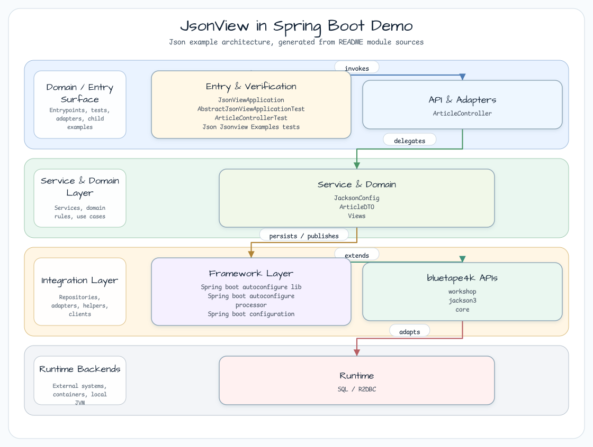
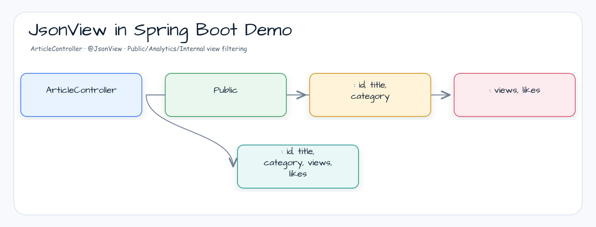

# JsonView in Spring Boot Demo

[English](README.md) | 한국어

## 예제 시나리오

이 예제는 **JsonView in Spring Boot Demo**를 실행 가능한 JSON serialization 워크플로우 워크샵 조각으로 다룹니다. 개발자가 가장 먼저 확인할 흐름인 모듈 설정, 샘플 또는 테스트 실행, 반복적인 인프라 코드를 줄여 주는 라이브러리/프레임워크 API 관찰에 초점을 둡니다.

## 아키텍처 다이어그램



이 모듈은 샘플 진입점 또는 테스트 픽스처, bluetape4k 확장 계층, 예제가 사용하는 런타임 의존성을 중심으로 구성됩니다. 이 README를 코드와 비교할 때는 `io.bluetape4k.workshop.json` 패키지를 기준으로 삼습니다.

## 시퀀스 다이어그램

Spring Boot REST API에서 응답할 때 `@JsonView`를 사용해 응답 데이터를 필터링하는 방법을 배웁니다.
bluetape4k의 `Jackson.defaultJsonMapper`를 `@Bean`으로 등록해 KotlinModule + JavaTimeModule 설정을 단순화합니다.

## 사용한 bluetape4k 기능

| function | artifact | code location | advantage |
|---|---|---|---|
| `Jackson.defaultJsonMapper` | `bluetape4k-jackson3` | `JacksonConfig.jsonMapper()` | KotlinModule + JavaTimeModule 사전 등록 — 수동 설정 불필요 |
| `KLogging` | `bluetape4k-logging` | companion object | 지연 lambda logging |
| `shouldBeNull()` / `shouldBeEqualTo` | `bluetape4k-assertions` | controller test | Kluent style assertion |

## Before / After

```kotlin
// Before — Manual JsonMapper setup
@Bean
fun jsonMapper(): JsonMapper = JsonMapper.builder()
    .addModule(KotlinModule.Builder().build())
    .addModule(JavaTimeModule())
    .build()

// After — bluetape4k Jackson.defaultJsonMapper
@Bean
fun jsonMapper(): JsonMapper = Jackson.defaultJsonMapper
```



## 주요 기능

- **Response field screening** — 같은 DTO class를 재사용하면서 endpoint별로 노출 필드를 다르게 제어
- **Hierarchical view inheritance** — `Internal`이 `Public`과 `Analytics`를 동시에 상속해 모든 필드를 노출
- **Automatically exclude fields not specified in the view** — `content` 필드처럼 `@JsonView` 없이 정의된 필드는 view 적용 시 응답에서 제외됩니다.
- **Controller level declaration** — method에 `@JsonView`를 선언하면 serialization 단계에서 자동으로 필터링됩니다.
- **Spring WebFlux coroutine support** — `suspend fun`과 `Flow` 반환 타입에서 동작합니다.

## View hierarchy

```kotlin
interface Views {
interface Public // Public information: id, title, category
interface Analytics // Statistical information: views, likes
interface Internal: Public, Analytics // Internal information: includes both public + statistics
}
```

| view interface | exposure field | explanation |
|---|---|---|
| `Views.Public` | `id`, `title`, `category` | 외부 공개용 — 식별자와 기본 정보만 노출 |
| `Views.Analytics` | `views`, `likes` | 통계와 분석용 — 조회 수와 좋아요 수만 노출 |
| `Views.Internal` | `id`, `title`, `category`, `views`, `likes` | 내부 관리자용 — Public + Analytics 모두 노출 |
| (no view) | `content` | 어떤 view에도 포함되지 않으므로 항상 제외 |

## API endpoint

| method | channel | Applied view | response field |
|---|---|---|---|
| `GET` | `/articles` | `Views.Public` | `id`, `title`, `category` |
| `GET` | `/articles/{id}` | (no view) | 모든 필드(`content` 포함) |
| `GET` | `/articles/{id}/analytics` | `Views.Analytics` | `views`, `likes` |
| `GET` | `/articles/{id}/internal` | `Views.Internal` | `id`, `title`, `category`, `views`, `likes` |

## 사용 예제

### DTO definition — @JsonView applied

```kotlin
data class ArticleDTO(
    @JsonView(Views.Public::class)
    val id: Long?,

    @JsonView(Views.Public::class)
    val title: String?,

    @JsonView(Views.Public::class)
    val category: String?,

val content: String?, // @JsonView none — always excluded when applying a view

    @JsonView(Views.Analytics::class)
    val views: Long?,

    @JsonView(Views.Analytics::class)
    val likes: Long?,
)
```

### Controller — Endpoint-specific view declarations

```kotlin
@RestController
@RequestMapping("/articles")
class ArticleController {

// Full list: Apply public view → expose only id, title, and category
    @GetMapping
    @JsonView(Views.Public::class)
    fun getAllArticles(): Flow<ArticleDTO> = articles.values.asFlow()

// Detailed query: No view → All fields exposed (including content)
    @GetMapping("/{id}")
    suspend fun getArticleDetails(@PathVariable id: Long): ArticleDTO? = articles[id]

// Statistics inquiry: Analytics view → Only views and likes are exposed
    @JsonView(Views.Analytics::class)
    @GetMapping("/{id}/analytics")
    suspend fun getArticleAnalytics(@PathVariable id: Long): ArticleDTO? = articles[id]

// Internal view: Internal view → Exposure of both Public + Analytics fields
    @JsonView(Views.Internal::class)
    @GetMapping("/{id}/internal")
    suspend fun getArticleInternal(@PathVariable id: Long): ArticleDTO? = articles[id]
}
```

### Jackson 설정

```kotlin
@Configuration(proxyBeanMethods = false)
class JacksonConfig {

// bluetape4k Jackson.defaultJsonMapper: KotlinModule + JavaTimeModule pre-registration
    @Bean
    fun jsonMapper(): JsonMapper = Jackson.defaultJsonMapper
}
```

### 테스트 예제

```kotlin
// Public view: views, likes return null
val articles = client.httpGet("/articles")
    .expectStatus().is2xxSuccessful
    .expectBodyList<ArticleDTO>()
    .returnResult().responseBody!!

articles.forEach { it.views.shouldBeNull() } // Check for exclusion of Analytics fields
articles.forEach { it.likes.shouldBeNull() }

// Analytics view: id, title, category return as null
val analytics = client.httpGet("/articles/1/analytics")
    .returnResult<ArticleDTO>().responseBody.awaitSingle()

analytics.id.shouldBeNull()
analytics.views shouldBeEqualTo 1000L

// Internal view: Public + Analytics return all fields
val internal = client.httpGet("/articles/1/internal")
    .returnResult<ArticleDTO>().responseBody.awaitSingle()

internal.id shouldBeEqualTo 1
internal.views shouldBeEqualTo 1000L
```

## 참고 자료

* [@JsonView with Spring Boot and Kotlin](https://codersee.com/jsonview-with-spring-boot-and-kotlin/)
* [Jackson @JsonView official documentation](https://github.com/FasterXML/jackson-annotations/wiki/Jackson-Annotations#jsonview)
* [Spring MVC @JsonView support](https://docs.spring.io/spring-framework/reference/web/webmvc/mvc-controller/ann-methods/jackson.html)
