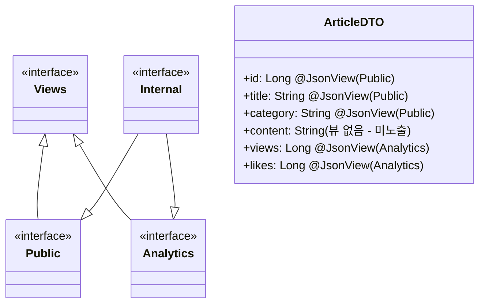
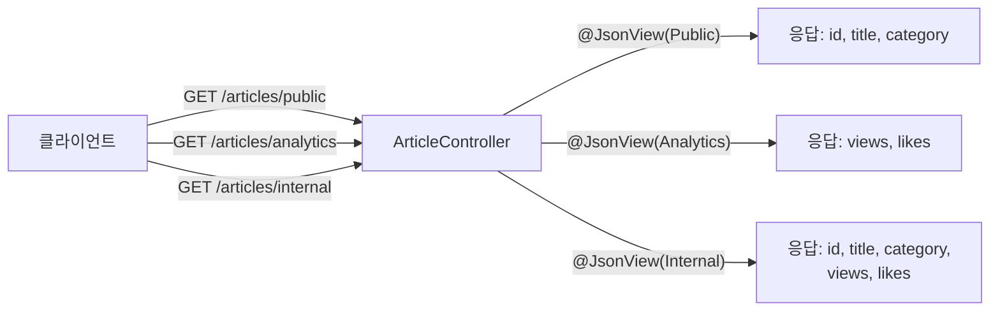

# JsonView in Spring Boot Demo

Spring Boot REST API 에서 응답 시 `@JsonView` 를 사용하여 응답 데이터를 필터링하는 방법을 알아보겠습니다.





## 주요 기능

- **응답 필드 선별** — 동일한 DTO 클래스를 재사용하면서 엔드포인트별로 노출 필드를 다르게 제어
- **계층형 뷰 상속** — `Internal`이 `Public`과 `Analytics`를 동시에 상속하여 모든 필드 노출
- **뷰 미지정 필드 자동 제외** — `content` 필드처럼 `@JsonView` 없이 정의된 필드는 뷰 적용 시 응답에서 제외
- **컨트롤러 레벨 선언** — 메서드에 `@JsonView`를 선언하면 직렬화 단계에서 자동으로 필터링
- **Spring WebFlux 코루틴 지원** — `suspend fun` 및 `Flow` 반환 타입과 함께 동작

## 뷰 계층 구조

```kotlin
interface Views {
    interface Public                        // 공개 정보: id, title, category
    interface Analytics                     // 통계 정보: views, likes
    interface Internal : Public, Analytics  // 내부 정보: 공개 + 통계 모두 포함
}
```

| 뷰 인터페이스 | 노출 필드 | 설명 |
|---|---|---|
| `Views.Public` | `id`, `title`, `category` | 외부 공개용 — 식별자와 기본 정보만 노출 |
| `Views.Analytics` | `views`, `likes` | 통계·분석용 — 조회수·좋아요 수만 노출 |
| `Views.Internal` | `id`, `title`, `category`, `views`, `likes` | 내부 관리자용 — Public + Analytics 모두 노출 |
| (뷰 없음) | `content` | 어떤 뷰에도 포함되지 않아 항상 제외 |

## API 엔드포인트

| 메서드 | 경로 | 적용 뷰 | 응답 필드 |
|---|---|---|---|
| `GET` | `/articles` | `Views.Public` | `id`, `title`, `category` |
| `GET` | `/articles/{id}` | (뷰 없음) | 모든 필드 (`content` 포함) |
| `GET` | `/articles/{id}/analytics` | `Views.Analytics` | `views`, `likes` |
| `GET` | `/articles/{id}/internal` | `Views.Internal` | `id`, `title`, `category`, `views`, `likes` |

## 사용 예제

### DTO 정의 — @JsonView 적용

```kotlin
data class ArticleDTO(
    @JsonView(Views.Public::class)
    val id: Long?,

    @JsonView(Views.Public::class)
    val title: String?,

    @JsonView(Views.Public::class)
    val category: String?,

    val content: String?,           // @JsonView 없음 — 뷰 적용 시 항상 제외

    @JsonView(Views.Analytics::class)
    val views: Long?,

    @JsonView(Views.Analytics::class)
    val likes: Long?,
)
```

### 컨트롤러 — 엔드포인트별 뷰 선언

```kotlin
@RestController
@RequestMapping("/articles")
class ArticleController {

    // 전체 목록: Public 뷰 적용 → id, title, category 만 노출
    @GetMapping
    @JsonView(Views.Public::class)
    fun getAllArticles(): Flow<ArticleDTO> = articles.values.asFlow()

    // 상세 조회: 뷰 없음 → 모든 필드 노출 (content 포함)
    @GetMapping("/{id}")
    suspend fun getArticleDetails(@PathVariable id: Long): ArticleDTO? = articles[id]

    // 통계 조회: Analytics 뷰 → views, likes 만 노출
    @JsonView(Views.Analytics::class)
    @GetMapping("/{id}/analytics")
    suspend fun getArticleAnalytics(@PathVariable id: Long): ArticleDTO? = articles[id]

    // 내부 조회: Internal 뷰 → Public + Analytics 필드 모두 노출
    @JsonView(Views.Internal::class)
    @GetMapping("/{id}/internal")
    suspend fun getArticleInternal(@PathVariable id: Long): ArticleDTO? = articles[id]
}
```

### Jackson 설정

```kotlin
@Configuration(proxyBeanMethods = false)
class JacksonConfig {

    // bluetape4k Jackson.defaultJsonMapper: KotlinModule + JavaTimeModule 사전 등록
    @Bean
    fun jsonMapper(): JsonMapper = Jackson.defaultJsonMapper
}
```

### 테스트 예제

```kotlin
// Public 뷰: views, likes 는 null 로 반환
val articles = client.httpGet("/articles")
    .expectStatus().is2xxSuccessful
    .expectBodyList<ArticleDTO>()
    .returnResult().responseBody!!

articles.forEach { it.views.shouldBeNull() }    // Analytics 필드 제외 확인
articles.forEach { it.likes.shouldBeNull() }

// Analytics 뷰: id, title, category 는 null 로 반환
val analytics = client.httpGet("/articles/1/analytics")
    .returnResult<ArticleDTO>().responseBody.awaitSingle()

analytics.id.shouldBeNull()
analytics.views shouldBeEqualTo 1000L

// Internal 뷰: Public + Analytics 모든 필드 반환
val internal = client.httpGet("/articles/1/internal")
    .returnResult<ArticleDTO>().responseBody.awaitSingle()

internal.id shouldBeEqualTo 1
internal.views shouldBeEqualTo 1000L
```

## 참고

* [@JsonView with Spring Boot and Kotlin](https://codersee.com/jsonview-with-spring-boot-and-kotlin/)
* [Jackson @JsonView 공식 문서](https://github.com/FasterXML/jackson-annotations/wiki/Jackson-Annotations#jsonview)
* [Spring MVC @JsonView 지원](https://docs.spring.io/spring-framework/reference/web/webmvc/mvc-controller/ann-methods/jackson.html)
