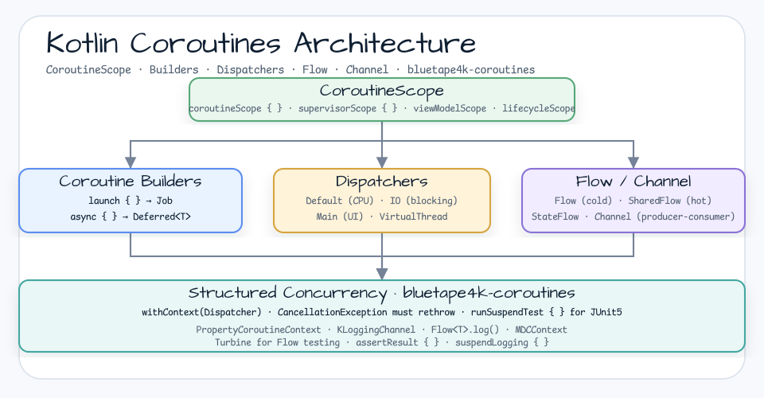

# Coroutines Examples

[English](README.md) | 한국어

## 예제 시나리오

이 예제는 **Coroutines Examples**를 실행 가능한 Kotlin 언어 및 코루틴 패턴 워크샵 조각으로 다룹니다. 개발자가 먼저 확인할 경로인 모듈 설정, 샘플 또는 테스트 실행, 반복적인 인프라 코드를 줄이는 라이브러리나 프레임워크 API 관찰에 초점을 둡니다.

## 아키텍처 다이어그램



모듈은 샘플 진입점 또는 테스트 픽스처, bluetape4k 확장 계층, 예제가 사용하는 런타임 의존성을 중심으로 구성됩니다. README와 코드를 비교할 때는 `io.bluetape4k.workshop.kotlin` 패키지 아래의 구현을 기준으로 삼습니다.


## 흐름 다이어그램

1. `kotlin-coroutines`에 필요한 로컬 런타임을 준비합니다.
2. 예제 시나리오를 담당하는 애플리케이션, 컨트롤러, 서비스 또는 테스트 픽스처를 실행합니다.
3. 반복적인 인프라 작업을 bluetape4k 유틸리티 또는 Spring/Kotlin 통합 기능에 위임합니다.
4. 샘플 출력, HTTP 응답, 저장소 상태, metric, trace 또는 테스트 기대값으로 보이는 결과를 검증합니다.

## 시퀀스 다이어그램

핵심 시퀀스는 호출자 또는 테스트 픽스처 -> 워크샵 어댑터 -> bluetape4k 헬퍼/API -> 외부 런타임 또는 인메모리 백엔드 -> 검증/응답 순서입니다. 이 모듈에 전용 시퀀스 자산이 있으면 아래 이미지가 상호작용 순서를 보여주며, 그렇지 않으면 소스 테스트가 실행 가능한 시퀀스의 기준입니다.

Kotlin Coroutines의 핵심 개념을 익히기 위한 예제 모음입니다.

## 코루틴 구조 개요


## 예제 범주

### 기초 (`guide/`)
| 파일 | 상세 |
|---|---|
| `CoroutineBuilderExamples` | `launch`, `async`, `runBlocking` 빌더 사용법 |
| `CoroutineContextExamples` | `CoroutineContext`, `Dispatcher` 이해 |
| `SuspendExamples` | suspend 함수 작성 패턴 |
| `FlowExamples` | Cold Stream `Flow` 기본 연산자 |
| `SharedFlowExamples` | Hot Stream `SharedFlow` / `StateFlow` |
| `ChannelExamples` | `Channel`을 사용하는 Producer-Consumer 패턴 |
| `ChannelAsFlowExamples` | Channel을 Flow로 변환하는 패턴 |
| `MDCContextExamples` | Log MDC와 Coroutine Context 통합 |

### 취소 처리 (`cancellation/`)
- `CancellationExamples` — 코루틴 취소 전파, `CancellationException` 처리, `NonCancellable` 활용

### 사용자 정의 CoroutineContext (`context/`)
- `CounterCoroutineContext` — 상태를 가진 사용자 정의 Context Element
- `UuidProviderCoroutineContext` — 요청마다 UUID를 제공하는 Context

### 빌더 심화 (`builders/`)
- `CoroutineBuilderExamples` — `supervisorScope`, `coroutineScope`, 오류 전파 차이
- `CoroutineContextBuilderExamples` — `withContext`, Context 전환 패턴

### Scope 관리 (`scope/`)
- `CoroutineScopeExamples` — Structured Concurrency
- `SpringCoroutineScopeTest` — Spring Bean 생명주기와 CoroutineScope 통합

### Flow 테스트 (`tests/`)
- `TurbineExamples` — [Turbine](Flow test using https://github.com/cashapp/turbine) 라이브러리

## 사용된 bluetape4k 기능

| 기능 | artifact | 코드 위치 | 장점 |
|---|---|---|---|
| `KLoggingChannel` | `bluetape4k-logging` | 모든 companion object | 코루틴 컨텍스트를 포함한 구조적 로깅, SLF4J MDC와 연동 |
| `suspendLogging { }` | `bluetape4k-logging` | `DispatcherExamples` | suspend 컨텍스트에서 로그 메시지를 안전하게 구성 |
| `coroutines.support.log` | `bluetape4k-coroutines` | `DispatcherExamples` | job에 이름 태그를 추가하고 완료 로그를 자동 출력 |
| `Flow<T>.log()` | `bluetape4k-coroutines` | `FlowBuilderExamples`, `FlowLifecycleExamples` | flow 파이프라인 중간에서 emit 값을 로깅 |
| `coroutines.tests.assertResult` | `bluetape4k-coroutines` | `FlowBuilderExamples`, `CallbackFlowExamples` | turbine 없이 flow 결과를 검증하는 테스트 유틸리티 |
| `PropertyCoroutineContext` | `bluetape4k-coroutines` | `context/` package | 타입 안전 key-value store를 제공하는 사용자 정의 CoroutineContext 구현 |
| `runSuspendTest { }` | `bluetape4k-junit5` | test full | JUnit 5에서 suspend 테스트를 실행하는 확장 함수 |
| `Fakers` | `bluetape4k-junit5` | test fixture | JavaFaker 기반 테스트 데이터 생성 유틸리티 |
| `OutputCapture` / `OutputCapturer` | `bluetape4k-junit5` | Output Verification Test | stdout/stderr 캡처 JUnit 5 확장 |
| `bluetape4k-assertions` | `bluetape4k-core` | test full | Kluent 스타일의 읽기 쉬운 assertion (`shouldBeEqualTo`, `shouldNotBeNull` 등) |
| `Uuid` (idgenerators) | `bluetape4k-idgenerators` | `UuidProviderCoroutineContext` | UUID v7을 포함한 다양한 ID 생성 전략 |
| `withLoggingContext { }` | `bluetape4k-logging` | MDC integration example | Kotlin DSL 기반 MDC 컨텍스트 설정 |

## bluetape4k Before / After

### 표준 Logger 대비 `KLoggingChannel`

```kotlin
// Before — Direct use of SLF4J LoggerFactory
class MyClass {
    companion object {
        private val log = LoggerFactory.getLogger(MyClass::class.java)
    }
}

// After — bluetape4k KLoggingChannel (with coroutine context)
class MyClass {
    companion object: KLoggingChannel()
// Automatic creation of log property + Included in coroutine context information log
}
```

### 일반 로그 호출 대비 `suspendLogging { }`

```kotlin
// Before — General log in coroutine (only includes thread information)
launch(Dispatchers.IO) {
    log.debug("Running on thread ${Thread.currentThread().name}")
}

// After — bluetape4k suspendLogging (includes coroutine name + thread information)
launch(Dispatchers.IO) {
    suspendLogging { "Running on thread ${Thread.currentThread().name}" }
// Example output: [DefaultDispatcher-worker-1 @coroutine#3] Running on thread ...
}
```

### `Flow<T>.log()` 디버깅 연산자

```kotlin
// Before — onEach + println to check intermediate values
flow { emit(1); emit(2) }
    .onEach { println("value: $it") }
    .collect()

// After — bluetape4k .log() extension function
flow { emit(1); emit(2) }
.log("my-flow") // Automatically log emit/complete/error events
    .collect()
```

### Turbine 대비 `coroutines.tests.assertResult`

```kotlin
// Before — Requires Turbine library dependency
someFlow.test {
    awaitItem() shouldBeEqualTo 1
    awaitItem() shouldBeEqualTo 2
    awaitComplete()
}

// After — bluetape4k assertResult (no additional dependencies)
someFlow.assertResult(1, 2)
```

## 참고

- [Kotlin Coroutines Official Guide](https://kotlinlang.org/docs/coroutines-guide.html)
- [Kotlin Flow official documentation](https://kotlinlang.org/docs/flow.html)
