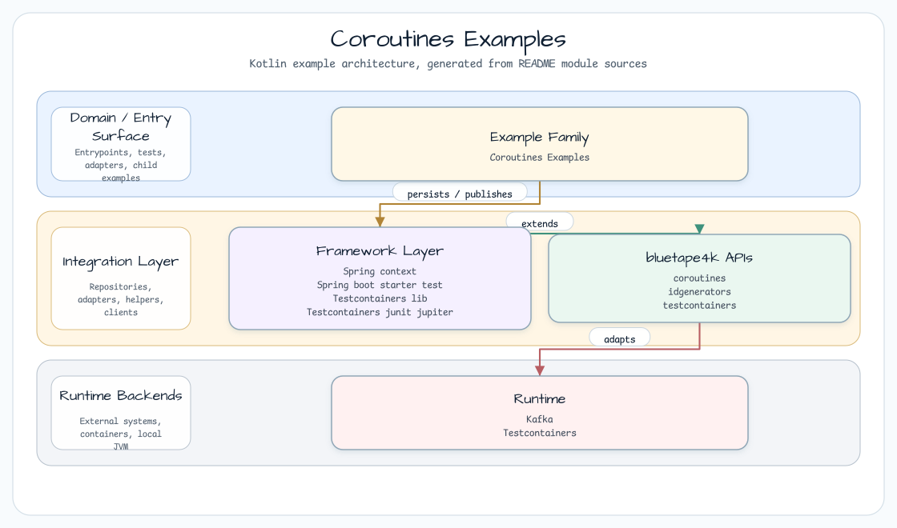

# Coroutines Examples

[한국어](README.ko.md) | English

## Example Scenario

This example exercises **Coroutines Examples** as a runnable Kotlin language and coroutine patterns workshop slice. It focuses on the path a developer would inspect first: configure the module, run the sample or tests, and observe the library or framework APIs that remove repetitive infrastructure code.

## Architecture Diagram



The module is organized around the sample entry point or test fixture, the bluetape4k extension layer, and the runtime dependency used by the example. Keep the package under `io.bluetape4k.workshop.kotlin` as the source of truth when comparing this README with the code.

## Sequence Diagram

A collection of examples to learn the core concepts of Kotlin Coroutines.

## Coroutine structure overview

## Example Category

### Basics (`guide/`)
| file | detail |
|---|---|
| `CoroutineBuilderExamples` | How to use `launch`, `async`, `runBlocking` builders |
| `CoroutineContextExamples` | Understand `CoroutineContext`, `Dispatcher` |
| `SuspendExamples` | pattern for writing suspend functions |
| `FlowExamples` | Cold Stream `Flow` Basic Operator |
| `SharedFlowExamples` | Hot Stream `SharedFlow` / `StateFlow` |
| `ChannelExamples` | Producer-Consumer pattern using `Channel` |
| `ChannelAsFlowExamples` | Pattern to convert Channel to Flow |
| `MDCContextExamples` | Log MDC and Coroutine Context integration |

### Cancellation processing (`cancellation/`)
- `CancellationExamples` — Propagate coroutine cancellation, handle `CancellationException`, utilize `NonCancellable`

### Custom CoroutineContext (`context/`)
- `CounterCoroutineContext` — Custom Context Element with state
- `UuidProviderCoroutineContext` — UUID provided for each request Context

### Builder Advanced (`builders/`)
- `CoroutineBuilderExamples` — `supervisorScope`, `coroutineScope`, error propagation difference
- `CoroutineContextBuilderExamples` — `withContext`, Context switching pattern

### Scope Management (`scope/`)
- `CoroutineScopeExamples` — Structured Concurrency
- `SpringCoroutineScopeTest` — Spring Bean life cycle and CoroutineScope integration

### Flow Test (`tests/`)
- `TurbineExamples` — [Turbine](Flow test using https://github.com/cashapp/turbine) library

## bluetape4k features used

| function | artifact | code location | advantage |
|---|---|---|---|
| `KLoggingChannel` | `bluetape4k-logging` | All companion objects | Structured logging including coroutine context; Linked with SLF4J MDC |
| `suspendLogging { }` | `bluetape4k-logging` | `DispatcherExamples` | Building log messages safely in suspend context |
| `coroutines.support.log` | `bluetape4k-coroutines` | `DispatcherExamples` | Add name tag to job and automatically print completion log |
| `Flow<T>.log()` | `bluetape4k-coroutines` | `FlowBuilderExamples`, `FlowLifecycleExamples` | Logging emit values ​​in the middle of the flow pipeline |
| `coroutines.tests.assertResult` | `bluetape4k-coroutines` | `FlowBuilderExamples`, `CallbackFlowExamples` | Test utility that verifies flow results without turbine |
| `PropertyCoroutineContext` | `bluetape4k-coroutines` | `context/` package | Custom CoroutineContext implementation with type-safe key-value store |
| `runSuspendTest { }` | `bluetape4k-junit5` | test full | Extension function to run suspend tests in JUnit 5 |
| `Fakers` | `bluetape4k-junit5` | test fixture | JavaFaker-based test data generation utility |
| `OutputCapture` / `OutputCapturer` | `bluetape4k-junit5` | Output Verification Test | stdout/stderr capture JUnit 5 extension |
| `bluetape4k-assertions` | `bluetape4k-core` | test full | Kluent-style highly readable assertions (`shouldBeEqualTo`, `shouldNotBeNull`, etc.) |
| `Uuid` (idgenerators) | `bluetape4k-idgenerators` | `UuidProviderCoroutineContext` | Various ID generation strategies, including UUID v7 |
| `withLoggingContext { }` | `bluetape4k-logging` | MDC integration example | Kotlin DSL-based MDC context setting |

## bluetape4k Before / After

### `KLoggingChannel` vs Standard Logger

```kotlin
// Before — Direct use of SLF4J LoggerFactory
class MyClass {
    companion object {
        private val log = LoggerFactory.getLogger(MyClass::class.java)
    }
}

// After — bluetape4k KLoggingChannel (with coroutine context)
class MyClass {
    companion object: KLoggingChannel()
// Automatic creation of log property + Included in coroutine context information log
}
```

### `suspendLogging { }` vs general log call

```kotlin
// Before — General log in coroutine (only includes thread information)
launch(Dispatchers.IO) {
    log.debug("Running on thread ${Thread.currentThread().name}")
}

// After — bluetape4k suspendLogging (includes coroutine name + thread information)
launch(Dispatchers.IO) {
    suspendLogging { "Running on thread ${Thread.currentThread().name}" }
// Example output: [DefaultDispatcher-worker-1 @coroutine#3] Running on thread ...
}
```

### `Flow<T>.log()` Debugging operators

```kotlin
// Before — onEach + println to check intermediate values
flow { emit(1); emit(2) }
    .onEach { println("value: $it") }
    .collect()

// After — bluetape4k .log() extension function
flow { emit(1); emit(2) }
.log("my-flow") // Automatically log emit/complete/error events
    .collect()
```

### `coroutines.tests.assertResult` vs Turbine

```kotlin
// Before — Requires Turbine library dependency
someFlow.test {
    awaitItem() shouldBeEqualTo 1
    awaitItem() shouldBeEqualTo 2
    awaitComplete()
}

// After — bluetape4k assertResult (no additional dependencies)
someFlow.assertResult(1, 2)
```

## reference

- [Kotlin Coroutines Official Guide](https://kotlinlang.org/docs/coroutines-guide.html)
- [Kotlin Flow official documentation](https://kotlinlang.org/docs/flow.html)
