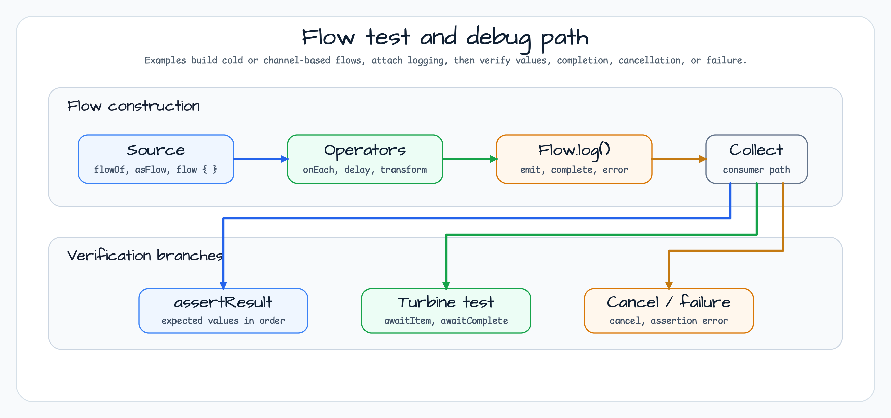

# Coroutines Examples

[한국어](README.ko.md) | English

This module is a test-driven catalog for Kotlin coroutine behavior. It is not a single runnable
service; each package demonstrates one coroutine topic with JUnit tests, coroutine test utilities,
logging helpers, and flow assertions.

## Learning map


Start with the `guide/` package when learning the basic coroutine vocabulary, then move into
builders, dispatchers, cancellation, flow/channel examples, context propagation, and Spring scope
lifecycle examples.

## Flow test and debug path



Flow examples build cold or channel-backed streams, attach `Flow<T>.log()` to observe emit/complete
events, and then verify the result through `assertResult`, Turbine, cancellation checks, or failure
assertions.

## Example categories

| package | examples | reader question |
|---|---|---|
| `guide/` | builders, context, suspend functions, flow, shared flow, channels, MDC | What are the basic coroutine primitives? |
| `builders/` | `coroutineScope`, `supervisorScope`, `withContext` | How do builders affect child jobs and error propagation? |
| `dispatchers/` | Default, IO, custom pools, Main dispatcher override | Which thread or dispatcher runs this coroutine? |
| `cancellation/` and `exceptions/` | cancellation propagation, `NonCancellable`, error handling | How should cancellation and failures be modeled? |
| `flow/` and `channels/` | `flowOf`, `asFlow`, `callbackFlow`, `channelFlow`, actors | How do cold streams, hot streams, and channels behave? |
| `context/` | `CounterCoroutineContext`, `UuidProviderCoroutineContext` | How do custom context elements carry request-scoped state? |
| `scope/spring/` | `SpringCoroutineScope`, bean destroy hook | How can a Spring bean own and cancel a coroutine `Job`? |
| `tests/` | Turbine examples | How do tests assert asynchronous flow behavior? |

## bluetape4k features used

| function | artifact | code location | advantage |
|---|---|---|---|
| `KLoggingChannel` | `bluetape4k-logging` | companion objects across examples | Lazy coroutine-aware logging |
| `suspendLogging { }` | `bluetape4k-logging` | `dispatchers/DispatcherExamples` | Builds log messages from suspend contexts |
| `Job.log("name")` | `bluetape4k-coroutines` | dispatcher examples | Adds completion logging to launched jobs |
| `Flow<T>.log()` | `bluetape4k-coroutines` | `flow/*`, `tests/TurbineExamples` | Logs flow emit, completion, and error events |
| `assertResult(...)` | `bluetape4k-coroutines` | `flow/FlowBuilderExamples` | Verifies flow values without a full Turbine block |
| `runSuspendTest { }` / `runTest` | `bluetape4k-junit5`, kotlinx-coroutines-test | coroutine tests | Runs suspend examples under JUnit 5 |
| `OutputCapture` / `OutputCapturer` | `bluetape4k-junit5` | `scope/spring/SpringCoroutineScopeTest` | Verifies destroy-time output |
| `Uuid.V7` | `bluetape4k-idgenerators` | `context/UuidProviderCoroutineContext` | Provides request-style identifiers through coroutine context |

## Representative patterns

### Dispatcher logging

```kotlin
launch(Dispatchers.IO) {
    val threadName = Thread.currentThread().name
    suspendLogging { "Running on thread $threadName" }
}.log("IO")
```

### Flow construction and compact assertion

```kotlin
val function: suspend () -> String = suspend {
    delay(1000)
    "UserName"
}

function.asFlow()
    .log("function")
    .assertResult("UserName")
```

### Spring-owned coroutine scope

```kotlin
class MyBean: SpringCoroutineScope by SpringCoroutineScope() {
    suspend fun run(input: Int) =
        withContext(coroutineContext) {
            delay(1000)
            input
        }
}
```

The `SpringCoroutineScope` implementation exposes the `Job` from its coroutine context and cancels
it from `destroy()`, which fits Spring bean lifecycle cleanup.

## References

- [Kotlin Coroutines official guide](https://kotlinlang.org/docs/coroutines-guide.html)
- [Kotlin Flow documentation](https://kotlinlang.org/docs/flow.html)
- [Turbine](https://github.com/cashapp/turbine)
