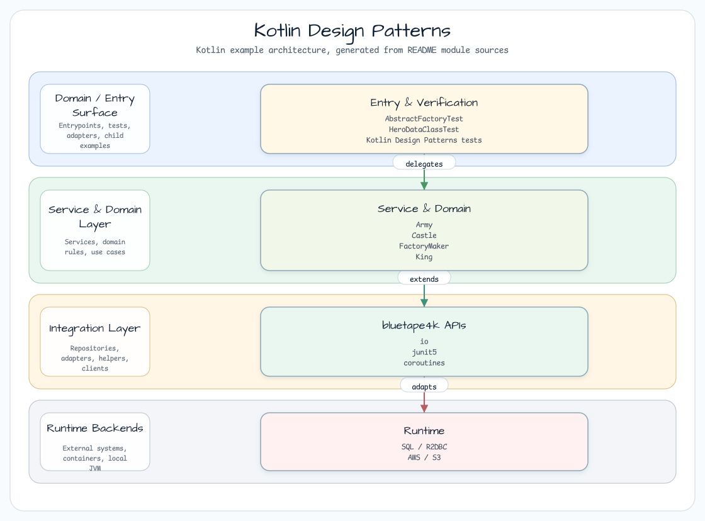

# Kotlin Design Patterns

[English](README.md) | 한국어

## 예제 시나리오

이 예제는 **Kotlin Design Patterns**를 실행 가능한 Kotlin 언어와 코루틴 패턴 예제로 보여줍니다. 개발자가 먼저 확인할 경로인 모듈 설정, 샘플 또는 테스트 실행, 반복적인 인프라 코드를 줄이는 라이브러리 또는 프레임워크 API 사용 방식을 중심으로 설명합니다.
## 아키텍처 다이어그램

모듈은 샘플 진입점 또는 테스트 픽스처, bluetape4k 확장 계층, 예제가 사용하는 런타임 의존성을 중심으로 구성됩니다. README와 코드를 비교할 때는 `io.bluetape4k.workshop.kotlin` 패키지 아래의 구현을 기준으로 삼습니다.

## 구현된 패턴
