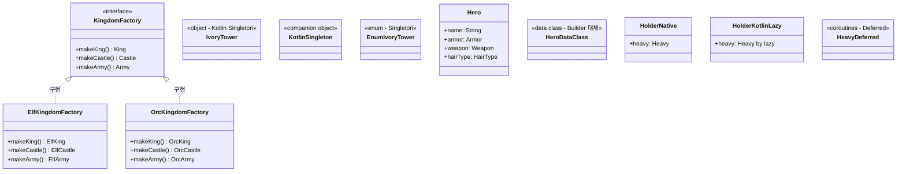

# Kotlin Design Patterns

Kotlin 언어로 구현하는 디자인 패턴 예제 모음입니다.

[Java Design Patterns](https://github.com/iluwatar/java-design-patterns) 를 참고하여, Kotlin 언어로 Design Patterns 예제를 설명합니다.

## 구현된 패턴

```mermaid
classDiagram
    class KingdomFactory {
        <<interface>>
        +makeKing() King
        +makeCastle() Castle
        +makeArmy() Army
    }
    class ElfKingdomFactory {
        +makeKing() ElfKing
        +makeCastle() ElfCastle
        +makeArmy() ElfArmy
    }
    class OrcKingdomFactory {
        +makeKing() OrcKing
        +makeCastle() OrcCastle
        +makeArmy() OrcArmy
    }
    KingdomFactory <|.. ElfKingdomFactory : 구현
    KingdomFactory <|.. OrcKingdomFactory : 구현

    class IvoryTower {
        <<object - Kotlin Singleton>>
    }
    class KotlinSingleton {
        <<companion object>>
    }
    class EnumIvoryTower {
        <<enum - Singleton>>
    }

    class Hero {
        +name: String
        +armor: Armor
        +weapon: Weapon
        +hairType: HairType
    }
    class HeroDataClass {
        <<data class - Builder 대체>>
    }

    class HolderNative {
        +heavy: Heavy
    }
    class HolderKotlinLazy {
        +heavy: Heavy by lazy
    }
    class HeavyDeferred {
        <<coroutines - Deferred>>
    }
```
