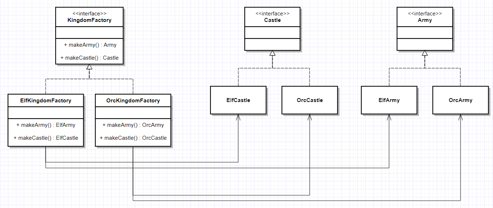
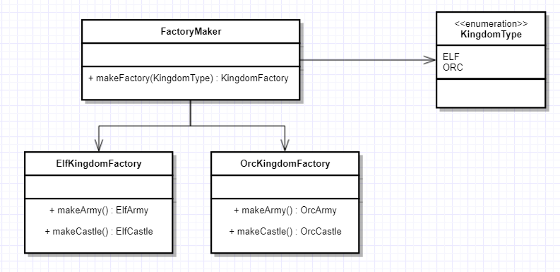

## Also known as

Kit

## Intent (취지)

관계된 또는 의존적인 객체 패밀리를 생성하기 위한 인터페이스를 제공합니다.

## Explanation (설명)

실전 예제

> 왕국을 만들기 위해서는 공통 주제를 가진 객체가 필요합니다. 엘프 왕국은 엘프 왕, 엘프 성, 엘프 군대가 필요하며, 오크 왕국은 오크 왕, 오크 성, 오크 군대가 필요합니다. 왕국의 객체들 사이에는 의존성이
> 있습니다.

간단히

> 팩토리의 팩토리; 구체적인 클래스를 지정하지 않고 개별적이지만 관련된/의존적인 팩토리를 그룹화하는 팩토리입니다.

WikiPedia에 따르면

> 추상 팩토리 패턴은 구체적인 클래스를 지정하지 않고 공통 주제를 가진 개별 팩토리 그룹을 캡슐화하는 방법을 제공합니다.

**프로그램 예제**

위의 왕국 예제를 변한합니다. 먼저 왕국 객체에 대한 인터페이스와 구현을 가지고 있습니다.



```kotlin
interface Castle {
    val description: String
}
interface King {
    val description: String
}
interface Army {
    val description: String
}

// Elven implementations ->
class ElfCastle implements Castle {
    companion object {
    const val DESCRIPTION = "This is the Elven castle!"
}
    override val description: String
    get() = DESCRIPTION
}
public class ElfKing implements King {
    companion object {
    const val DESCRIPTION = "This is the Elven king!"
}
    override val description: String
    get() = DESCRIPTION
}
public class ElfArmy implements Army {
    companion object {
    const val DESCRIPTION = "This is the Elven Army!"
}
    override val description: String
    get() = DESCRIPTION
}

// Orcish implementations similarly...

```

그런 다음 왕국 팩토리에 대한 추상화와 구현이 있습니다

```kotlin
interface KingdomFactory {
    createCastle(): Castle
    createKing(): King
    createArmy(): Army
}

class ElfKingdomFactory implements KingdomFactory {
    override fun createCastle(): Castle {
        return ElfCastle()
    }
    override fun createKing(): King {
        return ElfKing()
    }
    override fun createArmy(): Army {
        return ElfArmy()
    }

}

class OrcKingdomFactory implements KingdomFactory {
    override fun createCastle(): Castle {
        return OrcCastle()
    }
    override fun createKing(): King {
        return OrcKing()
    }
    override fun createArmy(): Army {
        return OrcArmy()
    }
}
```

이제 관련된 객체 패밀리를 만들 수 있는 추상 팩토리가 있습니다. 즉, 엘프 왕국 팩토리는 엘프 성, 왕, 군대 등을 만듭니다.

```kotlin
val factory = ElfKingdomFactory()
val castle = factory.createCastle()
val king = factory.createKing()
val army = factory.createArmy()

castle.description  // Output: This is the Elven castle!
king.description    // Output: This is the Elven king!
army.description // Output: This is the Elven Army!
```

이제 다른 왕국 팩토리를 위한 팩토리를 설계할 수 있습니다. 이 예제에서는 FactoryMaker를 만들었습니다. 이는 ElfKingdomFactory 또는 OrcKingdomFactory의 인스턴스를 반환하는
역할을 합니다.

클라이언트는 FactoryMaker를 사용하여 원하는 구체적인 팩토리를 만들 수 있으며, 이는 다양한 구체적인 객체(군대, 왕, 성)를 생성합니다.
이 예제에서는 클라이언트가 요청할 왕국 팩토리의 유형을 매개변수화하기 위해 enum을 사용했습니다.



```kotlin
object FactoryMaker {

    enum class KingdomType {
        ELF, ORC;
    }

    fun makeFactory(KingdomType type): KindomFactory {
        return when (type) {
            KingdomType.ELF -> ElfKingdomFactory()
            KingdomType.ORC -> OrcKingdomFactory()
            else            -> throw IllegalArgumentException("KingdomType not supported.")
        }
    }
}

fun main(vararg args: String) {
    val app = new App ()

    LOGGER.info("Elf Kingdom")
    app.createKingdom(FactoryMaker.makeFactory(KingdomType.ELF))

    LOGGER.info(app.getArmy().description)
    LOGGER.info(app.getCastle().description)
    LOGGER.info(app.getKing().description)

    LOGGER.info("Orc Kingdom")
    app.createKingdom(FactoryMaker.makeFactory(KingdomType.ORC))
    --similar use of the orc factory
}
```

## 적용 가능 여부

추상 팩토리 패턴을 사용하는 경우

* 시스템은 제품이 어떻게 생성되고 구성되며 표현되는지에 독립적이어야 합니다
* 시스템은 여러 제품 패밀리 중 하나로 구성되어야 합니다
* 관련된 제품 객체 패밀리가 함께 사용되도록 설계되었으며 이 제약을 강제해야 합니다
* 당신이 제품의 클래스 라이브러리를 제공하고, 그들의 구현이 아닌 인터페이스만을 공개하고 싶을 때
* 의존성 수명이 소비자의 수명보다 개념적으로 짧을 때
* 런타임 값이 특정 종속성을 구성하는 데 필요할 때
* 프로덕트 패밀리 중 어떤 제품을 런타임에 호출할지 결정하고 싶을 때
* 한개나 그 이상의 파라미터를 런타임에 알아야만 의존성을 해결할 수 있을 때
* 프로덕트들 간의 일관성이 필요할 때
* 기존 코드를 변경하지 않고 새 제품이나 제품 패밀리를 프로그램에 추가하고 싶을 때
*

## 대표적 사용 사례

* 파일 시스템, 데이터베이스, 네트워크 서비스 중 하나를 런타임에 호출하는 경우
* 단위 테스트 케이스 작성이 훨씬 쉬워집니다
* 다양한 OS에 대한 UI 도구

## 결과

* 자바에서의 의존성 주입은 런타임 오류를 숨길 수 있으며, 컴파일 시간에 잡힐 수 있는 오류를 발생시킬 수 있습니다.
* 이 패턴은 미리 정의된 객체를 만들 때 훌륭하지만, 새로운 객체를 추가하는 것은 어려울 수 있습니다.
* 이 패턴과 함께 많은 새로운 인터페이스와 클래스가 도입된다면 코드가 예상보다 복잡해질 수 있습니다.

## 예제

* [Abstract Factory Pattern Tutorial](https://www.journaldev.com/1418/abstract-factory-design-pattern-in-java)

## 발표 자료

* [Abstract Factory Pattern](etc/presentation.html)

## 실제 예제

* [javax.xml.parsers.DocumentBuilderFactory](http://docs.oracle.com/javase/8/docs/api/javax/xml/parsers/DocumentBuilderFactory.html)
* [javax.xml.transform.TransformerFactory](http://docs.oracle.com/javase/8/docs/api/javax/xml/transform/TransformerFactory.html#newInstance--)
* [javax.xml.xpath.XPathFactory](http://docs.oracle.com/javase/8/docs/api/javax/xml/xpath/XPathFactory.html#newInstance--)

## 참고

* [Design Patterns: Elements of Reusable Object-Oriented Software](http://www.amazon.com/Design-Patterns-Elements-Reusable-Object-Oriented/dp/0201633612)
