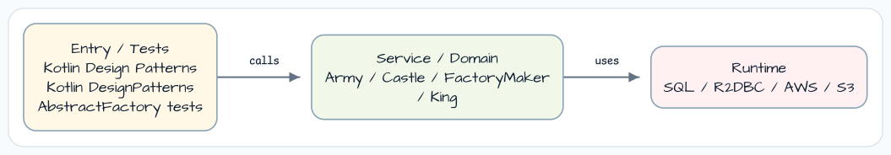
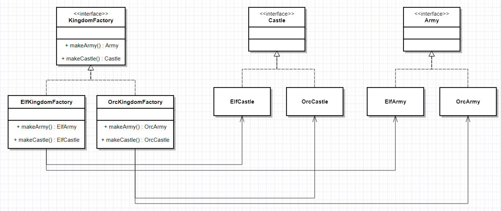
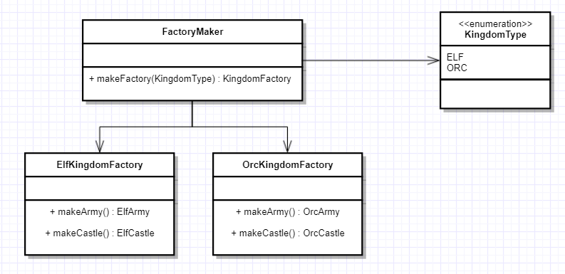

# abstractFactory

[한국어](README.ko.md) | English

## Example Scenario

This example exercises **abstractFactory** as a runnable Kotlin language and coroutine patterns workshop slice. It focuses on the path a developer would inspect first: configure the module, run the sample or tests, and observe the library or framework APIs that remove repetitive infrastructure code.

## Architecture Diagram



The module is organized around the sample entry point or test fixture, the bluetape4k extension layer, and the runtime dependency used by the example. Keep the package under `io.bluetape4k.workshop.kotlin` as the source of truth when comparing this README with the code.

## Sequence Diagram

---
layout: pattern
title: Abstract Factory
folder: abstract-factory
permalink: /patterns/abstract-factory/
categories: Creational
tags:
    - Java
    - Gang Of Four
    - Difficulty-Intermediate
---

## Also known as

Kit

## Intent

Provides an interface for creating families of related or dependent objects.

## Explanation

Practical example

> To create a kingdom, you need objects with a common theme. The elven kingdom needs an elven king, an elven castle, and an elven army, while the orc kingdom needs an orc king, an orc castle, and an orc army. There are dependencies between objects in the kingdom.
> Yes.

simply

> Factory of factories; A factory that groups together individual but related/dependent factories without specifying a specific class.

According to WikiPedia

> The Abstract Factory pattern provides a way to encapsulate a group of individual factories with a common theme without specifying a concrete class.

**Program example**

Here's a variation of the kingdom example above. First, we have an interface and implementation for the kingdom object.



```kotlin
interface Castle {
    val description: String
}
interface King {
    val description: String
}
interface Army {
    val description: String
}

// Elven implementations ->
class ElfCastle implements Castle {
    companion object {
    const val DESCRIPTION = "This is the Elven castle!"
}
    override val description: String
    get() = DESCRIPTION
}
public class ElfKing implements King {
    companion object {
    const val DESCRIPTION = "This is the Elven king!"
}
    override val description: String
    get() = DESCRIPTION
}
public class ElfArmy implements Army {
    companion object {
    const val DESCRIPTION = "This is the Elven Army!"
}
    override val description: String
    get() = DESCRIPTION
}

// Orcish implementations similarly...

```

Then there is the abstraction and implementation for the kingdom factory

```kotlin
interface KingdomFactory {
    createCastle(): Castle
    createKing(): King
    createArmy(): Army
}

class ElfKingdomFactory implements KingdomFactory {
    override fun createCastle(): Castle {
        return ElfCastle()
    }
    override fun createKing(): King {
        return ElfKing()
    }
    override fun createArmy(): Army {
        return ElfArmy()
    }

}

class OrcKingdomFactory implements KingdomFactory {
    override fun createCastle(): Castle {
        return OrcCastle()
    }
    override fun createKing(): King {
        return OrcKing()
    }
    override fun createArmy(): Army {
        return OrcArmy()
    }
}
```

We now have an abstract factory that allows us to create families of related objects. In other words, the Elf Kingdom Factory creates elven castles, kings, armies, and more.

```kotlin
val factory = ElfKingdomFactory()
val castle = factory.createCastle()
val king = factory.createKing()
val army = factory.createArmy()

castle.description  // Output: This is the Elven castle!
king.description    // Output: This is the Elven king!
army.description // Output: This is the Elven Army!
```

You can now design factories for other kingdom factories. In this example, we created FactoryMaker. This returns an instance of ElfKingdomFactory or OrcKingdomFactory.
It plays a role.

Using FactoryMaker, clients can create any concrete factory they want, which creates a variety of concrete objects (armies, kings, castles).
In this example, we used an enum to parameterize the type of kingdom factory that the client will request.



```kotlin
object FactoryMaker {

    enum class KingdomType {
        ELF, ORC;
    }

    fun makeFactory(KingdomType type): KindomFactory {
        return when (type) {
            KingdomType.ELF -> ElfKingdomFactory()
            KingdomType.ORC -> OrcKingdomFactory()
            else            -> throw IllegalArgumentException("KingdomType not supported.")
        }
    }
}

fun main(vararg args: String) {
    val app = new App ()

    LOGGER.info("Elf Kingdom")
    app.createKingdom(FactoryMaker.makeFactory(KingdomType.ELF))

    LOGGER.info(app.getArmy().description)
    LOGGER.info(app.getCastle().description)
    LOGGER.info(app.getKing().description)

    LOGGER.info("Orc Kingdom")
    app.createKingdom(FactoryMaker.makeFactory(KingdomType.ORC))
    --similar use of the orc factory
}
```

## Applicability

When to use the abstract factory pattern

* The system must be independent of how the product is created, structured and presented
* System must consist of one of several product families
* Related product object families are designed to be used together and must enforce this constraint
* When you provide a class library for your product and want to expose only the interfaces and not their implementations.
* When the dependency lifetime is conceptually shorter than the consumer lifetime.
* When runtime values ​​are needed to configure a specific dependency
* When you want to decide which product among the product family to call at runtime
* When dependencies can only be resolved if one or more parameters are known at runtime
* When consistency between products is needed
* When you want to add a new product or product family to the program without changing the existing code.
*

## Representative use cases

* When calling one of the file system, database, and network services at runtime.
*Writing unit test cases becomes much easier
* UI tools for various OS

## result

* Dependency injection in Java can hide runtime errors and cause errors that can be caught at compile time.
* This pattern is great for creating predefined objects, but adding new objects can be difficult.
* If many new interfaces and classes are introduced with this pattern, your code may become more complex than expected.

## Example

* [Abstract Factory Pattern Tutorial](https://www.journaldev.com/1418/abstract-factory-design-pattern-in-java)

## Presentation material

* [Abstract Factory Pattern](etc/presentation.html)

## Real example

* [javax.xml.parsers.DocumentBuilderFactory](http://docs.oracle.com/javase/8/docs/api/javax/xml/parsers/DocumentBuilderFactory.html)
* [javax.xml.transform.TransformerFactory](http://docs.oracle.com/javase/8/docs/api/javax/xml/transform/TransformerFactory.html#newInstance--)
* [javax.xml.xpath.XPathFactory](http://docs.oracle.com/javase/8/docs/api/javax/xml/xpath/XPathFactory.html#newInstance--)

## reference

* [Design Patterns: Elements of Reusable Object-Oriented Software](http://www.amazon.com/Design-Patterns-Elements-Reusable-Object-Oriented/dp/0201633612)
