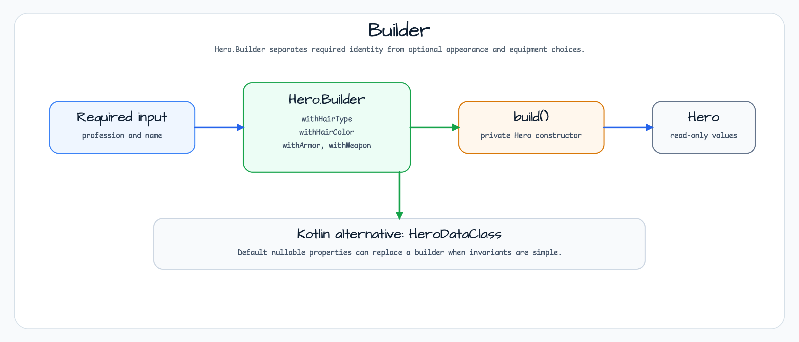

# builder

[English](README.md) | 한국어

## 예제 시나리오

이 예제는 **builder**를 실행 가능한 Kotlin 언어 및 코루틴 패턴 워크샵 조각으로 다룹니다. 개발자가 먼저 확인할 경로인 모듈 설정, 샘플 또는 테스트 실행, 반복적인 인프라 코드를 줄이는 라이브러리나 프레임워크 API 관찰에 초점을 둡니다.

## 아키텍처 다이어그램



모듈은 샘플 진입점 또는 테스트 픽스처, bluetape4k 확장 계층, 예제가 사용하는 런타임 의존성을 중심으로 구성됩니다. README와 코드를 비교할 때는 `io.bluetape4k.workshop.kotlin` 패키지 아래의 구현을 기준으로 삼습니다.

## 흐름 다이어그램

1. `builder`에 필요한 로컬 런타임을 준비합니다.
2. 예제 시나리오를 담당하는 애플리케이션, 컨트롤러, 서비스 또는 테스트 픽스처를 실행합니다.
3. 반복적인 인프라 작업을 bluetape4k 유틸리티 또는 Spring/Kotlin 통합 기능에 위임합니다.
4. 샘플 출력, HTTP 응답, 저장소 상태, metric, trace 또는 테스트 기대값으로 보이는 결과를 검증합니다.

## 시퀀스 다이어그램

핵심 시퀀스는 호출자 또는 테스트 픽스처 -> 워크샵 어댑터 -> bluetape4k 헬퍼/API -> 외부 런타임 또는 인메모리 백엔드 -> 검증/응답 순서입니다. 이 모듈에 전용 시퀀스 자산이 있으면 아래 이미지가 상호작용 순서를 보여주며, 그렇지 않으면 소스 테스트가 실행 가능한 시퀀스의 기준입니다.

---
layout: pattern
title: Builder
folder: builder
permalink: /patterns/builder/
categories: Creational
tags:
    - Java
    - Gang Of Four
    - Difficulty-Intermediate
---

## 목적

복잡한 객체의 생성 과정을 표현 방식과 분리하여, 같은 생성 과정으로 서로 다른 표현을 만들 수 있게 합니다.

## 설명

실제 예

> 롤플레잉 게임의 캐릭터 생성기를 상상해 보세요. 가장 쉬운 선택지는 컴퓨터가 캐릭터를 만들게 하는 것입니다.
> 하지만 직업, 성별, 머리 색 같은 캐릭터 세부사항을 선택하면 모든 선택이 완료될 때 캐릭터 생성이 끝나는 단계별 과정이 됩니다.

간단히 말하면

> 서로 다른 맛의 객체를 만들 수 있고 생성자 오염을 피할 수 있습니다.
> 객체에 여러 변형이 있을 수 있을 때 유용합니다. 또는 객체 생성에 많은 단계가 포함될 때 유용합니다.

Wikipedia에 따르면

> Builder 패턴은 telescope constructor anti-pattern의 해결책을 찾기 위한 객체 생성 소프트웨어 디자인 패턴입니다.

그러면 telescope constructor anti-pattern을 조금 더 설명해 보겠습니다. 어느 시점에는 다음과 같은 생성자를 본 적이 있을 것입니다.

```kotlin
class Hero(
    profession: Profession,
    name: Name,
    hairType: HairType,
    hairColor: HairColor,
    armor: Armor,
    weapon: Weapon,
) {
    // ...
}
```

생성자 매개변수 수는 빠르게 감당하기 어려워질 수 있고, 그 배열도 이해하기 어려워질 수 있습니다.
또한 나중에 더 많은 옵션을 추가하려면 이 매개변수 목록은 계속 늘어날 수 있습니다.
이것을 telescope generator anti-pattern이라고 합니다.

**프로그램 예제**

이상적인 대안은 Builder 패턴을 사용하는 것입니다. 먼저 생성하려는 Hero가 있습니다.

```kotlin
class Hero private constructor(builder: Hero.Builder) {

    val profession = builder.profession
    val name = builder.name
    val hairType = builder.hairType
    val hairColor = builder.hairColor
    val armor = builder.armor
    val weapon = builder.weapon

    override fun toString(): String {
        return buildString {
            append("This is a ")
                .append(profession)
                .append(" named ")
                .append(name)
            if (hairColor != null || hairType != null) {
                append(" with ")
                hairColor?.run { append(this).append(' ') }
                hairType?.run { append(this).append(' ') }
            }
            armor?.run { append(" wearing ").append(this) }
            weapon?.run { append(" and wielding a ").append(this) }
            append('.')
        }
    }
    //...
}
```

그다음 builder를 만듭니다.

```kotlin
class Builder(val profession: Profession, val name: String) {
    var hairType: HairType? = null
    var hairColor: HairColor? = null
    var armor: Armor? = null
    var weapon: Weapon? = null
    fun withHairType(hairType: HairType) = apply {
        this.hairType = hairType
    }
    fun withHairColor(hairColor: HairColor) = apply {
        this.hairColor = hairColor
    }
    fun withArmor(armor: Armor) = apply {
        this.armor = armor
    }
    fun withWeapon(weapon: Weapon) = apply {
        this.weapon = weapon
    }
    fun build(): Hero {
        return Hero(this)
    }
}
```

그러면 다음처럼 사용할 수 있습니다.

```kotlin
val mage = Hero.Builder(Profession.MAGE, "Riobard")
    .withHairColor(HairColor.BLACK)
    .withWeapon(Weapon.DAGGER)
    .build()
```

## 적용 가능성

Builder 패턴은 다음과 같은 경우에 사용합니다.

* 생성 과정이 복잡한 객체의 부분과 객체가 구성되는 방식에서 독립적이어야 하는 경우
* 객체 생성을 위한 서로 다른 표현을 허용해야 하는 경우

## 예제

* [java.lang.StringBuilder](http://docs.oracle.com/javase/8/docs/api/java/lang/StringBuilder.html)
* [java.nio.ByteBuffer](http://docs.oracle.com/javase/8/docs/api/java/nio/ByteBuffer.html#put-byte-) as well as similar
  buffers such as FloatBuffer, IntBuffer and so on.
* [java.lang.StringBuffer](http://docs.oracle.com/javase/8/docs/api/java/lang/StringBuffer.html#append-boolean-)
* All implementations of [java.lang.Appendable](http://docs.oracle.com/javase/8/docs/api/java/lang/Appendable.html)
* [Apache Camel builders](https://github.com/apache/camel/tree/0e195428ee04531be27a0b659005e3aa8d159d23/camel-core/src/main/java/org/apache/camel/builder)

## 참고

* [Design Patterns: Elements of Reusable Object-Oriented Software](http://www.amazon.com/Design-Patterns-Elements-Reusable-Object-Oriented/dp/0201633612)
* [Effective Java (2nd Edition)](http://www.amazon.com/Effective-Java-Edition-Joshua-Bloch/dp/0321356683)
