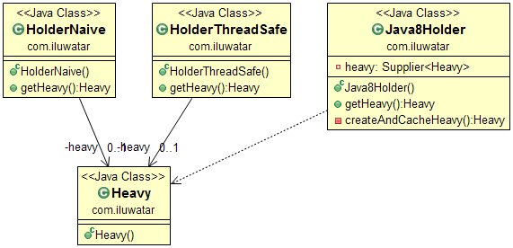

## 취지

Lazy Loading은 객체의 초기화를 필요한 시점까지 미루는 데 자주 사용되는 디자인 패턴입니다.
적절하게 사용된다면 프로그램의 작동 효율성에 기여할 수 있습니다.

## 적용 방법

Lazy Loading 방식은 적용할 때 다음과 같은 경우에 사용합니다.

* eager loading이 비용이 많이 들거나 로드할 객체가 전혀 필요하지 않을 수 있을 때

## 실제 사례

* JPA annotations @OneToOne, @OneToMany, @ManyToOne, @ManyToMany and fetch = FetchType.LAZY

## 참고

* [J2EE Design Patterns](http://www.amazon.com/J2EE-Design-Patterns-William-Crawford/dp/0596004273/ref=sr_1_2)
