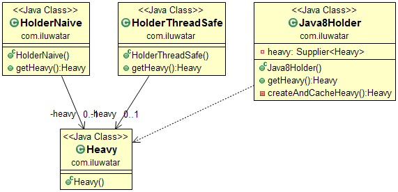

# lazyLoading

[한국어](README.ko.md) | English

## Example Scenario

This example exercises **lazyLoading** as a runnable Kotlin language and coroutine patterns workshop slice. It focuses on the path a developer would inspect first: configure the module, run the sample or tests, and observe the library or framework APIs that remove repetitive infrastructure code.

## Architecture Diagram

The module is organized around the sample entry point or test fixture, the bluetape4k extension layer, and the runtime dependency used by the example. Keep the package under `io.bluetape4k.workshop.kotlin` as the source of truth when comparing this README with the code.

## Sequence Diagram

---
layout: pattern
title: Lazy Loading
folder: lazy-loading
permalink: /patterns/lazy-loading/
categories: Other
tags:
    - Java
    - Difficulty-Beginner
    - Idiom
    - Performance
---

## Purpose

Lazy Loading is a design pattern often used to postpone initialization of an object until it is needed.
If used properly, they can contribute to the operational efficiency of the program.

## How to apply

The Lazy Loading method is used in the following cases:

* When eager loading is expensive or the object to be loaded may not be needed at all.

## Real examples

* JPA annotations @OneToOne, @OneToMany, @ManyToOne, @ManyToMany and fetch = FetchType.LAZY

## reference

* [J2EE Design Patterns](http://www.amazon.com/J2EE-Design-Patterns-William-Crawford/dp/0596004273/ref=sr_1_2)
