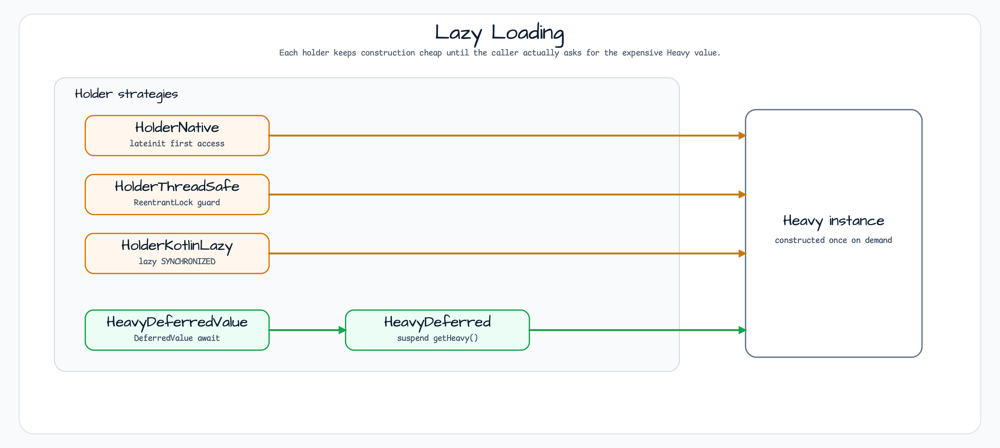

# Lazy Loading

[한국어](README.ko.md) | English

Lazy Loading delays expensive initialization until a value is actually requested. This package uses
`Heavy` as the expensive object and compares native, lock-guarded, Kotlin `lazy`, and coroutine
`DeferredValue` holders.

## Architecture



## Source map

| source | role |
|---|---|
| `Heavy` | expensive object; parks briefly during construction to make creation visible without `Thread.sleep` |
| `HolderNative` | initializes a `lateinit` property on first `getHeavy()` |
| `HolderThreadSafe` | protects first initialization with `ReentrantLock` |
| `HolderKotlinLazy` | uses Kotlin `lazy(LazyThreadSafetyMode.SYNCHRONIZED)` |
| `coroutines/HeavyDeferredValue` | defers suspend initialization through `DeferredValue` |

## Usage shape

```kotlin
val holder = HolderKotlinLazy()

// Heavy is not created by holder construction.
val heavy = holder.getHeavy()
```

Use lazy loading when eager creation is expensive and the caller may not need the value at all.
