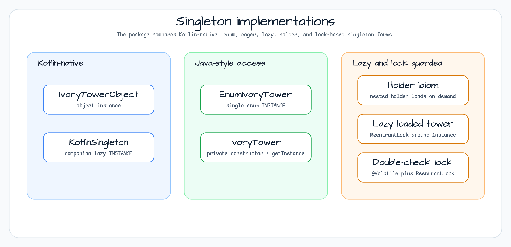

# Singleton

[English](README.md) | 한국어

Singleton은 특정 type이 잘 알려진 접근 경로를 통해 하나의 shared instance만 노출하도록 보장합니다.
이 package는 Kotlin-native 구현과 Java-style, lock-guarded variant를 비교합니다.

## 아키텍처

## Source map

| source | 역할 |
|---|---|
| `IvoryTowerObject` | Kotlin `object` singleton |
| `KotlinSingleton` | `lazy`로 초기화되는 companion `INSTANCE` |
| `EnumIvoryTower` | 단일 enum instance |
| `IvoryTower` | private constructor와 `getInstance()`를 쓰는 eager singleton |
| `InitializingOnDemandHolderIdiom` | 필요할 때 load되는 nested holder |
| `ThreadSafeLazyLoadedIvoryTower` | `ReentrantLock`으로 보호되는 lazy instance |
| `ThreadSafeDoubleCheckLocking` | volatile field와 `ReentrantLock` 기반 double-check locking |

## 선택 기준

Kotlin 코드에서는 lifecycle 요구사항을 만족한다면 `object`나 단순 `lazy` holder를 우선 고려합니다.
Lock 기반 예제는 legacy singleton mechanics를 이해하거나, `synchronized` 없이 생성 구간을 명시적으로
보호해야 하는 경우를 설명할 때 유용합니다.
