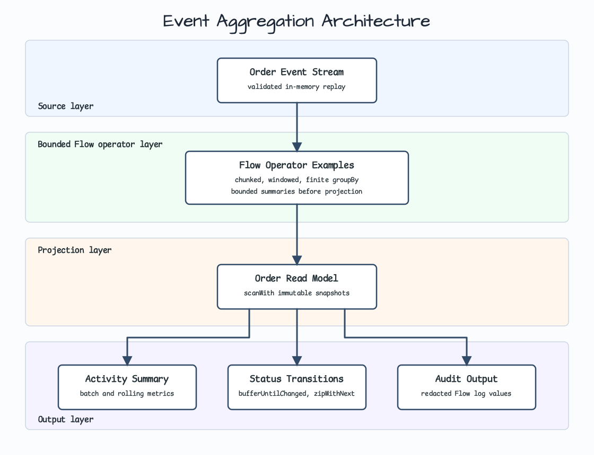
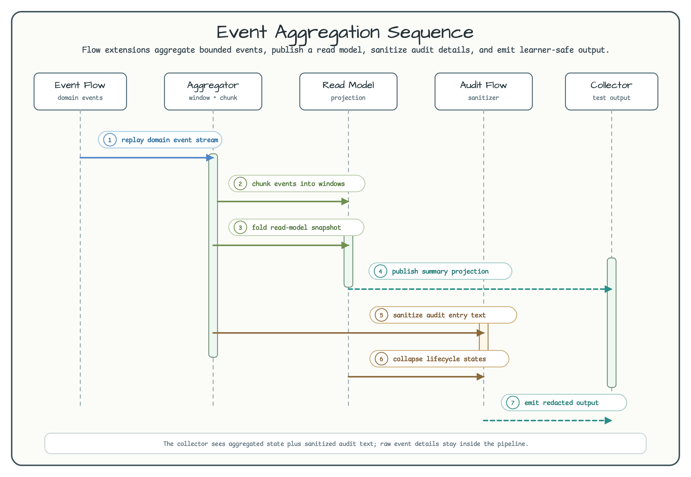
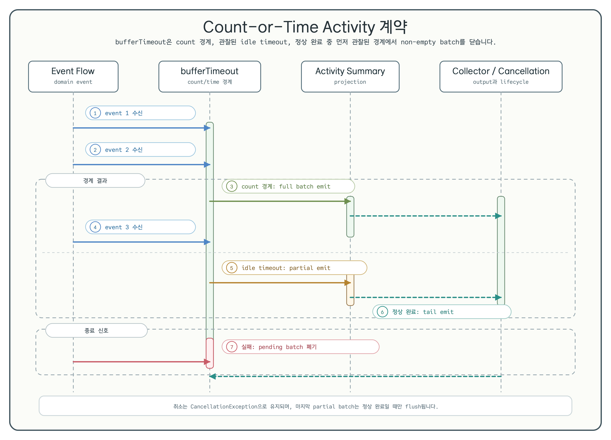

# Flow Extensions Event Aggregation

[English](README.md) | 한국어

이 예제는 bluetape4k Flow extension으로 작은 event aggregation pipeline을 구성하는 방법을 보여줍니다.

Bounded replay 형태의 domain event를 요약하고, aggregate id별로 그룹화하고, read model로 projection하고, lifecycle run으로 접은 뒤, 민감한 값을 노출하지 않고 로그로 관찰해야 하는 상황을 다룹니다.

## 시나리오

주문 서비스가 `OrderCreated`, `LineAdded`, `PaymentAuthorized`, `ShipmentStarted`, `OrderCancelled` 같은 lifecycle event를 방출합니다. Workshop pipeline은 이 event를 in-memory로 소비해 학습자가 이해하기 쉬운 projection으로 바꿉니다.

이 예제는 Kafka, database, HTTP endpoint, durable checkpoint를 일부러 넣지 않았습니다. Infrastructure를 붙이기 전에 Flow operator의 의미를 먼저 익히는 것이 목적입니다.

## Architecture



Architecture는 위에서 아래로 읽습니다. Raw event가 bounded Flow operator layer로 들어가고, immutable read-model projection을 거친 뒤, summary, lifecycle transition, sanitized audit output으로 나뉩니다.

`groupBy`는 finite stream용 도구로 보여줍니다. `toGroupItems()`로 완료된 group을 materialize하므로 replay window, batch 검증, test에는 적합하지만, unbounded hot ingestion에는 맞지 않습니다.

## Operator sequence





Sequence diagram은 중요한 contract를 보여줍니다.

- `chunked`는 batch-level activity summary를 위해 bounded batch를 emit합니다.
- `bufferTimeout`은 count 경계, 관찰된 idle timeout, 정상 완료 중 먼저 관찰된 경계에서 non-empty batch를 닫습니다.
- `windowed`는 rolling context가 필요할 때 overlapping window를 emit합니다.
- `groupBy`는 완료된 replay를 `orderId`별로 나눕니다.
- `scanWith`는 immutable read-model snapshot을 만듭니다.
- `bufferUntilChanged`는 인접한 같은 lifecycle state를 하나의 run으로 접습니다.
- `zipWithNext`는 status state를 transition으로 바꿉니다.
- `Flow<T>.log()`는 sanitized audit entry를 관찰합니다.

## Before: 직접 작성한 mutable aggregation

```kotlin
val states = mutableMapOf<String, OrderState>()

for (event in events) {
    val current = states[event.orderId] ?: OrderState.empty(event.orderId)
    states[event.orderId] = current.apply(event)
}
```

직접 loop를 작성하면 시작은 쉽지만, validation, batching, grouping, projection, lifecycle collapse, debug logging이 한곳에 섞입니다.

## After: Flow extension chain

```kotlin
val pipeline = OrderEventAggregationPipeline()

val summaries = pipeline.chunkedActivity(events, chunkSize = 100)
val countOrTimeSummaries = pipeline.countOrTimeActivity(
    events,
    maxSize = 100,
    timeout = 250.milliseconds,
)
val readModels = pipeline.readModels(events)
val transitions = pipeline.transitions(events, orderId = "order-1")
```

각 public function은 하나의 aggregation boundary만 가르칩니다. 그래서 학습자는 테스트를 실행하고 operator별 emitted value를 차례로 확인할 수 있습니다.

`countOrTimeActivity`는 `maxSize`가 먼저 차면 full batch를 emit하고, upstream이 정상 완료되거나 관찰된 idle timeout이 먼저 발생하면 non-empty partial batch를 emit합니다. 이 workshop은 bluetape4k-coroutines `1.12.1`의 동작을 고정합니다. 현재 구현은 각 원소를 받은 뒤 timeout을 다시 등록하므로, timeout은 마지막 원소 이후의 idle period로 관찰됩니다. 첫 원소부터 측정하는 wall-clock window가 필요하면 dependency source와 version을 다시 확인해야 합니다.

## Domain model

Order event는 private constructor를 가진 regular serializable class입니다. generated `copy(...)`가 token normalization과 safe rendering을 우회하지 못하게 일부러 data class를 쓰지 않았습니다.

`OrderState`, `OrderReadModel`, `OrderActivitySummary`, `OrderStatusRun`, `OrderTransition`, `OrderAuditEntry` 같은 projection 값은 data class이며 `Serializable`을 구현합니다.

## Failure and cancellation contracts

- 잘못된 id, amount, quantity, control character는 collect 전에 실패합니다.
- `CancellationException`은 다시 던져 coroutine cancellation을 cooperative하게 유지합니다.
- `countOrTimeActivity`는 정상 완료일 때만 마지막 partial batch를 flush하고, upstream failure에서는 진행 중인 partial batch를 버린 뒤 원래 exception을 유지합니다.
- `groupBy`는 upstream failure를 `FlowOperationException`으로 감쌉니다. 테스트는 원래 cause가 사라지지 않는지 확인합니다.
- Debug rendering은 customer id, tracking number, cancellation reason을 redaction합니다.

## 사용한 Bluetape4k 기능

| 기능 | 코드 위치 | 학습 포인트 |
|---|---|---|
| `chunked` | `chunkedActivity` | Batch size로 memory 사용량 제한 |
| `bufferTimeout` | `countOrTimeActivity` | Count, 관찰된 idle timeout, 완료 경계에서 batch를 닫음 |
| `windowed` | `rollingActivity` | Overlapping rolling summary emit |
| `groupBy` + `toGroupItems` | `groupedByOrder` | 완료된 replay를 aggregate id별로 분리 |
| `scanWith` | `readModels` | Immutable projection snapshot emit |
| `bufferUntilChanged` | `statusRuns` | 인접한 같은 lifecycle state를 접음 |
| `zipWithNext` | `transitions` | State를 lifecycle transition으로 변환 |
| `Flow<T>.log()` | `audit` | Sanitized stream value 관찰 |

## 빌드와 테스트

```bash
./gradlew :kotlin-flow-extensions-event-aggregation:test --rerun-tasks --console=plain
./gradlew :kotlin-flow-extensions-event-aggregation:compileKotlin :kotlin-flow-extensions-event-aggregation:compileTestKotlin --console=plain
./gradlew projects --console=plain
```

## 참고

- [chunked](../../../../bluetape4k-projects/bluetape4k/coroutines/src/main/kotlin/io/bluetape4k/coroutines/flow/extensions/chunked.kt)
- [bufferTimeout](../../../../bluetape4k-projects/bluetape4k/coroutines/src/main/kotlin/io/bluetape4k/coroutines/flow/extensions/bufferTimeout.kt)
- [windowed](../../../../bluetape4k-projects/bluetape4k/coroutines/src/main/kotlin/io/bluetape4k/coroutines/flow/extensions/windowed.kt)
- [groupBy](../../../../bluetape4k-projects/bluetape4k/coroutines/src/main/kotlin/io/bluetape4k/coroutines/flow/extensions/groupBy.kt)
- [scanWith](../../../../bluetape4k-projects/bluetape4k/coroutines/src/main/kotlin/io/bluetape4k/coroutines/flow/extensions/scanWith.kt)
- [bufferUntilChanged](../../../../bluetape4k-projects/bluetape4k/coroutines/src/main/kotlin/io/bluetape4k/coroutines/flow/extensions/bufferUntilChanged.kt)
- [zipWithNext](../../../../bluetape4k-projects/bluetape4k/coroutines/src/main/kotlin/io/bluetape4k/coroutines/flow/extensions/zipWithNext.kt)
- [Flow logging](../../../../bluetape4k-projects/bluetape4k/coroutines/src/main/kotlin/io/bluetape4k/coroutines/flow/extensions/logger.kt)
